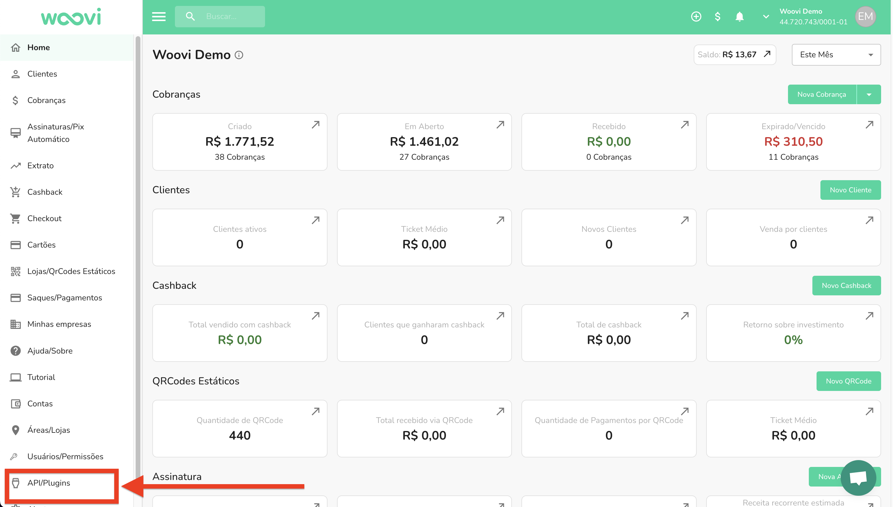
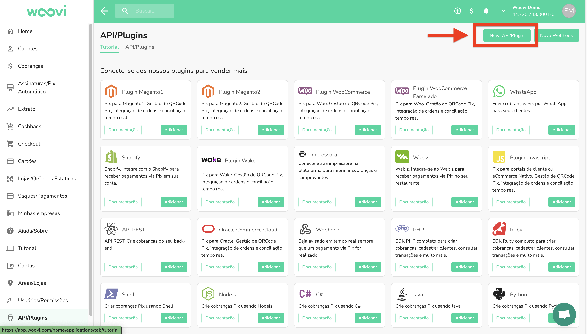

### 1. Para criar uma nova API MASTER

Vá para `Api/Plugins` na barra lateral e clique em `Nova API/Plugin`.

:::caution
Caso você não esteja visualizando o sidebar API/Plugins é necessário ter a permissão correta, veja com o admin da sua empresa. E é necessário ter a permissão correta para criar esta api.
:::

### 2. Coloque o tipo de API como **MASTER**.

- Coloque o tipo de API como MASTER.
- Selecione a Conta Bancaria Woovi IP principal.

### 3. Crie a nova API MASTER
- A API precisa ser do tipo MASTER porquê ela precisa ser capaz de criar novas integrações.
- A conta bancária relacionada a essa API será utilizada no processo de criação das novas contas bancárias, elas usarão os dados desta para serem criadas.

### 4. Coloque o código de validação

- Esse AppID deve ser armazenado de forma **segura** em sua base de dados.  
- Ele será a **chave principal** enviada em toda requisição de criação de nova conta bancária.
