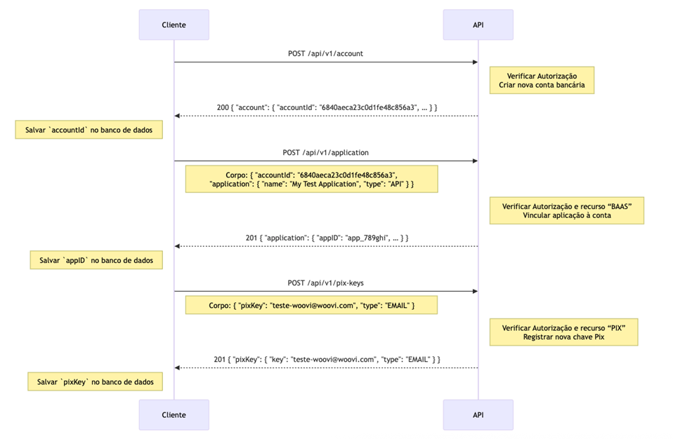

### 1 Crie uma nova API

Vá para `Api/Plugins` na barra lateral e clique em `Nova API/Plugin`.

:::caution
Caso você não esteja visualizando o sidebar API/Plugins é necessário ter a permissão correta, veja com o admin da sua empresa.
:::


### 2. Coloque o tipo de API como **MASTER**.


- Coloque o tipo de API como MASTER.
- Selecione a Conta Bancaria Woovi IP principal.


### 3. Crie a nova API MASTER
- A API precisa ser do tipo MASTER porquê ela precisa ser capaz de criar novas integrações.
- A conta bancária relacionada a essa API será utilizada no processo de criação das novas contas bancárias, elas usarão os dados desta para serem criadas.

### 4. Coloque o código de validação


- Esse AppID deve ser armazenado de forma **segura** em sua base de dados.  
- Ele será a **chave principal** enviada em toda requisição de criação de nova conta bancária.

## Sequência da integração 


## Como começar uma nova campanha?
- Crie uma nova conta bancária usando o AppID da conta principal.
- Armazene o accountId retornado pela requisição de criação de conta bancária.
- Crie uma nova aplicação utilizando o accountId retornado na última requisição.
- Armazene o AppID relacionado a essa conta. Você usará ele para pegar o saldo de uma campanha.
- Crie uma nova chave pix utilizando o AppID da conta que deseja.
- Cada conta bancária tem um saldo, então é recomendado que crie uma nova conta bancária para cada campanha.

### 1. Criando uma conta bancária

- Utilize o endpoint de criação de conta bancária para criar uma nova conta.
- Utilize o AppID da conta principal, o criado no slide 7.
- Faça a requisição.

```json
curl -X POST "https://api.woovi.com/api/v1/account" \
  -H "Authorization: {APP_ID}" \
  -H "Content-Type: application/json" 
```
- Caso tudo ocorra corretamente, um código 200 será retornado.
- No corpo da resposta terá:

```json
{
  "account": {
    "accountId": "6840aeca23c0d1fe48c856a3",
    "taxId": "12.345.678/0001-90",
    "isDefault": true,
    "balance": {
      "total": 0,
      "blocked": 0,
      "available": 0
    }
  }
}
```

### 2. Criando uma Aplicação

- Utilize o endpoint de criação de aplicação.
- A aplicação será a chave que será utilizada para acessar os dados de uma conta bancária específica.
- Utilize o AppID retornado pelo último endpoint, para relacioná-lo com a nova conta bancária.

```json
curl -X POST "https://api.woovi.com/api/v1/application" \
  -H "Authorization: {{BANK_ACCOUNT_APP_ID}}" \
  -H "Content-Type: application/json" \
  -d '{
    "accountId": "{{ACCOUNT_ID}}",
    "application": {
      "name": "My Test Application",
      "type": "API"
    }
  }'
```

- O retorno do endpoint de criação de uma aplicação, se tudo ocorrer bem, será um código 201.
- No corpo da resposta conterá:
```json
{
  "application": {
    "name": "My Test Application",
    "isActive": true,
    "type": "API",
    "clientId": "client_123abc",
    "clientSecret": "secret_456def",
    "appID": {{APPLICATION_APP_ID}},
    "companyBankAccount": "{{ACCOUNT_ID}}"
  }
}
```

### 3. Criando uma Chave Pix

- Utilize o endpoint de criação de chave pix.
- Utilize o AppID retornado pelo último endpoint, para criar a chave pix naquela conta específica.

```json
curl -X POST "https://api.woovi.com/api/v1/pix-keys" \
  -H "Authorization: {{APPLICATION_APP_ID}}" \
  -H "Content-Type: application/json" \
  -d '{
    "pixKey": "campanha@woovi.com",
    "type": "EMAIL"
  }'
```

- Se tudo ocorrer bem, o código de retorno será 201.
- O retorno serão os dados daquela chave pix criada.
```json
{
  "pixKey": {
    "key": "campanha@woovi.com",
    "type": "EMAIL"
  }
}
```
- Com esse fluxo, já será possível criar novas campanhas com suas respectivas chaves pix.
- Ainda temos endpoints que permitem a visualização do saldo, as informações de uma conta e as chaves pix atreladas a ela.

### 4. Consultando Chaves Pix

- Utilize o AppID da conta bancária que você quer consultar.
```json
curl -X GET "https://api.woovi.com/api/v1/pix-keys" \
  -H "Authorization: {{APPLICATION_APP_ID}}"
```

- O retorno terá status 200.
- O corpo da resposta será:
```json
{
  "pixKeys": [
    {
      "key": "teste-woovi@woovi.com",
      "type": "EMAIL"
    },
    {
      "key": "random-evp-key",
      "type": "EVP"
    }
  ],
  "account": {
    "accountId": "6840aeca23c0d1fe48c856a3",
    "isDefault": true,
    "balance": {
      "total": 100000,
      "blocked": 0,
      "available": 100000
    }
  }
}
```

### 5. Deletando Chaves Pix
- Caso uma campanha chegue ao fim, apagar a chave pix garantirá que nenhum dinheiro seja mandado a ela novamente.
- Existe um endpoint que permite que uma chave pix seja deletada.
- Utilize o AppID da conta que está atrelada a chave pix.
- O retorno será um código 204, se tudo ocorrer bem.

```json
curl -X DELETE "https://api.woovi.com/api/v1/pix-keys/{{PIX_KEY_VALUE}}" \
  -H "Authorization: {{APPLICATION_APP_ID}}"
```


