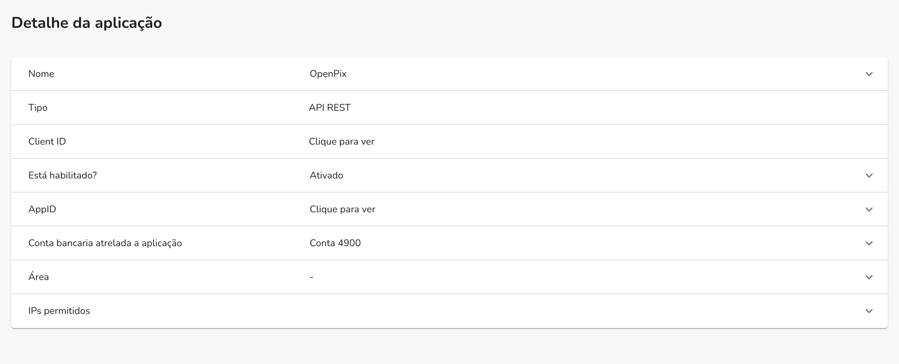
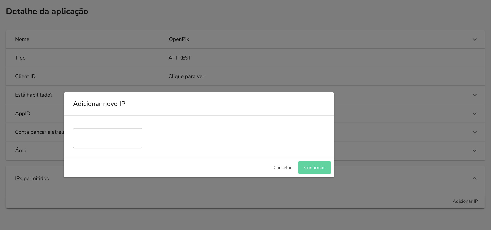

Como forma de garantir uma melhor segurança no uso da sua API, você pode adicionar uma lista de permissões de IP à sua API.
Assim, apenas os IPs que estão na lista de permissões poderão acessar sua API.

Vamos ver como você pode adicionar uma lista de permissões de IP à sua API.

## Adicionando uma lista de permissões de IP à sua API

Primeiramente, como um requisito, você precisa ter uma API criada.
Se você ainda não criou uma API, pode seguir os passos no guia [Criando uma API](./getting-started-api.md).

Após criar a API, você pode acessar os detalhes dela clicando no nome da API na [lista de APIs](https://app.openpix.com.br/home/applications/tab/list).

Nos detalhes da API, você pode clicar na seção de "IPs permitidos" para adicionar um novo IP.

Após clicar no modal, irá aparecer um campo onde poderá inserir o IP que deseja adicionar à lista de permissões.

Após a adição, será necessário efetuar a confirmação utilizando um código multi-fator,
é o meio de assegurar que somente você poderá adicionar IPs à lista de permissões.

Após a confirmação, o IP será adicionado à lista de permissões e poderá acessar a API.

Lembrando que, caso não tenha adicionado nenhum IP a lista de permissões, a API poderá estar
sendo utilizada por quaisquer IPs.

## Como posso pegar o IP da minha máquina?

Existe algumas ferramentas que facilitam a obtenção do IP da sua máquina, como por exemplo:

- [Meu IP](https://meuip.com/).
- [ifconfig.me](https://ifconfig.me/)

Com essas ferramentas, é possível saber qual IP você deve inserir na lista de permissões da sua API.
