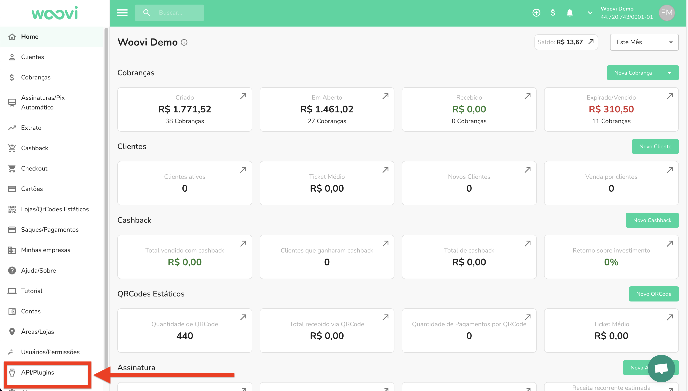
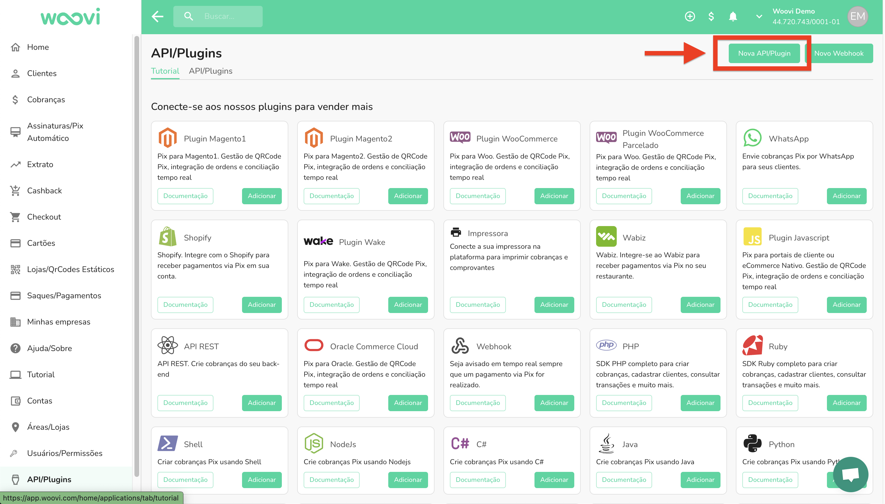
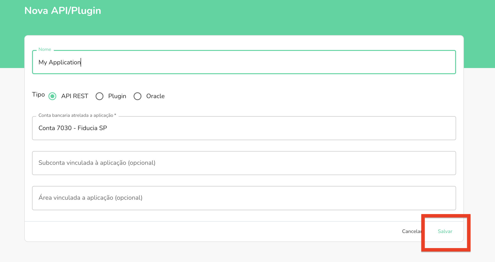
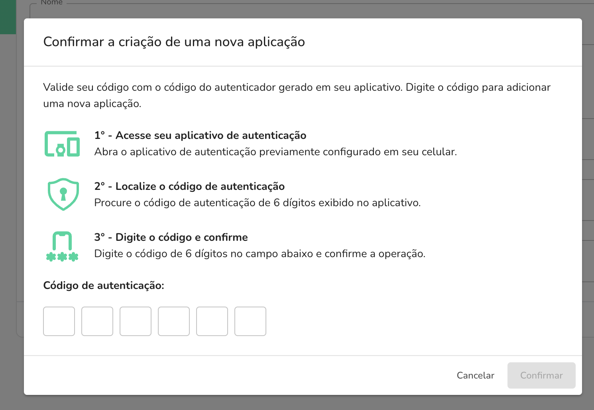
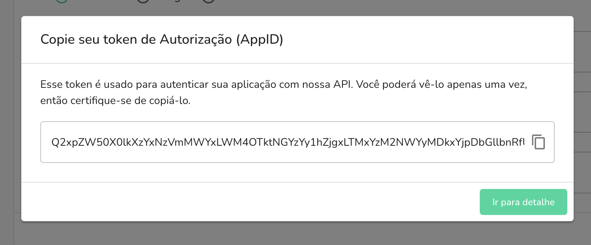

## Criando uma nova chave de API/Plugin

O primeiro passo para começar a integrar com a API é criar uma nova chave de API, para que possa ser feitas as requisições.

### Passo 1 - Criar um novo aplicativo

Vá para `Api/Plugins` na barra lateral e clique em `Nova API/Plugin`.

:::caution
Caso você não esteja visualizando o sidebar API/Plugins é necessário ter a permissão correta, veja com o admin da sua empresa.
:::



### Passo 2 - Nome da integração

Dentro da tela de criação, coloque um nome para a integração, e selecione `API` para integrações backend, ou `Plugin` para integrações frontend.



### Passo 3 - Criando uma nova chave de API/Plugin

Clique em `Salvar` para criar a nova chave de API/Plugin.



### Passo 4 - Colocando o fator de autenticação

Para que a API/Plugin possa ser utilizada, é necessário colocar um fator duplo de autenticação para garantir maior segurança na geração de chaves.



### Passo 5 - Copiando o AppID

Após criar a nova chave de API/Plugin, você pode copiar o AppID para utilizar em suas integrações.



## Como utilizar a API

Todas as `requests` e `responses` da API usam o formato JSON

Para que a requisição seja válida, é necessário enviar o `AppID`/`Token` no header `Authorization` da requisição.

```json
{
  "Authorization": "<AppID>"
}
```

Exemplo:

```bash
curl --request GET \
  --url https://api.openpix.com.br/api/v1/charge \
  --header 'Authorization: SEU_APPID_AQUI'
```

## Restrições de APIs

Os IPs e certificados dos servidores backend da API mudam constantemente, não armazene em cache nem IPs do servidor nem certificados

Todas as solicitações (requests) devem ser criptografadas usando `https`

As chaves de API são extremamente poderosas, pois podem criar ou ler dados de sua empresa, e devem ser armazenadas e compartilhadas com cuidado extra.

Orientações da API:

- Não compartilhe chaves com terceiros
- Não reutilize chaves - Chaves de acessos, você pode gerar várias chaves
- Apenas gere chaves quando for necessário
- Desative chaves não utilizadas

## AppID Inválido

Pode ocorrer de você receber uma resposta com o HTTP Status 401, que está relacionado à um appID inválido, sendo passado no header mencionado acima.

```json
{
	"data": null,
	"errors": [{
		"message": "appID inválido"
	}]
}
```

é retornado esse erro caso seja um appID inválido.

Caso você obtenha esse erro, é recomendado gerar um novo appID dá sua aplicação, ou regerar o appID, caso já tenha uma aplicação criada, e adicionar novamente em seu sistema.
