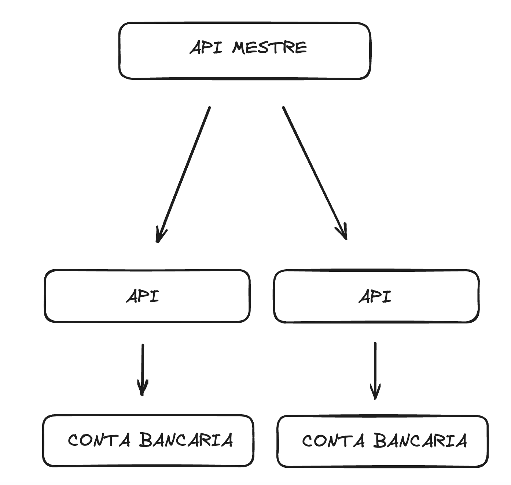
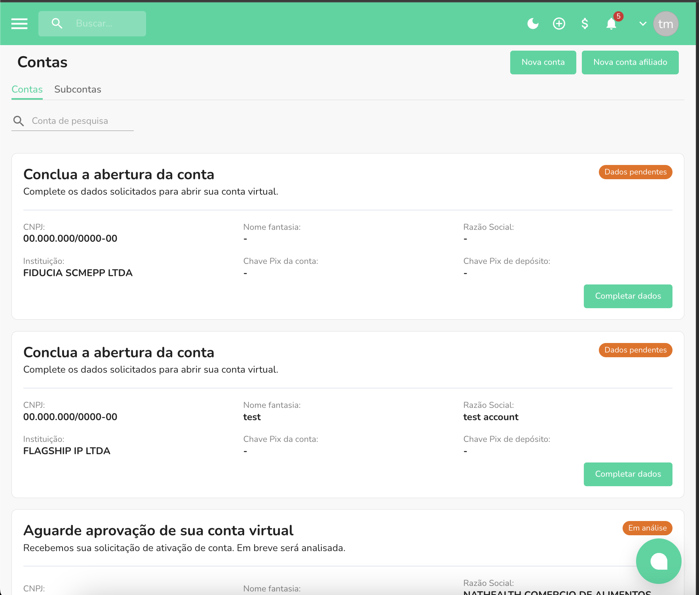

Este documento irá ajudá-lo a entender como criar api's para as contas abertas no modo BAAS

### API mestre

A API mestre é um conceito que permite voce criar API das as várias contas do modo BAAS



Visualização das várias contas:



### Como criar

Primeiro vá na plataforma em API/PLUGINS

E crie uma api MASTER

Logo após isso acesse no endpoint https://api.openpix.com.br/api/v1/application [application post](https://developers.openpix.com.br/en/api#tag/application/paths/~1api~1v1~1application/post)

e use o AppId da API mestre para criar o AppId da conta que você selecionou. 

é necessário ter o AccountId da conta a qual você quer criar a api. Para isso use o endpoint: 

https://api.openpix.com.br/api/v1/account/ [application get](https://api.openpix.com.br/api/v1/account/)

em api/v1/application

```ts
{
	"accountId": "account-id",
	"application": {
		"name": "application",
		"type": "API"
	}
}
```
O retorno será: 
```ts
{
	"application": {
		"name": "application",
		"isActive": true,
		"type": "API",
		"clientId": "Client_Id",
		"clientSecret": "Client_Secret6uWhGA=",
		"appId": "appId"
	}
}
```

Com o appId em mãos, você consegue acessar qualquer endpoint de determinada conta.