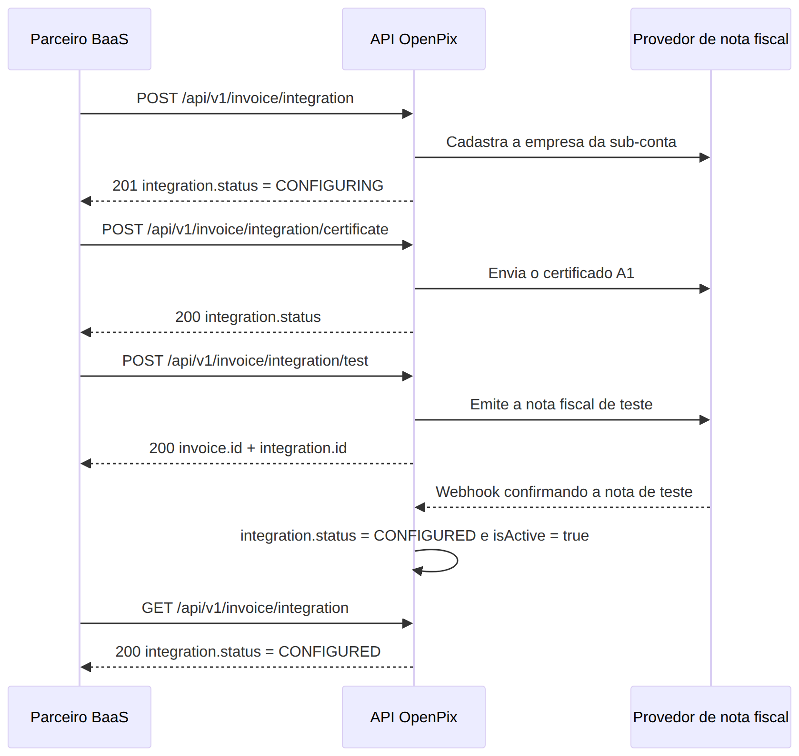

Este documento irá ajudá-lo a configurar, via API, a emissão de nota fiscal eletrônica de serviço (NFS-e) de uma conta, do cadastro da integração até a emissão da nota de teste que valida tudo.

:::info

Todos os endpoints deste documento operam sobre a **conta que está no token**, sem nenhum parâmetro de conta no corpo da requisição. O fluxo é o mesmo para qualquer conta.

A única diferença no modo BaaS é **como você obtém o appId**: em vez de criar a API pela plataforma, você gera o appId da conta a partir da sua API mestre. Veja [Controlando as contas no modo BAAS](/docs/baas/baas-api-master).

:::

:::caution

Esta documentação espera que:

- a feature de nota fiscal esteja habilitada para a sua empresa (disponível apenas por solicitação via chat);
- a conta já esteja com o cadastro **aprovado** — a identidade fiscal da nota é a da própria conta;
- você tenha em mãos o certificado digital **A1** (arquivo `.pfx`/`.p12`) e a senha dele.

:::

## Autenticação

Todas as requisições usam o padrão da API REST da OpenPix: o appId vai no header `Authorization`.

```
Authorization: <appId>
Content-Type: application/json
```

O **escopo é definido pelo próprio token**: a integração criada, o certificado enviado e a nota de teste emitida pertencem à conta do appId utilizado.

## Fluxo da configuração

A integração só fica pronta para emitir notas reais quando o provedor de nota fiscal **confirma a nota de teste por webhook**. É por isso que a emissão de teste é o último passo: ela é o que fecha a configuração.



<!-- Diagrama gerado a partir de ./__assets__/baas-invoice-integration-flow.mmd (mermaid).
     Para atualizar: edite o .mmd e re-renderize a imagem. -->

## 1. Criando a integração

O primeiro passo cria a integração de nota fiscal da conta e grava as informações fiscais dela. Essas informações garantem a conformidade tributária e podem ser obtidas com o auxílio do contador do titular da conta.

`POST /api/v1/invoice/integration`

Todos os campos do corpo são opcionais — envie os que se aplicam ao município e ao regime tributário da conta:

| Campo                       | Tipo      | Descrição                                                               |
| --------------------------- | --------- | ----------------------------------------------------------------------- |
| `cityServiceCode`           | `string`  | Código de serviço municipal, conforme a lista de serviços da prefeitura |
| `municipalSubscription`     | `string`  | Inscrição/assinatura municipal do prestador de serviço                  |
| `rpsNumber`                 | `string`  | Número do RPS (Recibo Provisório de Serviços)                           |
| `specialTax`                | `string`  | Regime de imposto especial                                              |
| `taxRegime`                 | `string`  | Regime tributário da empresa                                            |
| `federalTaxDetermination`   | `string`  | Determinação de tributos federais                                       |
| `municipalTaxDetermination` | `string`  | Determinação de tributos municipais                                     |
| `isPortalNacional`          | `boolean` | Indica se o município emite pelo Portal Nacional da NFS-e               |
| `isActive`                  | `boolean` | Ativa a integração (só é permitido depois de configurada)               |

```bash
curl 'https://api.openpix.com.br/api/v1/invoice/integration' -X POST \
  -H 'Authorization: <appId>' \
  -H 'Content-Type: application/json' \
  --data-raw '{
    "cityServiceCode": "2690",
    "municipalSubscription": "123456",
    "rpsNumber": "1",
    "taxRegime": "LimitedProfit",
    "specialTax": "None",
    "isPortalNacional": false
  }'
```

Resposta `201`:

```json
{
  "integration": {
    "id": "67001bbf0b0621890af7dc28",
    "type": "NFEIO",
    "status": "CONFIGURING",
    "isActive": false,
    "companyBankAccount": "66f8c1a20b0621890af7aa11",
    "metadata": {
      "nfeio": {
        "cityServiceCode": "2690",
        "municipalSubscription": "123456",
        "rpsNumber": "1",
        "taxRegime": "LimitedProfit",
        "specialTax": "None",
        "isPortalNacional": false
      }
    }
  }
}
```

:::info

O campo `companyBankAccount` na resposta confirma a qual conta a integração ficou vinculada. O status `CONFIGURING` indica que a integração existe, mas ainda não está apta a emitir notas.

:::

## 2. Enviando o certificado digital A1

Com a integração criada, envie o certificado A1 da conta. O arquivo `.pfx`/`.p12` deve ser convertido para **base64** e enviado no corpo em JSON.

`POST /api/v1/invoice/integration/certificate`

| Campo        | Tipo      | Obrigatório | Descrição                                                                     |
| ------------ | --------- | ----------- | ----------------------------------------------------------------------------- |
| `pcks12`     | `string`  | Sim         | Certificado A1 (pkcs12) codificado em base64                                  |
| `passphrase` | `string`  | Sim         | Senha do certificado                                                          |
| `test`       | `boolean` | Não         | Quando `true`, o certificado não é enviado ao provedor (validação é ignorada) |

Para gerar o base64 do certificado:

```bash
base64 -w 0 certificado.pfx > certificado.base64
```

```bash
curl 'https://api.openpix.com.br/api/v1/invoice/integration/certificate' -X POST \
  -H 'Authorization: <appId>' \
  -H 'Content-Type: application/json' \
  --data-raw "{
    \"pcks12\": \"$(cat certificado.base64)\",
    \"passphrase\": \"senha-do-certificado\"
  }"
```

Resposta `200`:

```json
{
  "integration": {
    "status": "CONFIGURING"
  }
}
```

:::info

A resposta devolve apenas o status resultante da integração. O certificado, a senha e as credenciais nunca são retornados pela API.

:::

## 3. Emitindo a nota fiscal de teste

Este é o passo que fecha a configuração. A emissão de teste leva a integração para `VALIDATING` e, quando o provedor confirma a nota por webhook, a integração passa para `CONFIGURED` e `isActive: true` — é isso que libera a emissão de notas reais.

`POST /api/v1/invoice/integration/test`

Não há corpo a ser enviado: a conta e a integração são resolvidas pelo token.

```bash
curl 'https://api.openpix.com.br/api/v1/invoice/integration/test' -X POST \
  -H 'Authorization: <appId>' \
  -H 'Content-Type: application/json'
```

Resposta `200`:

```json
{
  "invoice": {
    "id": "67001c5b0b0621890af7dc44"
  },
  "integration": {
    "id": "67001bbf0b0621890af7dc28"
  }
}
```

Guarde o `invoice.id`: é o identificador da nota de teste gerada, que você pode consultar depois pelos endpoints de nota fiscal.

## 4. Confirmando que a integração está configurada

A confirmação da nota de teste chega por webhook do provedor, então o status muda de forma assíncrona. Consulte a integração da conta para acompanhar:

`GET /api/v1/invoice/integration`

```bash
curl 'https://api.openpix.com.br/api/v1/invoice/integration' -X GET \
  -H 'Authorization: <appId>'
```

Resposta `200` com a configuração concluída:

```json
{
  "integration": {
    "id": "67001bbf0b0621890af7dc28",
    "type": "NFEIO",
    "status": "CONFIGURED",
    "isActive": true,
    "companyBankAccount": "66f8c1a20b0621890af7aa11",
    "metadata": {
      "nfeio": {
        "nfeioCompanyId": "9f1c4b2e5a7d",
        "cityServiceCode": "2690",
        "municipalSubscription": "123456",
        "rpsNumber": "1",
        "taxRegime": "LimitedProfit",
        "specialTax": "None",
        "isPortalNacional": false
      }
    }
  }
}
```

:::info

Com `status: "CONFIGURED"` e `isActive: true`, a conta está pronta para emitir notas fiscais. Vale validar o documento da nota de teste com o contador do titular da conta antes de começar a emitir notas reais.

:::

## Próximos passos

Agora que a integração da conta está configurada, o próximo passo é emitir notas fiscais de verdade pela API:

- [Criar Nota Fiscal de serviço via API](/docs/invoice/how-to-issue-invoice-by-api)
- [Baixar PDF e XML da nota via API](/docs/invoice/how-to-get-invoice-files-by-api)
- [Cancelar uma nota emitida via API](/docs/invoice/how-to-cancel-issued-invoice-by-api)
