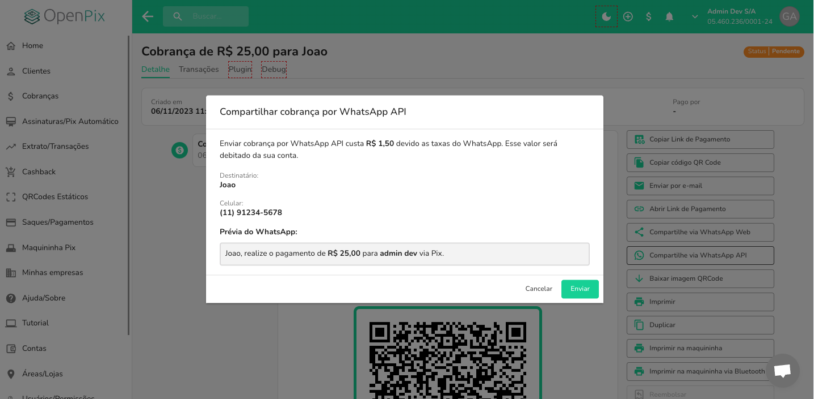

## Como enviar uma mensagem via API oficial de WhatsApp para uma cobrança manualmente?

Se você deseja estar em contato com seus clientes e fidelizá-los, estar em contato com eles via WhatsApp é uma maneira prática e eficiente de fazer.

Para isto, a OpenPix traz uma solução prática e rápida que garante que seu cliente vá receber sua mensagem utilizando a API oficial de WhatsApp disponibilizada pela Meta.

## Enviando uma mensagem manualmente

Para fazer o envio manual de uma mensagem via WhatsApp para uma cobrança, segue o tutorial abaixo.

### Acesse o detalhe de uma cobrança

Acesse o detalhe de uma cobrança criada.

### Abrindo o modal de envio

Nas opções do menu a direita, você irá encontrar a opção **Compartilhar via WhatsApp API**. Clique nela.

Ao clicar, você verá este modal aparecendo:

Você verá as informações como:

- O nome do destinatário;
- O número do WhatsApp que receberá a mensagem;
- O preview da mensagem que será enviado;

### Enviando a mensagem

Para enviar a mensagem, clique no botão **Enviar**. Você verá uma notificação de envio com sucesso e seu cliente
irá receber a mensagem no respectivo número de telefone.

:::info

Caso você queira enviar para todas as cobranças criadas, siga o tutorial [aqui](../whatsapp/whatsapp-how-to-send-charges.md).

:::

## Como ativar o envio do WhatsApp automaticamente para todas as cobranças?

Se você deseja estar habilitando esse fluxo de envio para todas as cobranças que forem criadas, também existe essa possibilidade.

Siga o tutorial a seguir: [Como ativar o WhatsApp](../whatsapp/whatsapp-how-to-activate.md).
