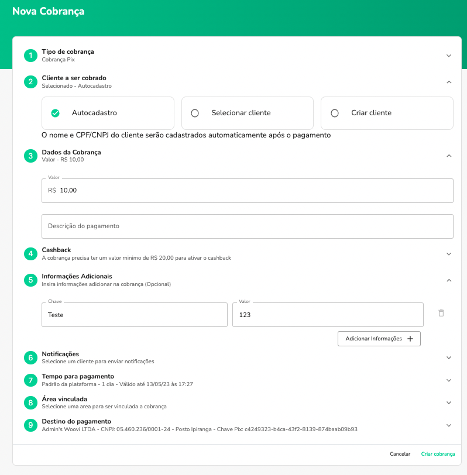
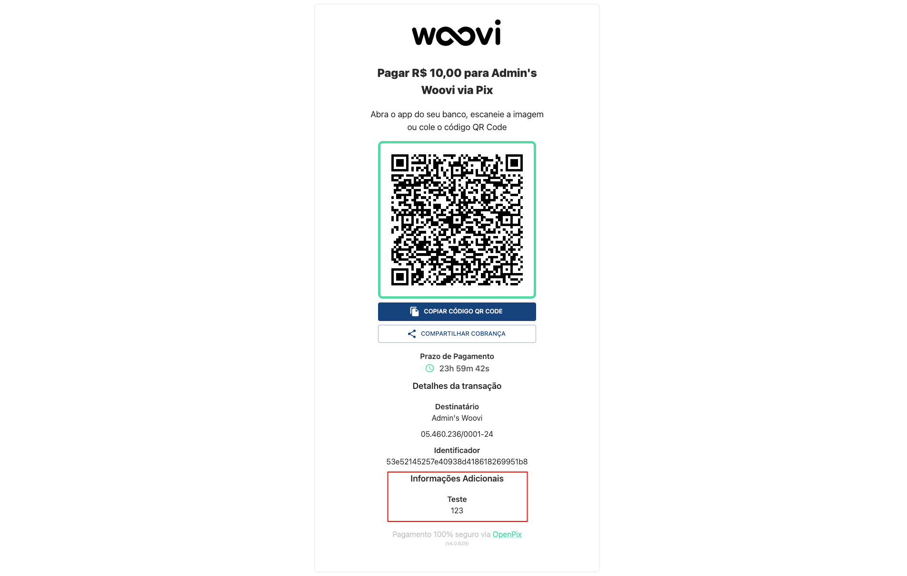

## Plataforma

1. No formulário de cobrança identifique o step de informações adicionais
2. Adiciona as informações que desejar em forma de chave valor



Após a criação da cobrança as informações adicionais estarão disponíveis no link de pagamento da cobrança:



## API

1. Envie o campo `additionalInfo` como um array de objeto
2. Cada objeto do array deve conter a seguinte estrutura `{ key: 'teste', value: '123' }`

- Request Body

```json
{
  "correlationID": "123abcde",
  "value": 1000,
  "type": "DYNAMIC",
  "additionalInfo": [
    {
      "key": "test",
      "value": "123"
    }
  ]
}
```

- Payload

```ts
{
    "charge": {
        "value": 1000,
        "identifier": "c8032ec611bd4ab7957ae58c19890a8d",
        "correlationID": "123abcde",
        "paymentLinkID": "ae0672da-d7a5-4599-8ec7-d0887b55a2b2",
        "transactionID": "c8032ec611bd4ab7957ae58c19890a8d",
        "status": "ACTIVE",
        "additionalInfo": [
            {
                "key": "test",
                "value": "123"
            }
        ],
        "discount": 0,
        "valueWithDiscount": 1000,
        "expiresDate": "2023-05-13T20:29:47.869Z",
        "type": "DYNAMIC",
        "createdAt": "2023-05-12T20:29:49.646Z",
        "updatedAt": "2023-05-12T20:29:49.646Z",
        "brCode": "00020101021226990014br.gov.bcb.pix2577pix-h.bpp.com.br/23114447/qrs1/v2/01pMq2ZLBxuiphmfCatLb772nzWZaiYTh9fL2irJewQ520400005303986540510.005802BR5904Finn6009Sao_Paulo62290525c8032ec611bd4ab7957ae58c163047AB5",
        "expiresIn": 86400,
        "pixKey": "cc134114-a533-4876-9a6d-e433a00b2300",
        "paymentLinkUrl": "https://woovi.com/pay/ae0672da-d7a5-4599-8ec7-d0887b55a2b2",
        "qrCodeImage": "https://api.woovi.com/openpix/charge/brcode/image/ae0672da-d7a5-4599-8ec7-d0887b55a2b2.png",
        "globalID": "Q2hhcmdlOjY0NWVhMWJkOTI2NTg5M2UwMjQyNDYyNw=="
    },
    "correlationID": "123abcde",
    "brCode": "00020101021226990014br.gov.bcb.pix2577pix-h.bpp.com.br/23114447/qrs1/v2/01pMq2ZLBxuiphmfCatLb772nzWZaiYTh9fL2irJewQ520400005303986540510.005802BR5904Finn6009Sao_Paulo62290525c8032ec611bd4ab7957ae58c163047AB5"
}
```
