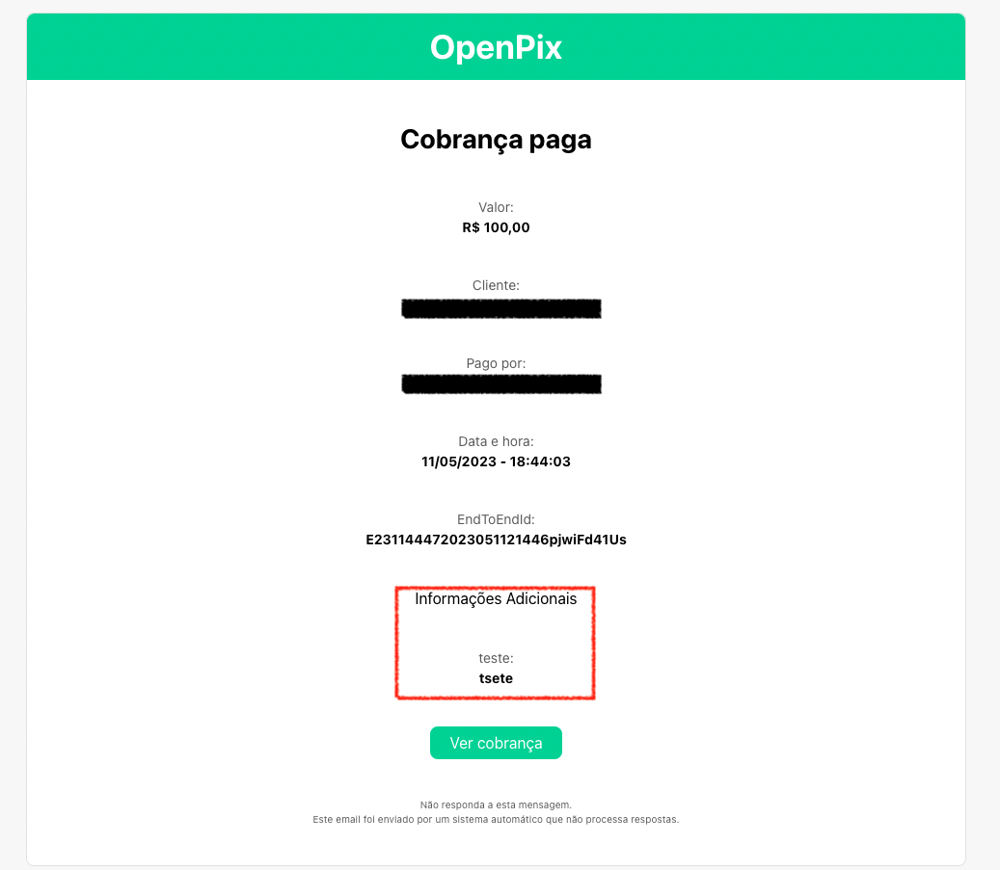

1. Crie a cobrança seguindo o tutorial [Como criar uma cobrança com informações adicionais?](/docs/charge/how-charge-additional-info)
2. Ao receber o email de cobrança paga você poderá identificar as informações no mesmo

