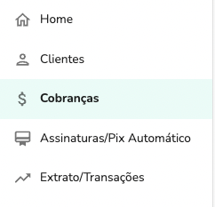
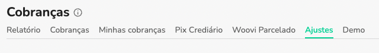
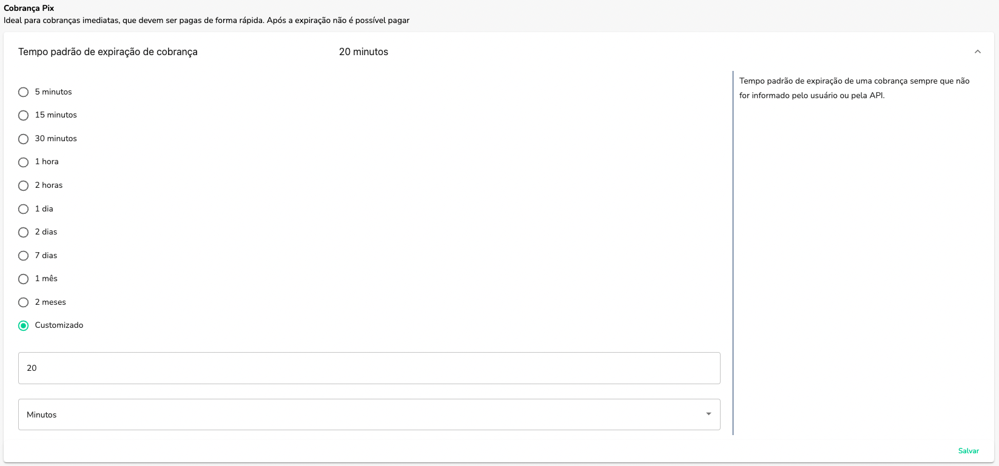

## Como definir o tempo de expiração de uma cobrança?

A configuração de expiração das cobranças pode ser configurado no menu `Cobranças`

Na aba `Ajustes`

Identifique o card `Tempo padrão de expiração de cobrança` e configure da forma que desejar com as opções disponíveis ou então customizadas.

