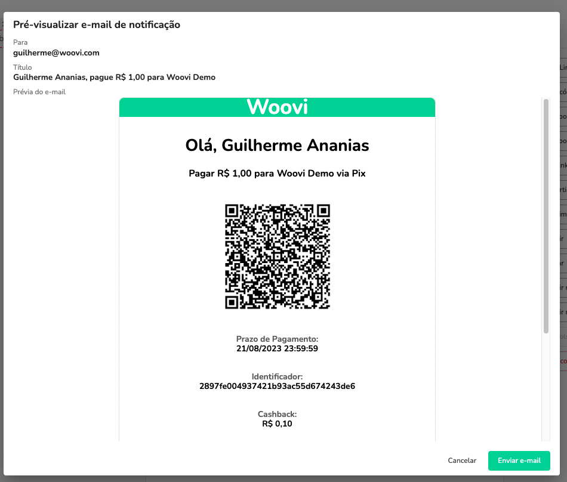
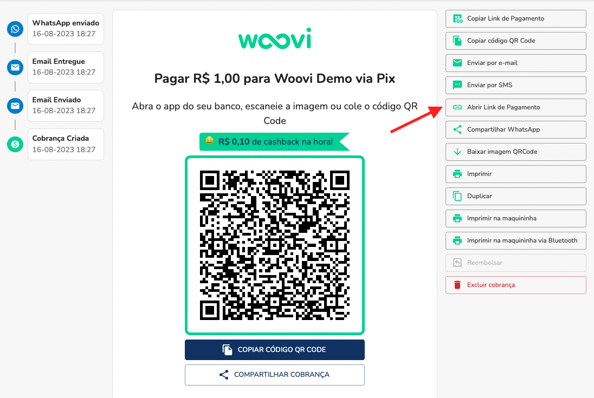
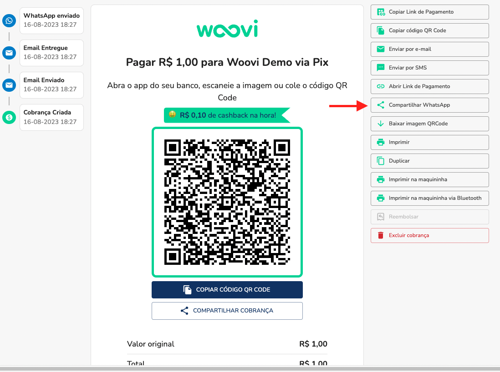
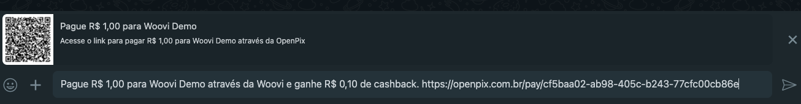

### Como compartilhar uma cobrança?

A melhor forma de compartilhar uma cobrança é enviando o link de pagamento para o seu cliente.

Você pode compartilhar esse link na nossa plataforma das seguintes formas:

#### Enviando o Link de Pagamento através de um e-mail

#### Enviando o Link de Pagamento

#### Enviando o Link de Pagamento através do WhatsApp

