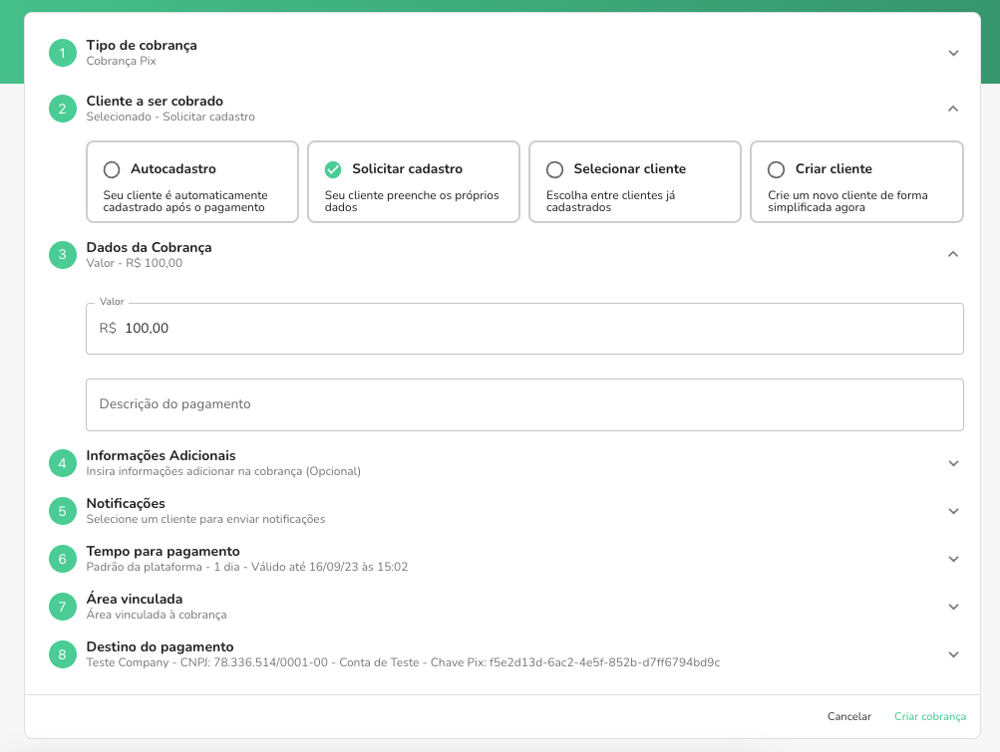

Você pode criar uma cobrança solicitando que o cliente cadastre seus dados antes que ele possa realizar o pagamento da cobrança.

No formulario de criação da cobrança na segunda etapa, selecione a opção "Solicitar cadastro".

Preencha os demais dados e clique em "Criar cobrança".

Com a cobrança criada, será necessário preencher um formulário com os dados do cliente para acessar o QR Code da cobrança.

Você pode copiar o link do pagamento e enviar para o seu cliente.

Após preencher os dados, o cliente terá acesso à página de pagamento da cobrança.

O cliente é cadastrado na plataforma e vinculado à cobrança automaticamente.

