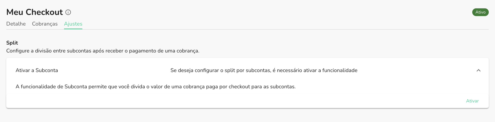
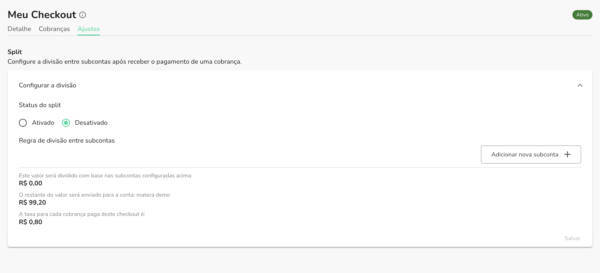
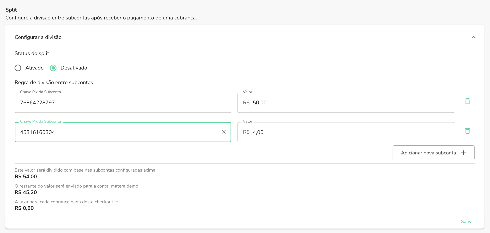

Com o split de subcontas configurado através do Checkout, você tem a possibilidade de
dividir o valor de uma cobrança paga entre duas ou mais subcontas, de acordo com o valor
que você definir para cada uma delas. Para saber mais sobre subcontas, [clique aqui](../subaccount/split-sub-account-usecases.mdx).

## Pré-requisitos

Caso ainda não tenha ativado o módulo de Subcontas, na aba de `Ajustes`, no detalhe do
chekout em questão, você verá a seguinte mensagem:

Clique no botão `Ativar`, e o módulo de Subcontas será ativado para o seu Checkout. Desse modo você poderá configurar o split entre subcontas. É necessário ativar o módulo de Subcontas para que seja possível configurar o split entre subcontas
através do Checkout.

Após ativar, você verá a seguinte seção:

## Configurando o split entre subcontas

Após realizar a ativação do módulo, você verá a seção de configuração do split entre subcontas
conforme a imagem acima. Você terá dois campos disponíveis para realizar a configuração:

### Status do split

Neste campo, você poderá definir se o split entre subcontas estará ativo ou inativo. Caso esteja
ativo, o valor da cobrança será dividido entre as subcontas configuradas. Caso esteja inativo, o
valor da cobrança será direcionado somente para a conta principal.

### Regra de divisão entre subcontas

Ao ativar o split entre subcontas, você terá uma seção onde poderá inserir as regras de divisão,
contendo os seguintes campos:

- **Chave Pix da Subconta**: chave Pix que irá receber o valor daquela regra de divisão;
- **Valor**: valor fixo que será destinado àquela subconta;

Segue o exemplo da imagem abaixo:

:::info

Caso queira adicionar novas subcontas na regra de divisão, basta clicar no botão: `Adicionar nova subconta`
e preencher os campos conforme a descrição acima.

:::

Após preencher os campos, clique no botão `Salvar` para que as configurações sejam salvas. Caso todas as informações
forem preenchidas corretamente, você verá uma mensagem de sucesso e estará com o split por subcontas configurado. Suas
próximas cobranças criadas através desse checkout farão o split automaticamente de acordo com as respectivas regras.

:::info

No final da seção do formulário, consta também a informação do montante que será repartido entre subcontas e o restante
que será direcionado para a conta principal.

:::
