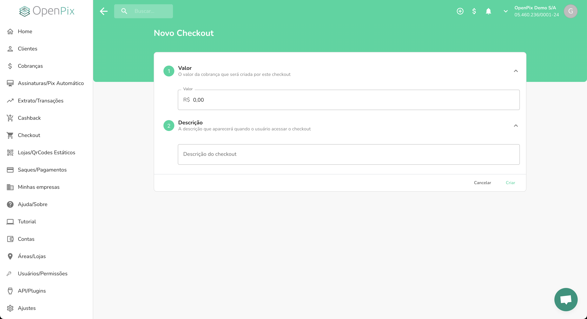
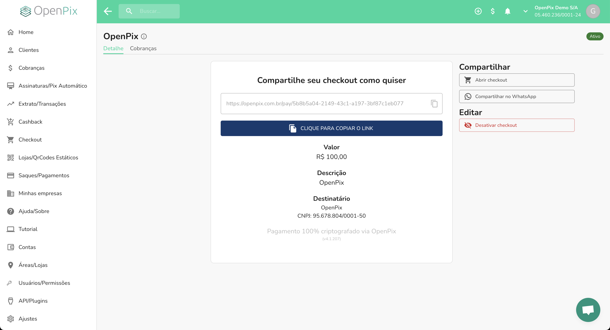
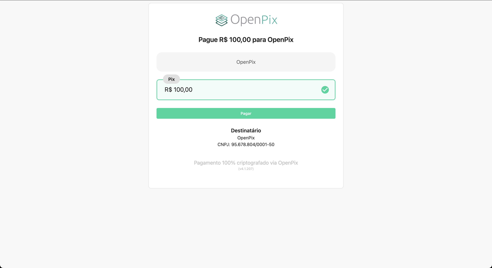

## Acessando o formulário

Através do menu lateral, acesse a opção **Checkout** e clique no botão, no canto superior direito,
**Novo Checkout**. Você acessará o [formulário de criação de um novo checkout](https://app.openpix.com.br/home/checkouts/list).

## Preenchendo o formulário

Após acessar o formulário, preencha os campos obrigatórios:

- **Valor**: valor referente as cobranças criadas por aquele checkout;
- **Descrição**: descrição que será exibido quando acessar aquele checkout.

Após preencher os campos, clique no botão **Criar**. Pronto,
seu checkout foi criado com sucesso!

Após a criação, você será automaticamente redirecionado para a página de detalhe do respectivo checkout.

## Detalhe do checkout

Na página de detalhe do checkout, você poderá visualizar as informações do checkout criado, como:

- **Valor**: valor referente as cobranças criadas por aquele checkout;
- **Descrição**: descrição que será exibido quando acessar aquele checkout;
- Poderá desativar o checkout, caso desejar.
- Poderá visualizar as cobranças criadas por aquele checkout.
- Poderá acessar o link de pagamento referente àquele checkout.

## Acessando o link de pagamento

Na página de detalhe do checkout, clique no botão **Abrir checkout**.
Você será redirecionado para a página de pagamento do checkout:

Esse é o link de pagamento atrelado ao checkout que você criou.
Quando o seu cliente clicar no botão **Pagar**, será gerado uma
cobrança que ele poderá pagar com o respectivo valor e descrição
que você definiu.
