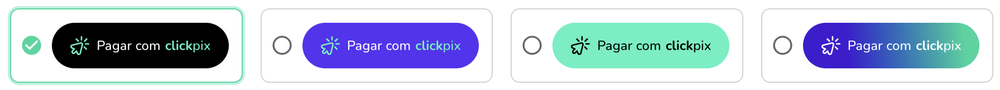

O ClickPix é um tipo de plugin que permite que você crie cobranças com mais facilidade. Para iniciar a utilização do ClickPix, você precisa seguir alguns passos:

## Solicitar a ativação da feature de ClickPix

- O primeiro passo é solicitar a ativação da feature de ClickPix, para isso, você pode solicitar a ativação via o chat de suporte.

## O que é necessário saber antes de utilizar o ClickPix?

- É necessário entender que para utilizar o ClickPix você precisa ter um AppID válido do tipo plugin, veja como criar [aqui](../plugin/app-id).

### Utilizando o Plugin `ClickPix`

A primeira coisa é incluir a tag de script do plugin na parte inferior do arquivo html

```html
<script src="https://plugin.openpix.com.br/v1/openpix.js" async>
```

O script pode ser importado dentro de um arquivo `.html`. Por exemplo, se seu aplicativo for um aplicativo em React, o script do Plugin OpenPix será importado dentro de `index.html`.

Veja o exemplo abaixo:

```html
<!DOCTYPE html>
<html lang="pt-BR">
  <head>
    <meta charset="UTF-8" />
    <title>Demo ClickPix</title>
  </head>
  <body>
    <div id="root"></div>
    <script src="https://plugin.openpix.com.br/v1/openpix.js" async></script>
  </body>
</html>
```

Até este momento, nada deve acontecer, pois o plugin não foi inicializado.
Para confirmar se o plugin foi inicializado corretamente, você pode acessar o console do seu navegador e buscar por esses logs

```
[OpenPix] connecting, attemp 0
[OpenPix] connected
```

### Inicializando o plugin `ClickPix`

Após a importação do script, você poderar adicionar as tags para a inicialização dos botões do ClickPix.

```html
<!DOCTYPE html>
<html lang="pt-BR">
  <head>
    <meta charset="UTF-8" />
    <title>Demo ClickPix</title>
  </head>
  <body>
    <div id="root">
      <div data-clickpix data-value="888"></div>
    </div>
    <script src="https://plugin.openpix.com.br/v1/openpix.js" async></script>
  </body>
</html>
```

### Customizando o botão ClickPix

É possível customizar o botão ClickPix adicionando atributos no elemento `div` como `data-customer-fields`, `data-additional-info`, e `data-variant`. Note que os paramêtros de `data-clickpix` e `data-value` são obrigatórios.

#### Definindo o valor da cobrança

O valor da cobrança é definido através do atributo `data-value`. O campo `data-value` é obrigatório, e caso não seja informado, o botão não será exibido. O valor enviado deverá ser um número inteiro, sendo o valor da cobrança em centavos.

**Exemplo:**

```html
<div data-clickpix data-value="888"></div>
```

No exemplo acima, o botão sempre gerará uma cobrança no valor de R$ 8,88.

#### Solicitando informações de cliente

Para solicitar informações específicas do cliente, é possível a utilização do atributo `data-customer-fields`. É possível solicitar os seguintes campos:

- Email
- Telefone
- Endereço

Esses dados serão solicitados após a criação da cobrança pelo o botão ClickPix.

**Exemplo:**

```html
<div
  data-clickpix
  data-value="888"
  data-customer-fields="email,phone,address"
></div>
```

No exemplo acima, cobranças criadas pelo o botão sempre solicitarão o email, telefone e endereço do cliente.

#### Adicionando informações adicionais

É possível adicionar informações adicionais em cobranças geradas pelo botão ClickPix, através do atributo `data-additional-info`. Esses dados precisam ser formatados no seguinte formato:

`key1:value1,key2:value2,key3:value3`

Sendo cada `key:value` uma informação adicional diferente.

**Exemplo:**

```html
<div
  data-clickpix
  data-value="888"
  data-additional-info="order:1234,product:123"
></div>
```

No exemplo acima o botão sempre irá gerar uma cobrança com as informações adicionais de `order: 1234` e `product: 123`.

### Definindo a variação do botão ClickPix

É possível definir a variação do botão ClickPix, através do atributo `data-variant`. Essa variação pode ser definida como `default` ou `purple`, `green` ou `gradient`.

Abaixo você encontra todas as variações, ordenadas por `default, purple, green, gradient`.



Caso não seja informado um valor específico, o botão será exibido como `default`.

**Exemplo:**

```html
<div data-clickpix data-value="888" data-variant="purple"></div>
```

No exemplo acima o botão será exibido como um botão `purple`.
