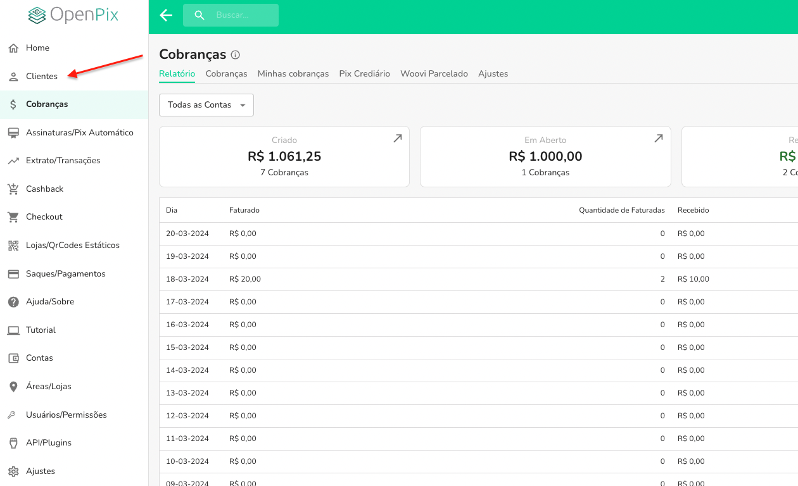
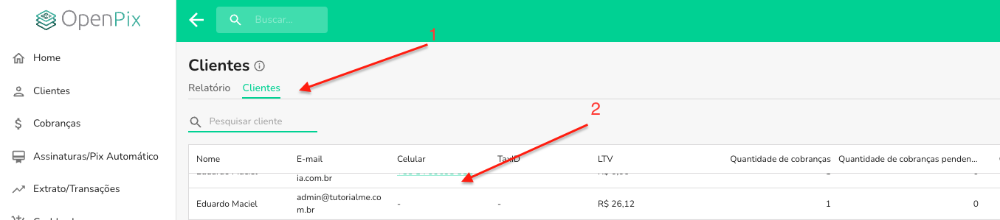
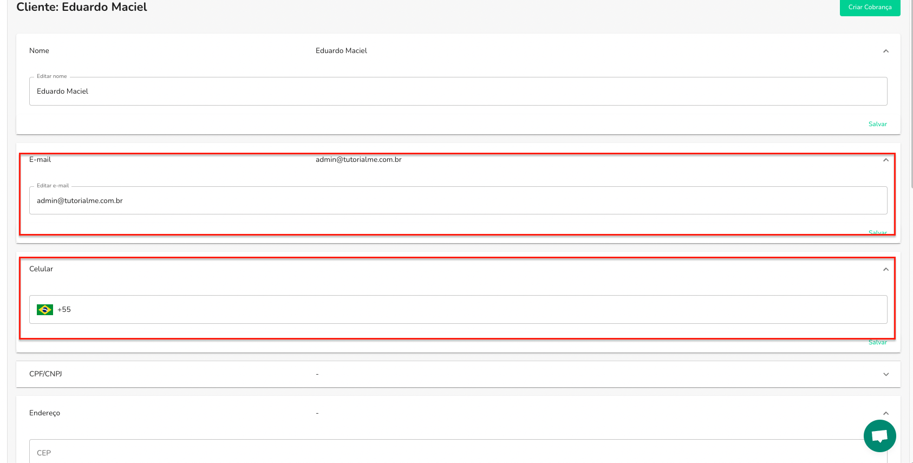

É possível alterar o dados de um cliente, tanto via api, quanto via plataforma e o objetivo dessa documentação é mostrar como fazer isso.

:::info
Alguns dados sensíveis na documentação estarão mascarados por questões de segurança.
:::

## Via Plataforma

Para alterar os dados de um cliente via plataforma você precisa

### 1. Acessar a aba de Clientes



### 2. Selecionar o cliente que deseja alterar



### 3. Clicar em qual campo você desejar alterar


Ao editar o campo não esqueça de clicar em salvar em cada campo.

## Via API

Para alterar os dados de um cliente via API, você utiliza o _endpoint_ `/api/v1/customer/{correlationID}` da API utilizando o método `PATCH`.

Para editar o cliente você precisa chamar a API informando o correlationID do cliente em que deseja alterar na URL, e no corpo da requisição você pode informar os campos `name`, `email`, `phone`, `address` and `taxID`.

:::info
O campo taxID é um campo que não pode ser editado do usuário, caso já possua valor. Ou seja, se o cliente já possuir um taxID cadastrado, não será possível alterá-lo. Caso precise editar o taxID de um usuário de qualquer maneira, o ideal é criar um novo cliente com o novo taxID.
:::

### Exemplo

No body da requisição, você precisa informar **somente** os campos que deseja alterar, caso não informe um campo, ele não será alterado.

#### Exemplo com taxID

```json
{
  "name": "Eduardo",
  "taxID: "360.***.***-72"
}
```

#### Exemplo com email

```json
{
  "name": "Dan",
  "email": "dan@gmail.com"
}
```

#### Exemplo com telefone

```json
{
  "name": "Dan",
  "phone": "+554899..."
}
```

#### Exemplo com endereço

```json
{
  "address": {
    "zipcode": "137...",
    "street": "R...",
    "number": "15",
    "neighborhood": "Centro",
    "city": "S...",
    "state": "SP",
    "complement": "Casa"
  }
}
```

Após efetuar a requisição, se tudo ocorreu bem, o _status code_ da requisição será `2xx` e no `body` da resposta, retornaremos o cliente criado.

Retornarmeros a seguinte resposta de exemplo:

```json
{
  "customer": {
    "name": "NOME DO CLIENTE",
    "taxID": { "taxID": "360...", "type": "BR:CPF" },
    "correlationID": "d1d46bbd-b010-4beb-b59e-cecf824efb43",
    "address": {
      "zipcode": "137...",
      "street": "R...",
      "number": "15",
      "neighborhood": "Centro",
      "city": "S...",
      "state": "SP",
      "complement": "Casa"
    }
  }
}
```

Consulte a documentação da API para mais informações sobre os campos e a resposta da requisição aqui: [API](https://developers.openpix.com.br/api#tag/customer/paths/~1api~1v1~1customer~1%7BcorrelationID%7D/patch)
