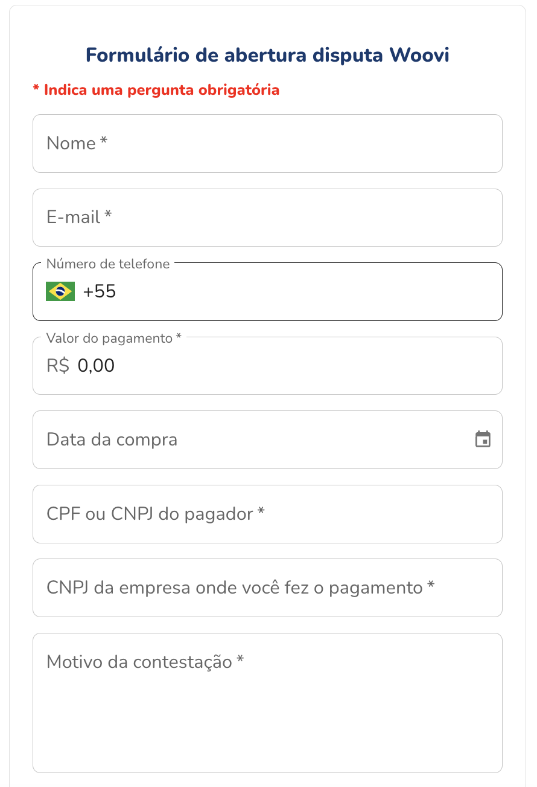
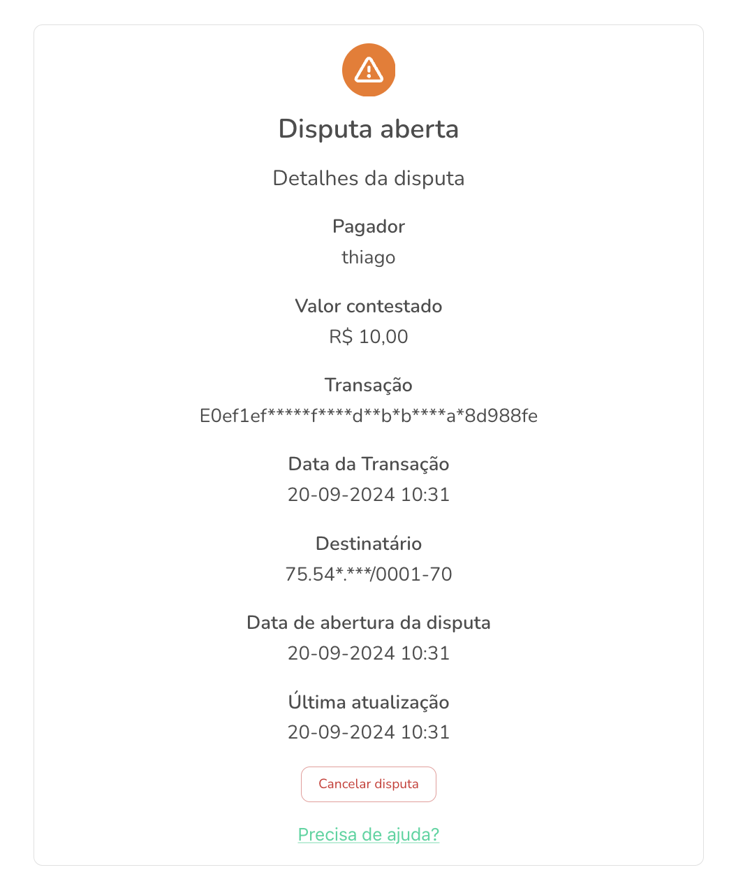

### Formulário

Você pode criar uma disputa de forma fácil atráves do link: https://woovi.com/disputa.

E então preencher os dados sobre a transação com suspeita de fraude fraudulenta

Após isso voce será redirecionado para uma página, onde será possível ver o status da disputa, esse link também será enviado para o email do pagador.

### Análise da disputa

E entao faremos uma análise da disputa, durante esse tempo o saldo relacionado a transação será bloqueado no saldo da empresa. Isso garante que o dinheiro possa ser devolvido, caso a disputa seja aceita.

### Envio de evidências e provas

Ambas as partes envolvidas na disputa - a empresa e o destinatário da transação - devem enviar evidências e provas para a equipe de suporte da OpenPix/Woovi. Isso inclui informações como descrições detalhadas da transação, conversas com o destinatário, comprovantes de pagamento, notas fiscais, entre outros.
