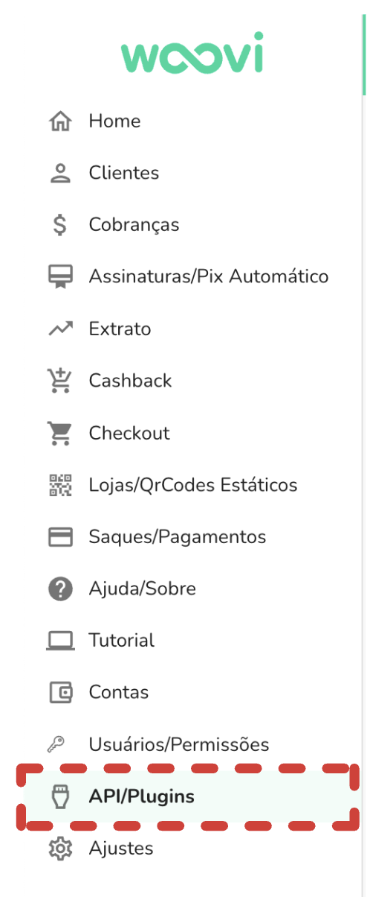
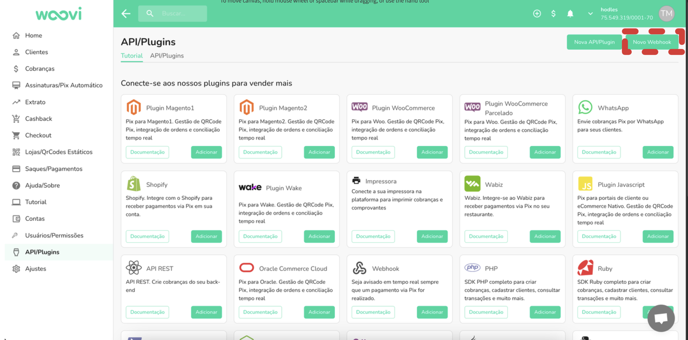
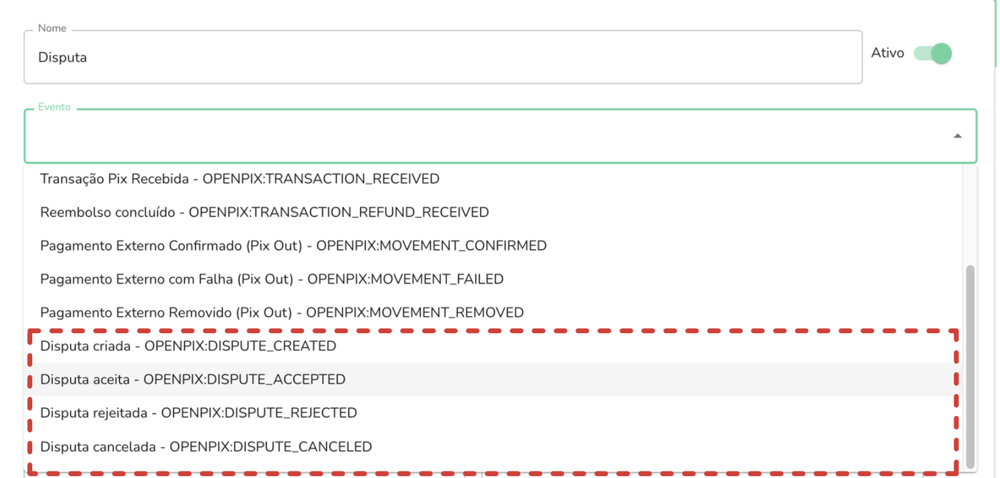

## Webhooks

Voce deve ir em API/Plugins e selecionar a opção `Novo webhook` para criar um webhook de disputa








Após selecionar a URl todo evento de disputa selecionado será enviado para essa URL

## Exemplo

Esse é o webhook que será enviado quando uma disputa for criada

```json
{
  "event": "OPENPIX:DISPUTE_CREATED",
  "dispute": {
    "status": "OPENED",
    "endToEndId": "E3524a995bbd54034b6d07c1c36014557",
    "name": "Seu jorge",
    "email": "test@email.com.br",
    "phoneNumber": "+5519989673846",
    "value": 1000,
    "disputeReason": "Golpe"
  }
}
```

Veja mais exemplos de webhooks [aqui](https://developers.openpix.com.br/docs/webhook/examples/webhook-created-payload)