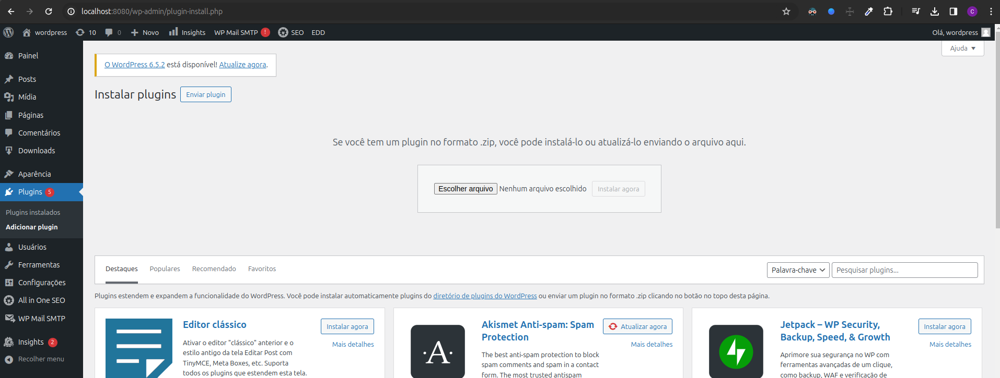
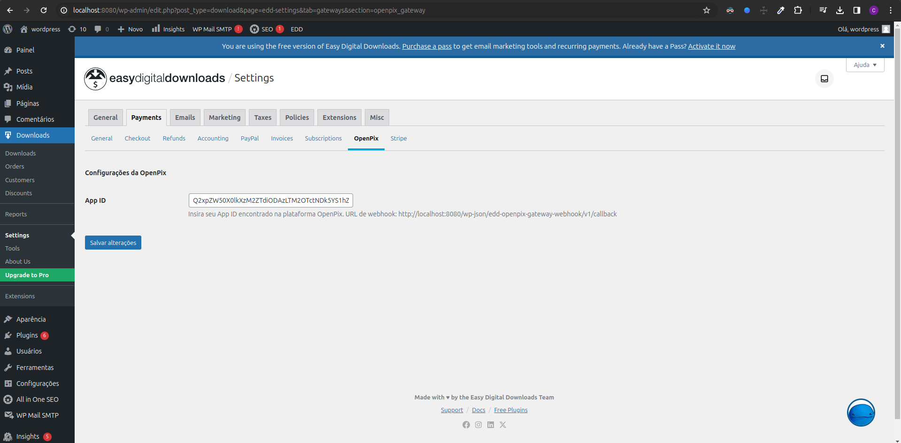
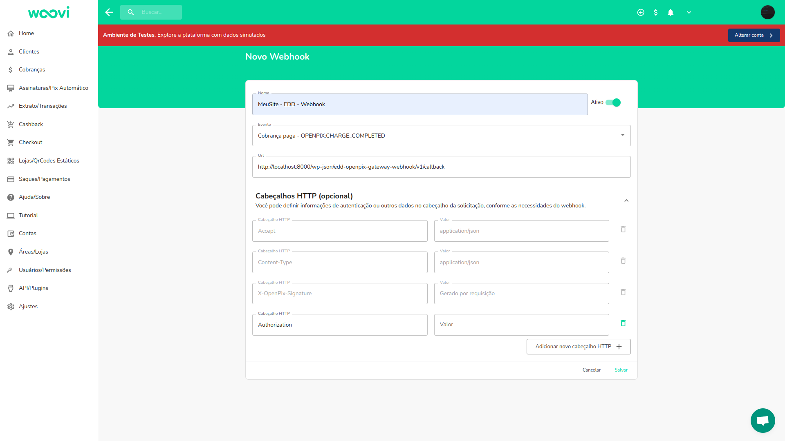
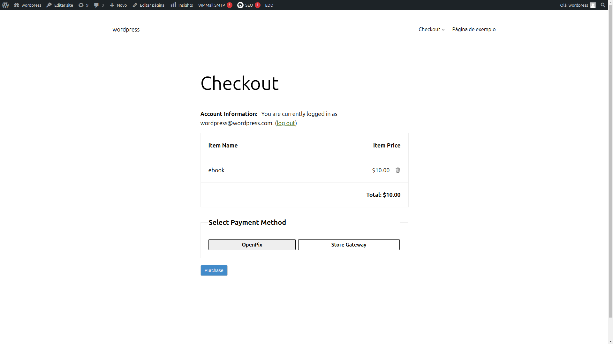
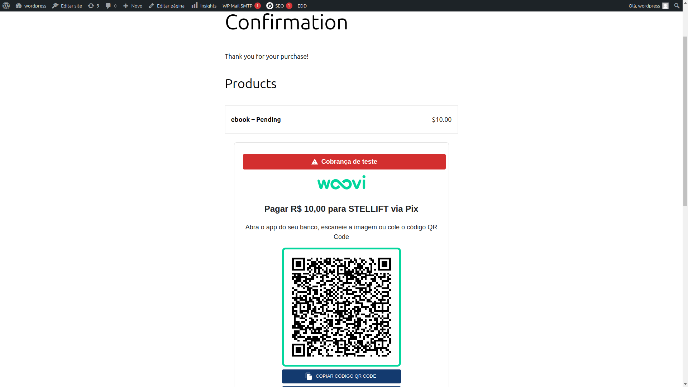
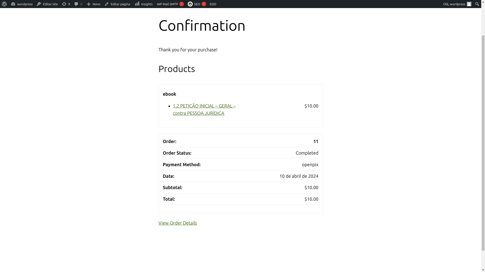

import Embed from 'react-embed';

Converta mais utilizando OpenPix na sua loja que utilize o plugin WordPress EasyDigitalDownloads.

## Como instalar

:::caution Pré-requisitos

- Instalação WordPress
- Plugin EasyDigitalDownloads
  :::

Acesse a página de [lançamentos](https://github.com/criskell/openpix-easy-digital-downloads/releases/latest) no GitHub e baixe o arquivo ZIP `openpix-easy-digital-downloads.zip` da última versão.

Em seu painel de administração, acesse a página de "Adicionar plugin" e clique em enviar plugin. Aperte o botão de escolher arquivo e selecione o arquivo ZIP:

Prossiga para a página de plugins em "Plugins instalados" e ative o plugin "OpenPix EasyDigitalDownloads"

## Como configurar

### Como criar a integração com API

Acesse a página de configurações do plugin EasyDigitalDownloads em Downloads > Settings (Configurações).

Vá na aba Pagamentos > OpenPix.

Nesta página é necessário informar seu [AppID](../plugin/app-id) da OpenPix. Veja [como criar uma nova integração do tipo plugin](../apis/api-getting-started).

Tendo seu App ID, cole ele no campo "App ID" e clique em Salvar alterações:

Veja que a URL de webhook está informada nesta página.

### Como criar o webhook

Para que os status dos pedidos sejam atualizados e o download seja liberado ao efetuar o pagamento PIX, é necessário configurar o webhook na plataforma da OpenPix.

Vá até a plataforma e acesse [API/Plugins > Novo Webhook](https://app.openpix.com/home/applications/webhook/create):

Informe o nome do webhook, selecione o evento "Cobrança paga - OPENPIX:CHARGE_COMPLETED" e insira a URL do seu webhook de acordo com o que foi informado na página de configurações do plugin seguindo o formato `https://<url-do-seu-site>/wp-json/edd-openpix-gateway-webhook/v1/callback`.

Salve o webhook e sua configuração estará pronta.

## Como fazer uma compra

Realize a compra de um produto e na página de checkout selecione o método de pagamento OpenPix:

Na tela de confirmação irá aparecer o QRCode da OpenPix:

Após efetuar o pagamento o download será liberado para o cliente:

## Vídeo demonstrativo

<Embed url="https://www.youtube.com/watch?v=fzhGMOcpcSI" />
