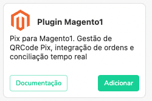
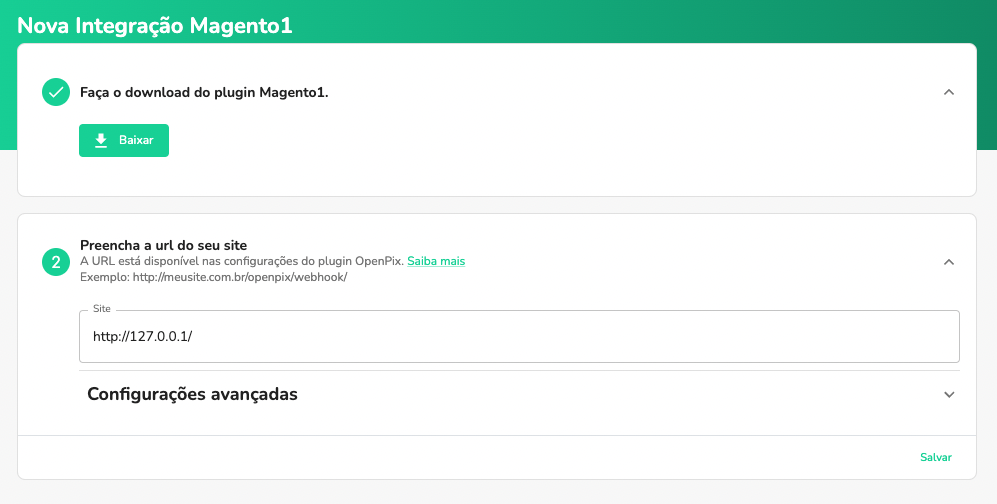
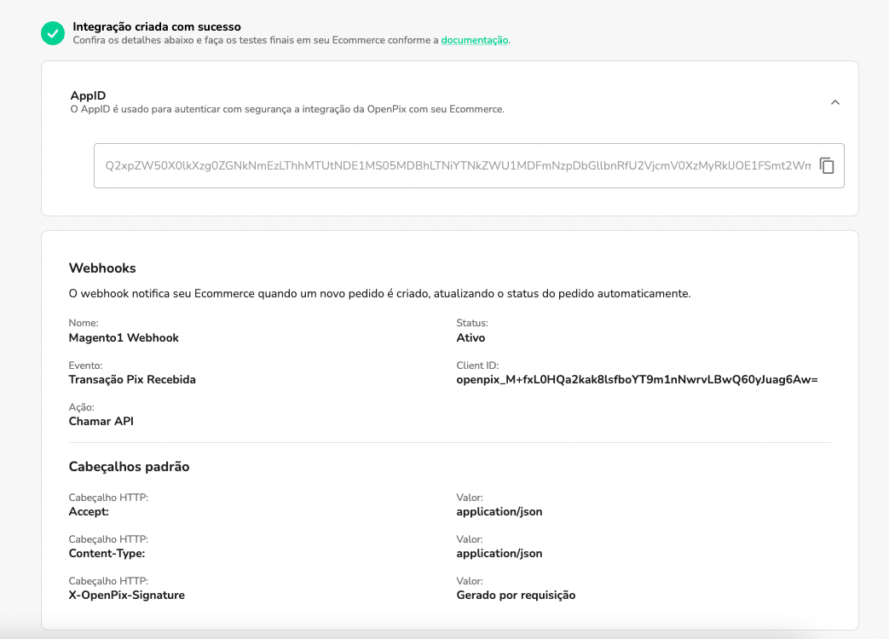
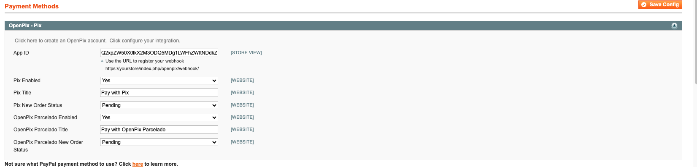

import Magento1Download from './__components__/magento1-download.mdx'

## Plugin Pix para Magento1

## Resumo

Este documento detalha passos necessários para conectar a sua plataforma de e-Commerce, baseada no Magento1, na OpenPix.

:::caution Atenção
Este documento espera que você já tenha um ambiente Magento1 ativo, e uma conta criada na OpenPix
:::

:::tip Dica
Para utilizar este tutorial é necessário ter uma versão acima da 1.4.0
:::

## Configurando o Plugin Magento1

### 1. Instale o Plugin OpenPix na sua instância Magento1

<Magento1Download/>

### 2. Acesse a configuração do Magento1

Entre na plataforma da OpenPix e [clique aqui](https://app.woovi.com/home/applications/magento1/add/oneclick) ou vá em `API/Plugins` > `Magento1` > `Adicionar`

### 2.1 Coloque o Link do seu site

Coloque a URL do seu site no campo

### 2.2 Clique em salvar

Clique no botão de salvar, e assim que tiver sucesso na sua integração você verá a seguinte mensagem:

## Configurações Avançadas

### Configurando CPF/CNPJ para o Customer (opcional)

Para salvar o cpf/cnpj do customer da order na sua cobrança OpenPix é necessário que seja ativado o campo `TaxVat` em sua loja Magento.

Entre em Magento1 Admin -> System > Configuration > Customers (side menu) > Customer Configuration

Em `Show Tax/VAT Number` selecione o valor required:

A partir de agora os clientes terão que preencher esse campo com o CPF ou CNPJ e o mesmo será usado para salvar o cliente na plataforma OpenPix.

### Giftback

Importante lembrete sobre a feature de Giftback para magento 1. O plugin suporta a mesma mas para que os clientes sejam contemplados apenas os que utilizarem CPF em suas compras serão inseridos na mesma.

> A versão minima do plugin Magento1 para consumir a feature giftback é a 1.2.5

### Crie o Webhook dentro da Plataforma OpenPix

Registre o Webhook que será responsável para atualizar sua loja Magento1 quando uma cobrança Pix for paga.

Para realizar o registro de um novo Webhook siga os passos abaixo:

- Va até a plataforma OpenPix e acesse: Admin -> API/Plugins -> Novo Webhook
- Utilize a mesma senha cadastrada em sua loja Magento1. O Webhook é necessário para atualizar o status dos Pedidos em tempo real quando a cobrança Pix é paga.
- A URL de Callback que deve ser utilizada no cadastro se encontra logo abaixo ao campo em que se registra a senha do webhook dentro da sua loja Magento1. O padrão é: `https://yourstore/openpix/webhook`

### Realizar Pedido com Pix

Escolha a opção de pagar o pedido usando Pix

Pague o Pix usando o app do seu banco.

Valide que o status do Pedido mudou após o pagamento

### Expiração

A OpenPix ira cuidar da expiração da cobrança Pix. Entretanto, é preciso que seja configurado em sua loja magento a expiração da order pois o mesmo cuidará de todo o processo.

Entretanto, o magento1 nao possui uma solução nativa para a mesma.

Indicamos que a expiração/cancelamento da order no magento1 seja feito utilizando uma lib terceira para ajuda.

Uma vez tendo a lib terceira indicamos que seja seguido uma configuração semelhante abaixo:

- tempo de expiração da cobrança OpenPix: 15 minutos
- coloque os mesmos 15 minutos dentro da sua loja Magento.

:::info
No magento você pode utilizar a lib abaixo ou alguma de sua preferência:

- <https://meetanshi.com/magento-auto-cancel-order.html>
:::

### Atualizando o plugin

Indicamos aos clientes OpenPix estar sempre atualizados com a última versão do plugin. Você pode identificar a mesma no step de instalação.

Caso seu plugin esteja desatualizado basta seguir os passos do mesmo step de instalação e atualizar os arquivos do plugin em seu ecommerce.

### Debug

Para debugar o plugin OpenPix temos dois arquivos e você encontra ambos dentro de `var/log`:

- `openpix_exception.log`: arquivo que concentra logs referentes ao processo de criação de um novo pedido Magento e consequentemente a charge no lado da OpenPix
- `openpix_webhooks.log`: arquivo que concentra logs referentes ao processo de pagamento de um pedido. O webhook é chamado quando identificamos um novo Pix em sua conta e o mesmo trata de atualizar o status da order em sua loja Magento.

## OpenPix Parcelado

### Configuração do OpenPix Parcelado

1. É necessário que você tenha o plugin do Magento1 configurado. [Siga a documentação](#configurando-o-plugin-magento1).

2. Vá até a seção de configurações do plugin Openpix.

3. O que você pode fazer?
 - Habilitar ou desativar o método de pagamento.
 - Customizar o título do método de pagamento OpenPix Parcelado dentro da sua loja.
 - Alterar qual deve ser o status inicial dos pedidos ao realizar uma compra.

### Configurações do CPF/CNPJ e do endereço

Para criar uma cobrança com OpenPix Parcelado, é necessário o cliente informar o seu CPF/CNPJ e os dados do endereço.

Para configurar o CPF/CNPJ, [veja a nossa documentação](#configurando-cpfcnpj-para-o-customer-opcional).

Em relação ao endereço, é necessário que ele tenha 4 linhas:
  - rua
  - número
  - complemento
  - bairro

Para configurar a quantidade de linhas em cada endereço, acesse Magento1 Admin -> System > Configuration > Customers:

Na seção `Name and Address options`, altere o campo _Number of Lines in a Street Address_ (Número de linhas em um endereço) para o valor 4:

### Como criar um pedido com OpenPix Parcelado

Escolha a opção de pagar o pedido usando Pix parcelado:

Pague o Pix usando o app do seu banco.

Ao selecionar pagamento no Pix à vista pague o QR Code.

Ao selecionar Pix + cartão de crédito insira os dados do cartão, pague o pix e o valor será capturado no cartão.

Valide que o status do Pedido mudou após o pagamento.

### Visualizando um pedido com OpenPix Parcelado

Seu cliente poderá visualizar a cobrança Pix dentro do detalhes do pedido.

Basta acessar a página de detalhes do pedido e visualizar em _Payment method_ (método de pagamento).

