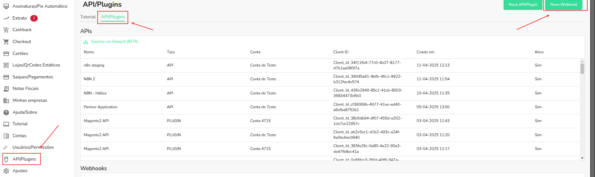
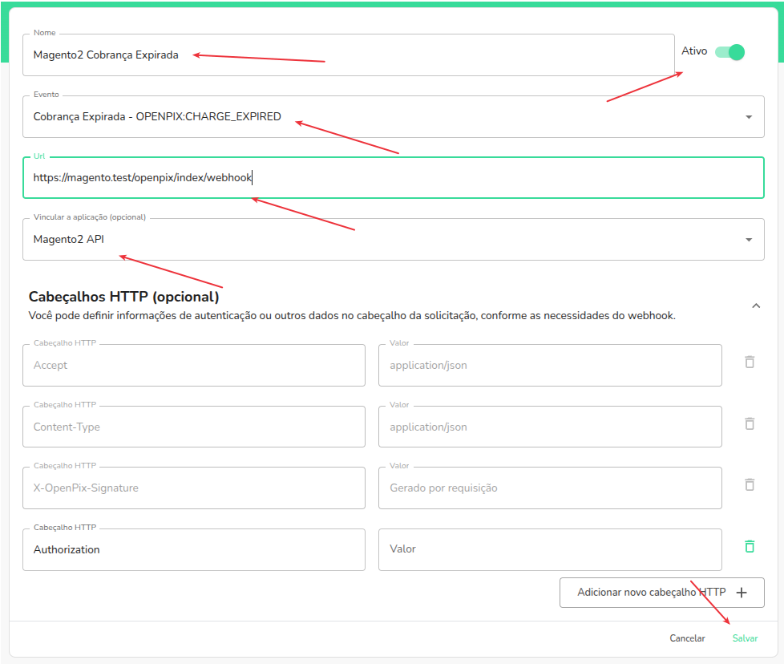
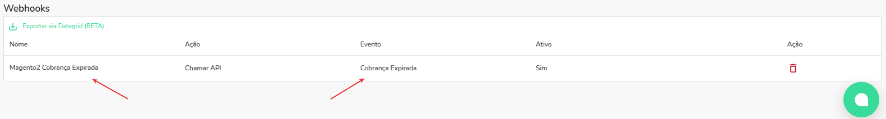

### Plugin Pix para Magento2

## Resumo

Este documento detalha passos necessários para criar um webhook do tipo `CHARGE_EXPIRED` para sua integração magento2 começar a escutar por cobranças expiradas.

:::caution Atenção
Este documento espera que você já tenha um ambiente Magento2 ativo,uma conta criada na OpenPix, e já possua uma inegração magento2 com um webhook ativo do `CHARGE_PAID`
:::

:::tip Dica
Para utilizar este tutorial é necessário ter uma versão acima da 2.3.0
:::

## Criando um novo webhook

1) Na lateral esquerda, vá em "API/Plugins" -> e clique no botão "Novo Webhook"

2) Preencha os campos com as informações necessárias, e clique em salvar

- Nome: com o nome que você gostaria de dar para seu Webhook
- Mantenha o webhoook com status ativo
- Evento: com tipo do evento do webhook novo que será "Cobrança Expirada"
- URL: use o mesmo endereço de webhook aplicado no webhook de "Cobrança Paga", em nosso exemplo estou usando https://magento.test/openpix/index/webhook
- Vincular a uma Aplicação: localize uma aplicação com o nome "Magento2 API", selecione-a para que todas as cobranças expiradas que foram criadas com o `appID` dessa aplicação sejam enviadas para a URL de webhook do magento2

:::tip Dica
É importante que você substitua `magento.test` pelo dominio que seu seu ecommerce está implantado
:::

3) Após salvar, você poderá ver seu novo webhook criado na lista de webhooks

