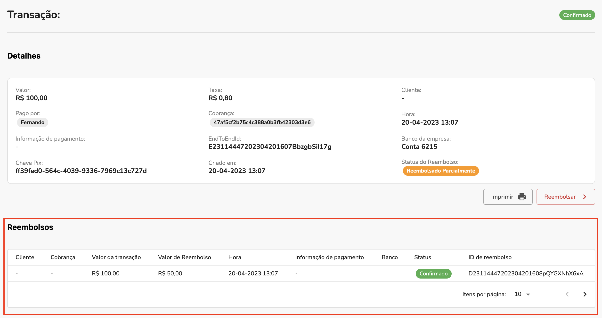

Nessa documentação falaremos como você pode realizar um reembolso 

## 1. Abra a lista de pedidos

No menu lateral, clique em **Sales** > **Orders**:

## 2. Abra os detalhes de um pedido

Selecione uma order já processada pelo Plugin e clique no botão **View**:

## 3. Abra a fatura do pedido

No menu lateral do pedido, selecione **Invoices** e abra a fatura clicando no botão **View**:

## 4. Crie uma nota de crédito

Na parte superior da fatura, clique em **Credit memo** para criar uma nova nota de crédito:

## 5. Preencha as informações do reembolso

Nesta parte você poderá ajustar como será feito o reembolso:

- No campo **Qty to refund** defina a quantidade de items que serão reembolsados. Ao inserir a quantidade, clique em **Update Qty's** para atualizar.
- Selecione **Return to stock** se deseja que os items voltem ao estoque.
- Em **Refund shipping** você poderá definir o valor da taxa de entrega que será reembolsado. O padrão é a taxa total.

Ao completar as informações, clique no botão **Refund** para realizar o reembolso.

## 6. Ver reembolsos da cobrança dentro da plataforma

Nos detalhes da cobrança, abra a aba **Transações** e selecione a transação de pagamento da cobrança:

Nos detalhes da transação você poderá visualizar todos os reembolsos:

