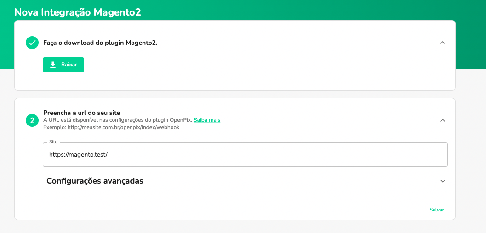
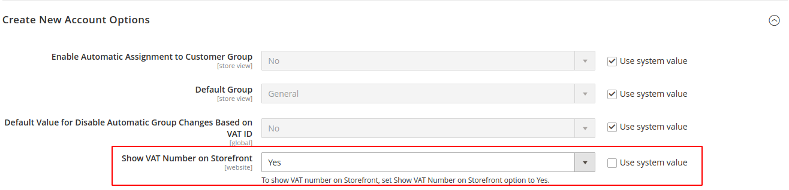
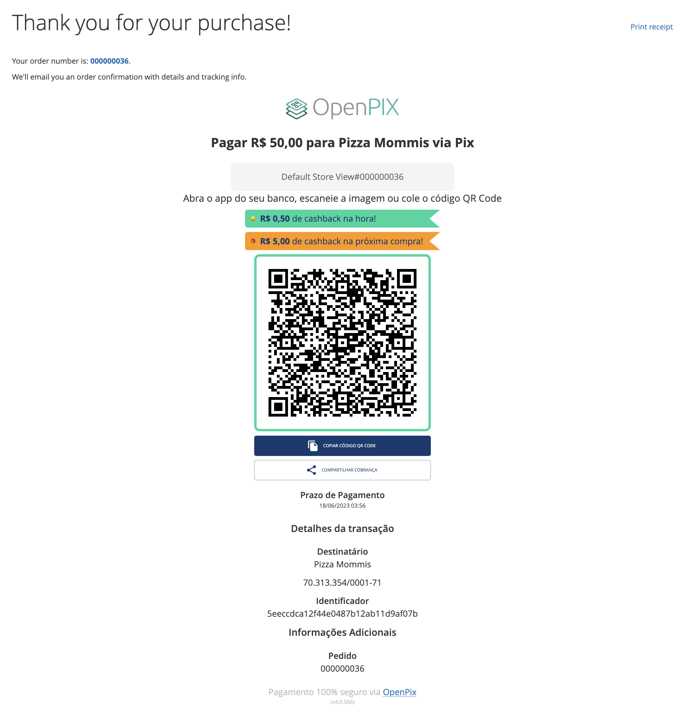

import Magento2Download from './__components__/magento2-install.mdx'

### Plugin Pix para Magento2

## Resumo

Este documento detalha passos necessários para conectar a sua plataforma de e-Commerce, baseada no Magento2, na OpenPix.

:::caution Atenção
Este documento espera que você já tenha um ambiente Magento2 ativo, e uma conta criada na OpenPix
:::

:::tip Dica
Para utilizar este tutorial é necessário ter uma versão acima da 2.3.0
:::

## Configurando o Plugin Magento2

### 1. Instale o Plugin OpenPix na sua instância Magento2

<Magento2Download />

### 2. Autenticação

Após a instalação, é necessário autenticar o plugin com a nossa plataforma. Isso pode ser realizado por meio do nosso botão de um clique ou ao lidar com a URL do webhook.

### 2.1. Autenticação com um clique (preferencialmente)

Na página de configurações do plugin em `Vendas > Formas de pagamento` (`Sales > Payment Methods`), clique no botão "Conectar a extensão" (_Connect the extension_):

Ao pressionar este botão, uma nova página será aberta em nossa plataforma, onde você poderá configurar rapidamente uma nova integração com o Magento 2.

Na plataforma, a URL do seu e-commerce será configurada automaticamente; você só precisará clicar em "Salvar":

Ao salvar, será possível criar novos pedidos com Pix e OpenPix Parcelado, e o webhook já estará configurado para atualizar o status de seus pedidos em tempo real.

### 2.2. Autenticação com a URL do e-commerce

Outra alternativa para autenticar o seu plugin seria acessar diretamente a plataforma e inserir a URL do seu e-commerce.

Entre na plataforma da OpenPix e [clique aqui](https://app.woovi.com/home/applications/magento2/add/oneclick) ou vá em `API/Plugins` > `Magento2` > `Adicionar`.

Coloque a URL do seu site no campo "Site":

Clique no botão de salvar, e assim que tiver sucesso na sua integração você verá a seguinte mensagem:

## Configurações Avançadas

### 1. Configurando CPF/CNPJ para o Customer (opcional)

Para salvar o cpf/cnpj do customer da order na sua cobrança OpenPix é necessário que seja ativado o campo `TaxVat` em sua loja Magento.

__Obs: Caso você siga sem a configuração deste campo suas cobranças serão salvas sem o cliente da mesma.__

Entre em Magento2 Admin -> Stores > Configuration -> Customers -> Customer Configuration

Primeiro ative o campo `Show VAT Number on Storefront` em `Create New Account Options`:

Em seguida em `Name and Address Options` ative o campo `Show Tax/VAT Number` selecionando `Required`:

A partir de agora os clientes terão que preencher esse campo com o CPF ou CNPJ e o mesmo será usado para salvar o cliente na plataforma OpenPix.

### 2. Crie o Webhook dentro da Plataforma OpenPix

Ao configurar a Store volte para a Plataforma OpenPix e registre o Webhook que será responsável para atualizar sua Store Magento2 quando uma cobrança Pix for paga.

Para realizar o registro de um novo Webhook siga os passos abaixo:

- Va até a plataforma OpenPix e acesse: Admin -> API/Plugins -> Novo Webhook
- Utilize a mesma senha cadastrada em sua store Magento2. O Webhook é necessário para atualizar o status dos Pedidos em tempo real quando a cobrança Pix é paga.
- A URL de Callback que deve ser utilizada no cadastro se encontra logo abaixo ao campo em que se registra a senha do webhook dentro da sua Store Magento2. O padrão é: <https://youstore.com.br/openpix/index/webhook>

### 3. Realizar Pedido com Pix

Escolha a opção de pagar o pedido usando Pix

Pague o Pix usando o app do seu banco.

Valide que o status do Pedido mudou após o pagamento

### 4. Visualizar Pedido com Pix

Seu cliente poderá visualizar o pedido realizado via Pix dentro do detalhes do pedido. Basta clicar no botão que irá aparecer dentro da pagina de detalhe do pedido "Clique aqui para ver seu QRCode"

### 5. Expiração do pedido Magento2

A OpenPix ira cuidar da expiração da cobrança Pix. Entretanto, é preciso que seja configurado em sua loja magento a expiração da order pois o mesmo cuidará de todo o processo.

Indicamos que a expiração/cancelamento da order no magento possua um tempo semelhante ao tempo configurado na OpenPix. Exemplo:

- tempo de expiração da cobrança OpenPix: 15 minutos
- coloque os mesmos 15 minutos dentro da sua loja Magento.

:::info
No magento você pode utilizar o lifetime order seguindo a doc abaixo:

- <https://docs.magento.com/user-guide/v2.3/sales/order-pending-payment-lifetime.html>
:::

### 6. Atualizando o plugin do Magento2

Indicamos aos clientes OpenPix estar sempre atualizados com a última versão do plugin. Você pode identificar a mesma no step de instalação.

Caso seu plugin esteja desatualizado basta seguir os passos do mesmo step de instalação e atualizar os arquivos do plugin em seu ecommerce.

### 7. Debug logs Magento2

Para debugar o plugin OpenPix temos o arquivo de log e você encontra dentro de `var/log`:

- `openpix.log`: arquivo que concentra logs referentes ao processo de criação de um novo pedido Magento e consequentemente a charge no lado da OpenPix e o processo de atualização da Order quando paga.
