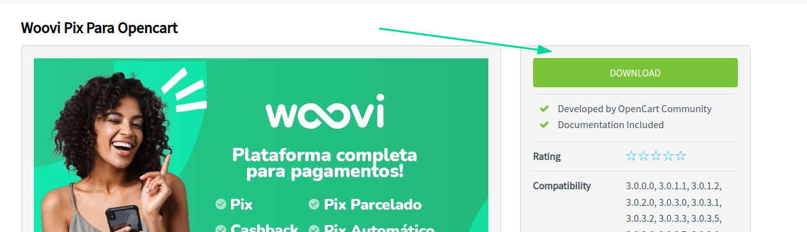
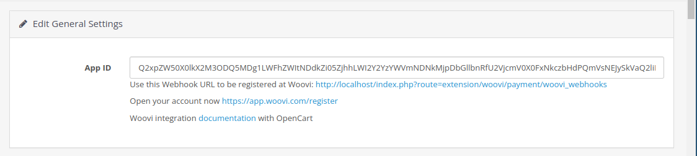

A Woovi disponibiliza uma extensão para o OpenCart 3 que permite a integração do Pix em seu checkout, com suporte à atualização automática do status de seus pedidos e logs.

A plataforma efetua em tempo real a conciliação entre seu Banco e sua loja. Após conectar a sua conta na Woovi é possível cobrar clientes em tempo real com QrCodes Pix, enviar links de pagamento e gerenciar cobranças incluindo extornos.

Veja como é fácil aumentar suas vendas integrando o Pix em sua loja:

## Pré-requisitos

:::caution Preste atenção
- Uma loja com o OpenCart 3 instalado.
:::

## Instalação

Antes de instalar a extensão, é importante garantir que ela esteja disponível na sua loja. Isso pode ser feito de duas maneiras: através do marketplace ou fazendo o upload do arquivo da extensão.

### Marketplace

A maneira mais conveniente de baixar a extensão em sua loja é acessando o [marketplace oficial](https://www.opencart.com/index.php?route=marketplace/extension/info&extension_id=45252&filter_search=woovi) do OpenCart. Lá, você encontrará a extensão pronta para ser baixada e instalada com facilidade.

Veja como você pode baixar utilizando o marketplace:

#### 1) Acesse o painel de administração

Para acessar o marketplace e carregar a extensão na sua loja, siga estes passos simples:

1. No painel de administração da sua loja, localize a barra lateral e clique na opção _Extensions_.

2. Em seguida, no submenu que é exibido, clique na opção _Marketplace_:

   

Ao seguir essas etapas, você será direcionado para o marketplace oficial do OpenCart.

#### 2) Pesquise a extensão

Ao acessar o marketplace, pesquise pela extensão _woovi_:

#### 3) Carregue a extensão

Desça um pouco a página até localizar a seção de _Download_ e identifique a versão mais recente da extensão em _Available installs_. Ao lado desta versão, haverá um botão marcado como _Install_. Clique nesse botão para carregar a extensão.

### Upload do arquivo

Além do marketplace, você também tem a opção de carregar manualmente o arquivo da extensão. Para isso, acesse a página de downloads no [marketplace oficial](https://www.opencart.com/index.php?route=marketplace/extension/info&extension_id=45252&filter_search=woovi) e baixe primeiramente o arquivo mais recente da extensão compatível com OpenCart 3:

:::caution Preste atenção
Assegure-se de que o nome do arquivo da extensão seja _woovi.ocmod.zip_ ao fazer o upload, porque o OpenCart considera o nome do arquivo como um "identificador" da extensão, que precisa ser _woovi_.
:::caution

Após isso, acesse a página do instalador de extensões, localizado na opção _Installer_ no menu _Extensions_ do OpenCart:

Ao acessar a página do instalador de extensões, localize o botão de _Upload_ azul:

Clique nesse botão e selecione o arquivo da extensão que deseja carregar.

### Instalando o método de pagamento Woovi Pix

Até o momento, você conseguiu instalar os arquivos da extensão do seu site. Agora, é necessário instalar o método de pagamento _Woovi Pix_ em sua loja.

Para fazer isso, acesse a página de extensões através da sub-opção _Extensions_ dentro da opção _Extensions_ localizada na barra lateral do painel de administração:

Na página de extensões, utilize a opção de filtro para selecionar extensões do tipo _Payment_:

Role um pouco para baixo na página e clique no botão verde com o símbolo "+" na extensão _Woovi Pix_ para que o método de pagamento seja instalado com sucesso:

Após isso, clique no botão azul com o ícone de um lápis para acessar a página de configuração da extensão.

### Instalando o método de pagamento Woovi Parcelado

Para instalar o método de pagamento Woovi Parcelado, siga os mesmos passos utilizados na instalação do Woovi Pix, porém aplicados ao Woovi Parcelado:

## Configuração dos métodos de pagamento

A nossa extensão oferece dois métodos de pagamento para a sua loja: Woovi Pix e Woovi Parcelado.

Ambos os métodos de pagamento possuem as mesmas possibilidades de configuração.

Após acessar a página de configurações da extensão, é necessário ativar o método de pagamento desejado no checkout, selecionando a opção "Enabled" (habilitado) no campo "Status" da seção "Edit Pix Settings" (editar configurações do Pix) ou "Edit Woovi Parcelado" (editar configurações do Woovi Parcelado):

Tendo habilitado o botão Status, o método de pagamento desejado deverá aparecer como método de pagamento no checkout.

## Autenticação

É necessário integrar a extensão com a plataforma Woovi e isto pode ser feito adicionando a url de _webhook_ na plataforma ou utilizando o botão de um clique.

### 1 clique

Na página de configurações, clique no botão "Conectar a extensão" (_Connect the extension_):

Ao pressionar esse botão, você será redirecionado para nossa plataforma, onde poderá configurar rapidamente uma nova integração com o OpenCart3.

Na plataforma, a URL do seu e-commerce será configurada automaticamente; você só precisará clicar em "Salvar":

Salvando a integração, seu _App ID_ deve estar em seu painel:

### URL de webhook

Para obter essa URL, vá até a página de configurações e copie ela:

Entre na plataforma da Woovi e [clique aqui](https://app.woovi.com/home/applications/opencart/add) ou vá em `API/Plugins` > `OpenCart` > `Adicionar`:

Cole a URL de webhook no campo _Preencha a url do seu site_ e pressione o botão _Salvar_:

Após isto, verifique se o _AppID_, um código que identifica sua loja, se encontra na página de configurações:

Pronto, agora vamos aprender como utilizar o Pix ou Woovi Parcelado no seu checkout.

### Modo de manutenção

Para criar novas integrações, é necessário desativar o modo de manutenção de sua loja, pois, caso contrário, nossa plataforma não poderá se comunicar com ela.

Para desativar o modo de manutenção, acesse a seção "Servidor" (_Server_) nas configurações da sua loja e desmarque a opção "Modo de manutenção" (_Maintenance mode_):

Acesse as configurações da sua loja na opção "Configurações" (_Settings_) dentro de "Sistema" (_System_) através da barra lateral do painel de administração.

## Como utilizar o Pix ou Woovi Parcelado no checkout

Ao realizar uma compra em sua loja OpenCart, o cliente será redirecionado para a página de checkout.

Nesta página, o cliente deve inserir informações como CPF/CNPJ e o endereço dele, que será utilizado para a criação da cobrança.

Após isso, o cliente deve selecionar o método de pagamento desejado: Pix ou Woovi Parcelado.

Ao confirmar a compra utilizando o método de pagamento _Pix_, o QR Code do Pix será exibido na página de sucesso, pronto para ser escaneado pelo seu cliente:

Ao escolher o Woovi Parcelado como método de pagamento, um menu será exibido para possibilitar o pagamento por meio de Pix e/ou cartão de crédito:

## Campos adicionais

A extensão necessita dos seguintes campos adicionais:

- CPF/CNPJ para ambos métodos de pagamento.
- Rua, número, complemento e bairro para o método de pagamento Woovi Parcelado.

Cada campo adicional é obtido de duas maneiras:

- Através dos _custom fields_ (campos personalizados) do OpenCart.
- Ou diretamente durante o checkout.

Durante a instalação, a extensão configura automaticamente os custom fields necessários para que os clientes possam inserir seu CPF/CNPJ e endereço durante o checkout:

Caso deseje, é possível alterar o custom field utilizado ou até mesmo desativar essa configuração no painel de administração, selecionando a opção _None_ (Nenhum) em _Edit custom fields settings_:

Se a extensão não puder encontrar um custom field, no checkout irá aparecer diretamente campos adicionais para que o cliente possa inserir seu CPF/CNPJ ou endereço, logo acima do botão de confirmação do pedido:

## Como configurar os status dos pedidos

As configurações dos status de cada pedido podem ser encontradas na página de configurações:

### Quando um pedido for criado

Por padrão, quando a cobrança da Woovi é criada, o status do pedido é alterado para _Pending_ (pendente). No entanto, é possível configurá-lo para qualquer status desejado:

Veja um exemplo de pedido que acabou de ser criado:

### Quando o pedido for pago

Por padrão, quando a cobrança da Woovi é paga, o status do pedido é alterado para _Processing_ (processando). No entanto, é possível configurá-lo para qualquer status desejado:

Veja um exemplo de pedido que acabou de ser pago:

## Como configurar o título do método de pagamento

Para modificar o título a ser empregado para o método de pagamento via Pix ou Woovi Parcelado durante o processo de checkout, dirija-se à página de configurações da extensão.

Configure o título do método de pagamento no campo _Payment method title_ (Título do Método de Pagamento) na seção de configurações do Pix ou Woovi Parcelado:

Observe o novo título do método de pagamento durante o processo de checkout.

## Como visualizar os logs da sua loja

Você pode acessar os logs da sua loja acessando a página localizada na barra lateral do seu painel de administração, em _System_ (Sistema) > _Maintenance_ (Manutenção) > _Error logs_ (Registro de erros):

Nessa página de logs, deve aparecer os erros registrados da sua loja:

