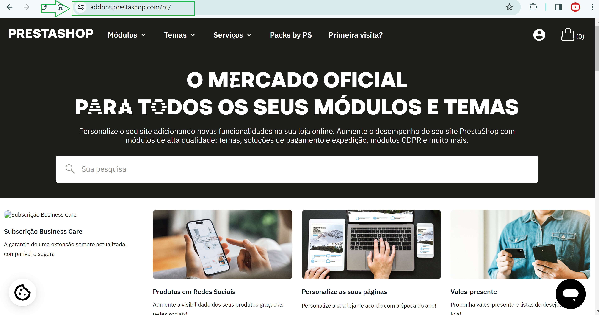
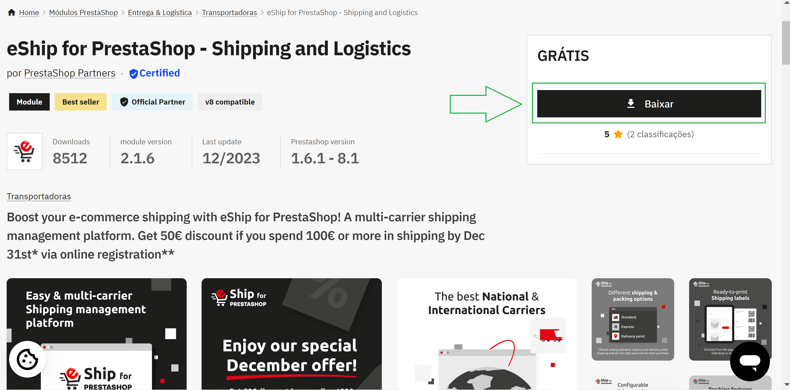
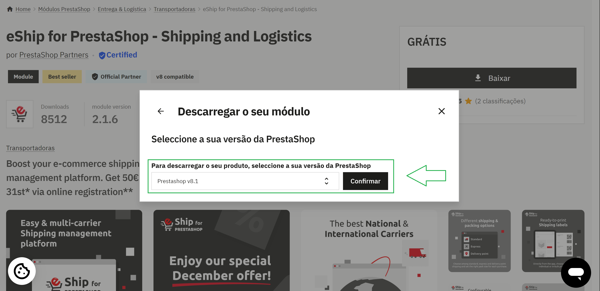
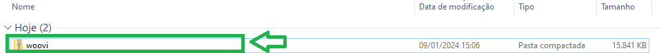
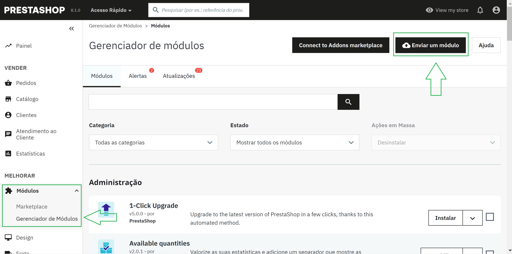
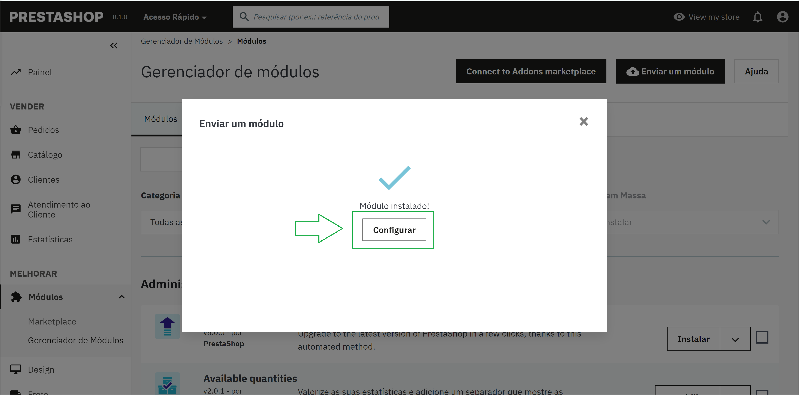

# Integrando a OpenPix na Prestashop

Este documento detalha os passos necessários para conectar sua plataforma de e-commernce, baseado na Prestashop, na OpenPix. 

## 1. Instale a OpenPix na sua loja Prestashop

Acesse o link abaixo:

[OpenPix para Prestashop](https://addons.prestashop.com/link_da_openpix_aqui)

## 2. Faça o download do plugin

## 3. Siga todos os passos para download até o final

## 4. Encontre o arquivo .zip salvo no computador

## 5. Entre como administrador no Back-Office do seu e-commerce

Em seguida, selecione o menu **Módulos > Gerenciador de módulos > Enviar um módulo**.

Siga as instruções da tela que aparecerá. 

## 6. Depois da instalação completa, clique em "Configurar"

## 7. Para os próximos passos, seguem as documentações abaixo

- (etapa obrigatória) Como configurar seu [AppID](./plugin-set-up.md)
- Como configurar seu [Webhook](./webhook-set-up.md)
