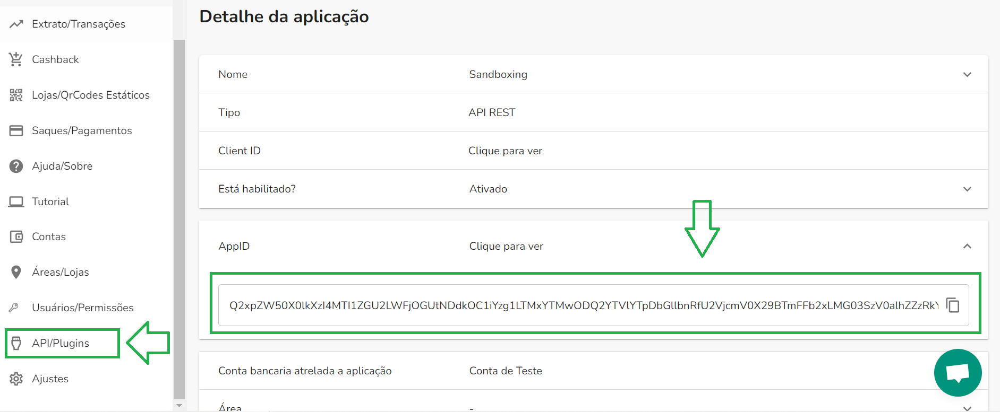
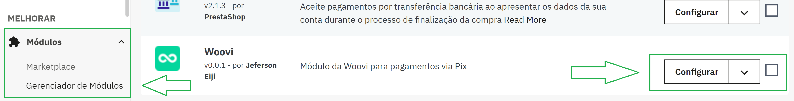
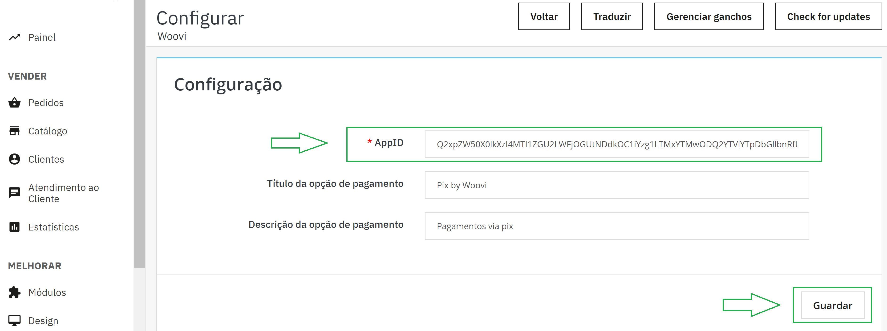

# Como configurar seu AppID na Prestashop

Este documento detalha os passos necessários para conectar sua plataforma Prestashop na OpenPix. 

## 1. Copie seu AppID na plataforma da Woovi

Para encontrá-lo, acesse o seguinte menu **API/Plugins**.

Caso ele ainda não exista, clique neste botão **Nova API/Plugin > Tipo API REST > Salvar > AppID**.

## 2. Após a instalação do módulo, selecione o botão "Configurar"

## 3. No campo de texto "AppID OpenPix" digite o AppID copiado

Em seguida, aperte o botão "Guardar". Pronto, AppID configurado.

