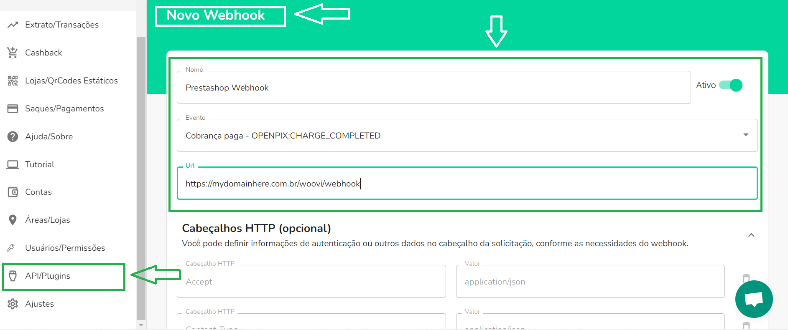
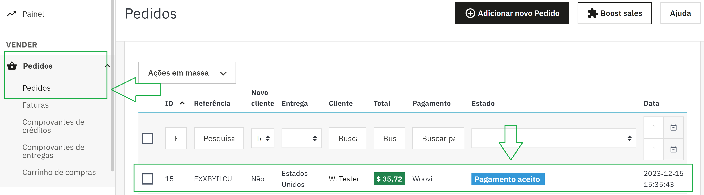

# Configuração do Webhook

Esta seção demonstra como configurar webhooks com seu e-commerce Prestashop. 

## 1. Registre o link do seu webhook na Woovi

Para encontrá-lo, acesso o seguinte menu **API/Plugins**.

Na sequência clique no botão **Novo Webhook**.

A tela abaixo deverá aparecer. 

O link a ser cadastrado será parecido com esse: 
```
https://seuwebsiteaqui.com.br/woovi/webhook
```

Ele deverá ser digitado no campo  **URL**:



Pronto! Webhook cadastrado.

## 2. Agora, os pedidos já podem ser atualizados pela Woovi

Depois da confirmação do pagamento, o status do pedido será alterado para **Pagamento Aceito**.

