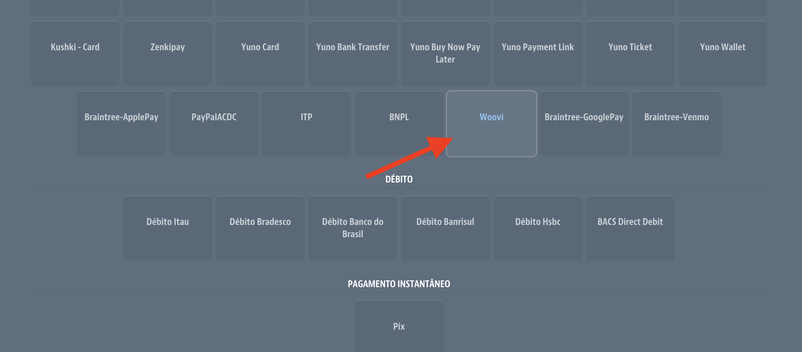

:::caution Atenção
Este documento espera que você já tenha um ambiente VTEX, e uma conta criada na OpenPix
:::

## Plugin Pix para VTEX

### 1. Acesse a configuração da VTEX

Entre na plataforma da OpenPix e [clique aqui](https://app.woovi.com/home/applications/vtex/add) ou vá em `API/Plugins` > `Plugin VTEX` > `Adicionar`

### 2.2. Clique em salvar

### 2.3. Copie o App ID gerado

### 3. Acesse as configurações de pagamento

Acesse as configurações de pagamento no ADMIN da seu ecommerce VTEX.

### 3.1 Acesse a aba `Afiliações de Gateways`

Nesta aba clique no botão `+`.

### 3.2 Selecione o gateway `WooviConnector`

### 4. Configure o gateway

Cole seu `Application Key`, `Application Token` e o `App ID` que você já havia copiado, e clique em `Salvar`.

Caso você não tenha o `Application Key` e `Application Token`, você pode seguir a [documentação](https://help.vtex.com/pt/tutorial/chaves-de-aplicacao--2iffYzlvvz4BDMr6WGUtet) oficial da VTEX para fazer a geração.

### 5. Adicionando `Condição de pagamento` da Woovi

Logo depois de adicionar a nova afiliação de gateway, vá na aba `Condições de pagamentos` e clique em `+`.

### 5.1 Selecione a condição de pagamento `Woovi`

### 5.2 Configure a condição de pagamento

Selecione o gateway da Woovi que você acabou de criar, logo em seguida clique em `Salvar`.

Pronto, agora o método de pagamento da Woovi já aparecerá no seu checkout.
