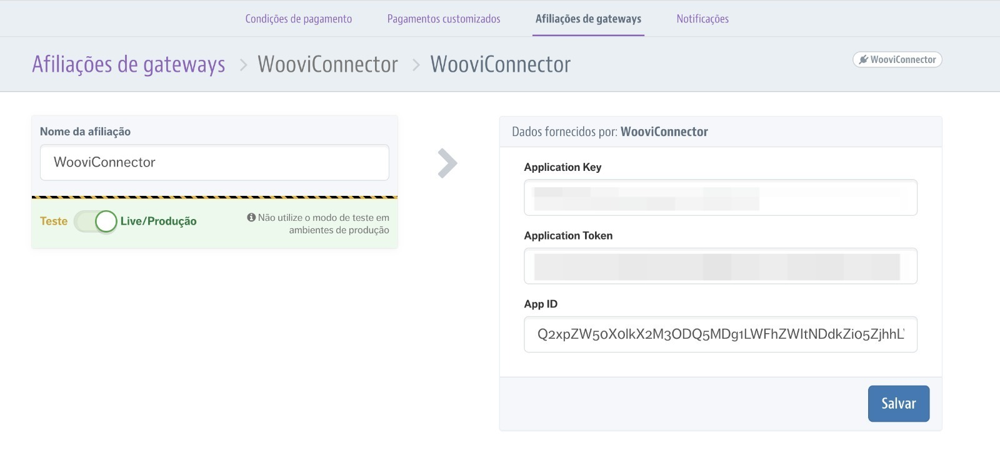

:::caution Atenção
Este documento espera que você já tenha um ambiente VTEX, e uma conta criada na OpenPix
:::

## Plugin Pix para VTEX

### 1. Acesse a configuração da VTEX

Entre na plataforma da OpenPix e [clique aqui](https://app.woovi.com/home/applications/vtex/add) ou vá em `API/Plugins` > `Plugin VTEX` > `Adicionar`

### 2.2. Clique em salvar

### 2.3. Copie o App ID gerado

### 3. Acesse as configurações de pagamento

Acesse as configurações de pagamento no ADMIN da seu ecommerce VTEX.

### 3.1 Acesse a aba `Afiliações de Gateways`

Nesta aba clique no botão `+`.

### 3.2 Selecione o conector `Woovi`

### 4. Configure o connector

Cole o App ID que você já havia copiado, e clique em Salvar

Agora basta você configurar sua `Condição de pagamento` no ADMIN do seu ecommerce VTEX, e pronto.
