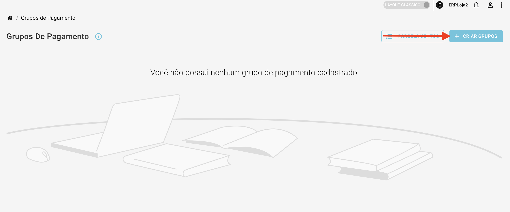
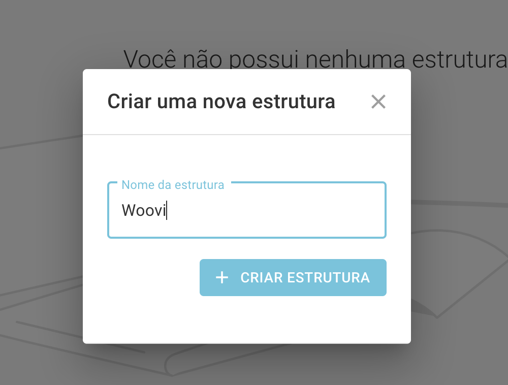

:::caution Atenção
Este documento espera que você já tenha um ambiente Wake, e uma conta criada na OpenPix
:::

## Plugin Pix para Wake

### 1. Acesse a configuração da Wake

Entre na plataforma da OpenPix e [clique aqui](https://app.woovi.com/home/applications/wake/add) ou vá em `API/Plugins` > `Plugin Wake` > `Adicionar`

### 2. Acesse a configuração da Wake na OpenPix

### 2.1. Copie o App ID gerado

### 3. Acesse o dashboard do seu ADMIN dentro da Wake

### 4. Vá até `Pagamentos > Conectores de Pagamento F-Gateway`

### 5. Procure a opção Custom

### 6. Clique em `Adicionar configuração`

### 7. Preencha com as seguintes informações

### 8. Adicione a configuração

### 9. Vá para a configuração que você acabou de criar e preencha as seguintes informações:

- Configuração do Endpoint de Pagamento: https://api.woovi.com/api/wake
- Versão: Completa
- Headers:
  - paymentType: pix
  - appID: Coloque o AppID que você gerou na etapa [2.1](#21-copie-o-app-id-gerado)

### 10. Vá até `Pagamentos > Grupos e Parcelamentos`

### 11. Crie um novo grupo

### 12. Preencha com as seguintes informações

### 13. Após salvar, volte em `Pagamentos > Grupos e Parcelamentos`

### 14. Vincule a forma de pagamento que você criou anteriormente

### 15. Vá `Pagamentos > Estrutura de pagamentos`

### 16. Crie uma nova estrutura

### 17. Configure o grupo de pagamento que você acabou de criar nessa nova estrutura

### 18. Salve a estrutura

Pronto, o método de pagamento Pix da OpenPix está configurado na sua Wake!
