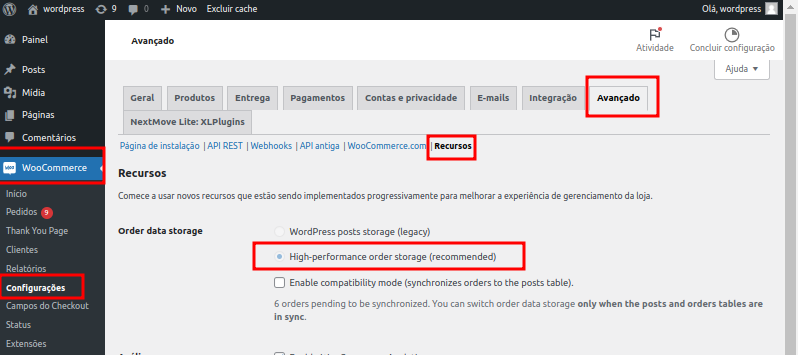

## 1. Customer Salvar CPF/CNPJ

Para salvar o customer da order na sua cobrança OpenPix é necessário que seja ativado um plugin que possibilite que o cliente informe o CPF/CNPJ no momento da compra.

Indicamos o uso do plugin [woocommerce-extra-checkout-fields-for-brazil](https://wordpress.org/plugins/woocommerce-extra-checkout-fields-for-brazil/) para este caso. Uma vez ativado o plugin passará a salvar os clientes que informarem o CPF/CNPJ no momento da compra.

**Obs: O uso não é obrigatório. Caso você siga sem a configuração do mesmo, suas cobranças serão salvas sem o cliente da mesma.**

## 2. Realizar Pedido com Pix no WooCommerce

Escolha a opção de pagar o pedido usando Pix

Pague o Pix usando o app do seu banco.

Valide que o status do Pedido mudou após o pagamento

## 3. Como configurar a expiração do pedido Woocommerce

A cobrança da Openpix tem um valor de expiração padrão que equivale a 1 dia, já a configuração de expiração padrão do Woocommerce é de 60 minutos

Para saber mais sobre Como configurar o tempo de expiração da OpenPix Charge [Clique aqui](/docs/flows/flow-edit-default-expiration).

Para alterar e igualar esse tempo de expiração para a OpenPix e para Woocommerce você deve procurar no menu admin:

`Woocommerce` > `Settings` > `Products` > `Inventory`

Por último, alterar o valor do Hold stock para 1440 minutos equivalente a 1 dia

## 4. Como selecionar qual deverá ser o status quando um novo pedido for gerado

Por padrão quando a cobrança da Openpix é criada, o status do pedido é alterado para `Pending payment`, porém é possível configurar para qualquer status que você queira.

Basta clicar e selecionar qual status você quer que seja colocado no pedido quando a cobrança da Openpix for criada.

Após esta alteração os novos pedidos quando forem criados irão receber o valor desse campo em seu status.

## 5. Como selecionar qual deverá ser o status quando um pedido for pago

Por padrão quando a cobrança da Openpix é paga, o status do pedido é alterado para `Processing`, porém é possível configurar para qualquer status que você queira.

Basta clicar e selecionar qual status você quer que seja colocado no pedido quando a transação Pix for paga.

Após esta alteração os novos pedidos quando forem pagos irão receber o valor desse campo em seu status.

## 6. Como ver meus logs OpenPix em minha loja WooCommerce/Wordpress

Você pode visualizar os logs OpenPix em sua loja através dos seguintes passos:

- 1. Tenha acesso aos arquivos da loja
- 2. Acesse o seguinte path: `/wp-content/uploads/wc-logs`
- 3. Dentro de `wc-logs` você irá encontrar os arquivos de logs da openpix com o seguinte padrão de nome `woocommerce_openpix-2023-01-13-7d609d821235742dd8162bbb0ef84862`

## 7. Como verificar se o HPOS está habilitado?

HPOS (High Performance Order Storage) é uma nova forma de armazenamento de pedidos no WooCommerce, sendo a opção padrão para novas lojas, o que possibilitará um aumento de desempenho em sua loja.

Gradualmente, cada loja deve migrar para utilizar o HPOS, e cada plugin deve adicionar compatibilidade.

Para verificar se esta opção está ativa em sua loja Woocommerce, vá até a aba de "Recursos", acessando "Woocommerce" > "Configurações" > "Avançado" > "Recursos" e verificando se a opção _High-performance order storage (recommended)_ está ativada:

