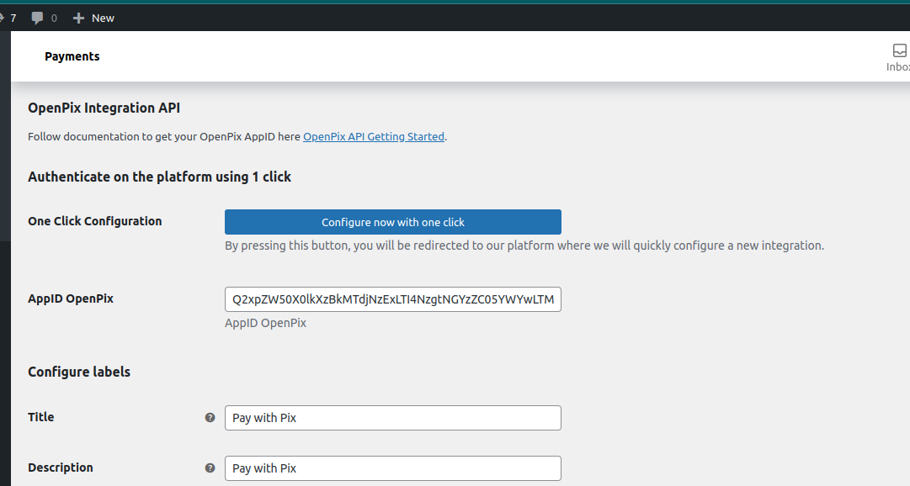
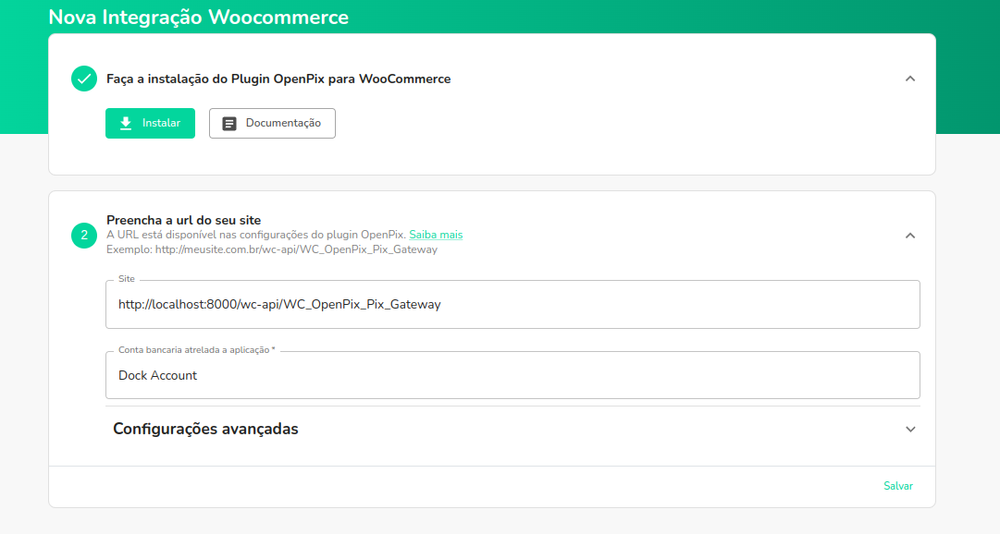

import Embed from 'react-embed';

## Veja o vídeo ou siga os passos abaixo

<Embed url='https://youtu.be/iE_O4sJ9gVM' />

### 1. Instale a OpenPix na sua instância WooCommerce

[OpenPix For WooCommerce](https://wordpress.org/plugins/openpix-for-woocommerce/)

### 2. Configurando o Plugin WooCommerce

Após a instalação, é necessário integrar o plugin com a nossa plataforma. Isso pode ser realizado por meio do nosso botão de um clique ou inserindo a URL do seu ecommerce diretamente em nossa plataforma.

Ao configurar uma nova integração, será possível criar novos pedidos com Pix e OpenPix Parcelado, e o webhook já estará configurado para atualizar o status de seus pedidos em tempo real.

Antes de tudo, vá até a página de configurações do seu plugin, clicando em "Settings", para configurar o plugin:

### 2.1. Configurando com um clique (recomendado)

Na página de configurações do plugin, clique no botão "Configure now with one click":

Ao pressionar este botão, uma nova página será aberta em nossa plataforma, onde você poderá configurar rapidamente uma nova integração com sua loja WooCommerce.

Na plataforma, a URL do seu e-commerce será configurada automaticamente; você só precisará clicar em "Salvar":

### 2.2. Configurando através da URL de seu ecommerce

Outra alternativa para autenticar o seu plugin seria acessar diretamente a plataforma e inserir a URL do seu e-commerce.

Na página de configurações do plugin, copie a URL de Webhook da sua loja WooCommerce:

Entre na plataforma da OpenPix e [clique aqui](https://app.woovi.com/home/applications/woocommerce/add/oneclick) ou vá em `API/Plugins` > `WooCommerce` > `Adicionar`:

Cole a URL de Webhook que você copiou no campo "Site":

