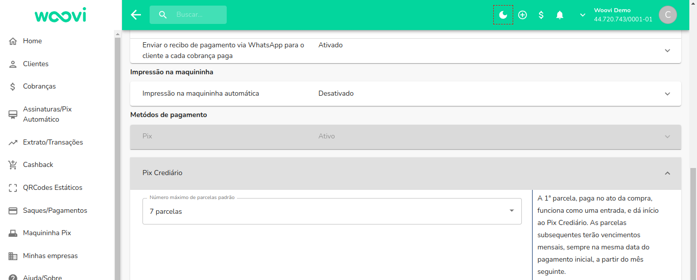
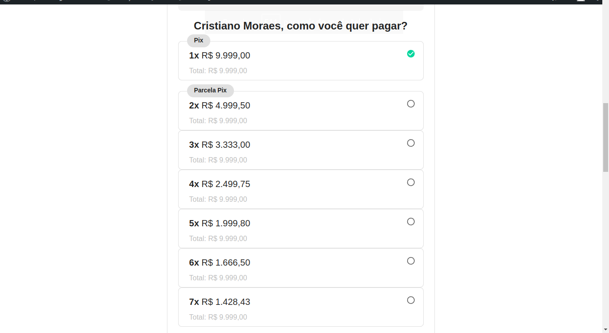

Para configurar o número máximo de parcelas ao criar um pedido em sua loja WooCommerce, acesse a plataforma OpenPix. Vá até a página de ajustes de cobrança, através de _Cobranças > Ajustes_, e clique na opção "Pix Crediário" na seção de "Métodos de pagamento":

Não se esqueça de clicar no botão "Salvar".

[Crie um novo pedido em seu Woocommerce](woocommerce-crediary.mdx).

Observe que o número máximo de parcelas será aquele configurado na página de ajustes de cobrança:

