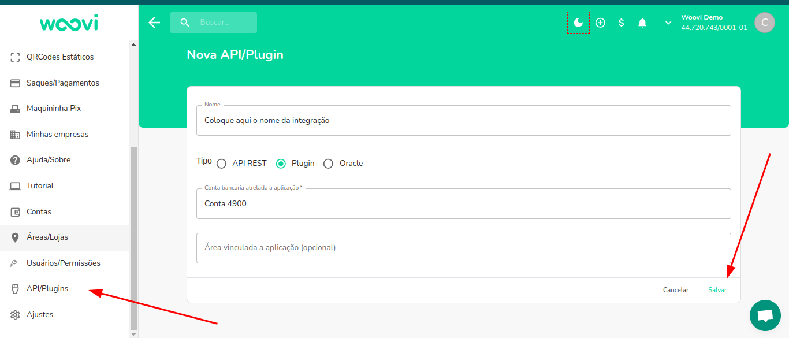
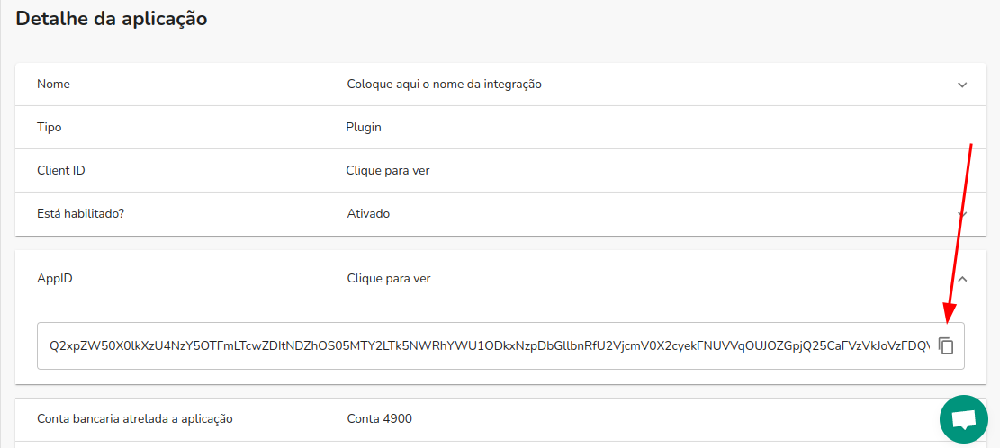
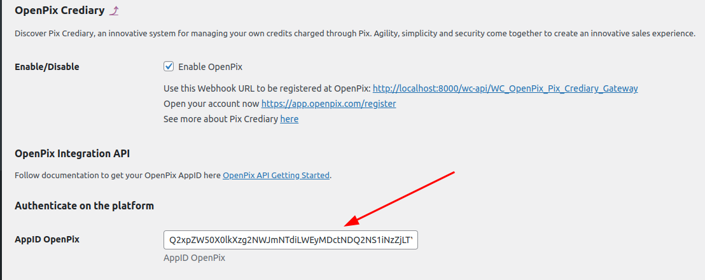
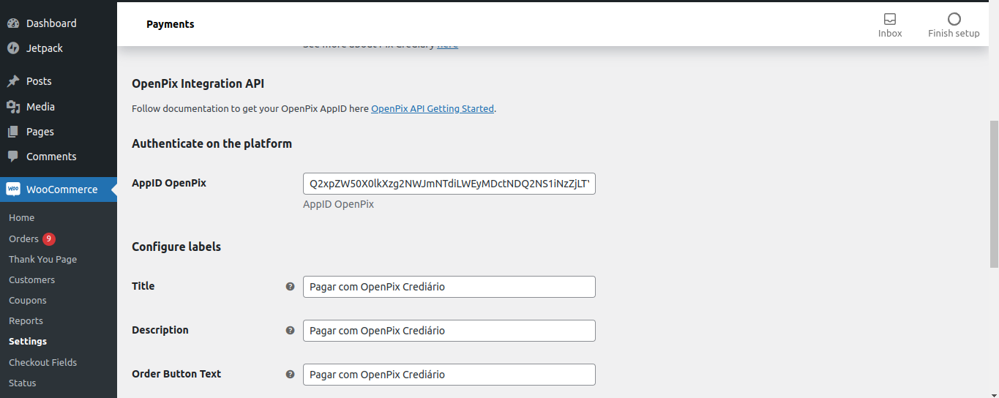
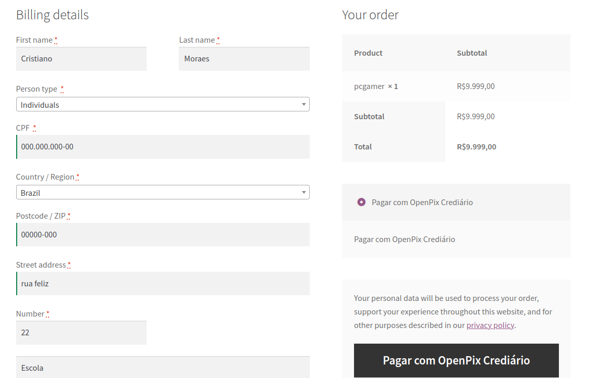
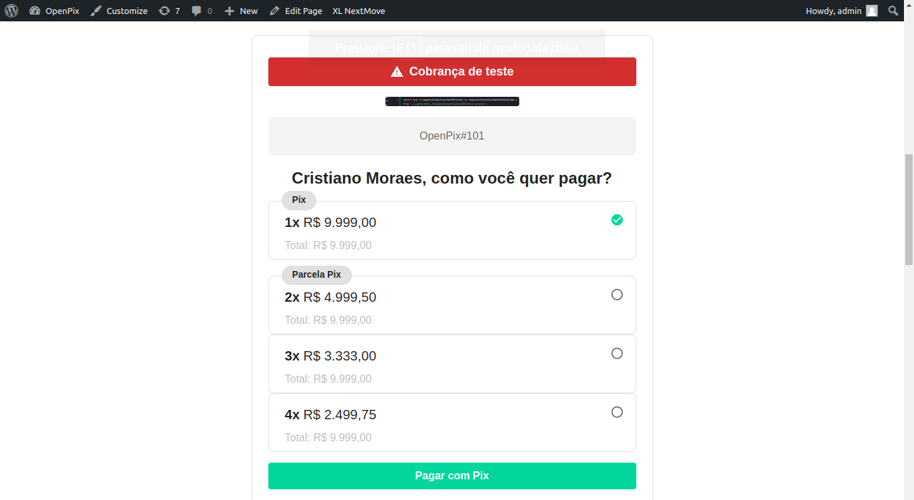
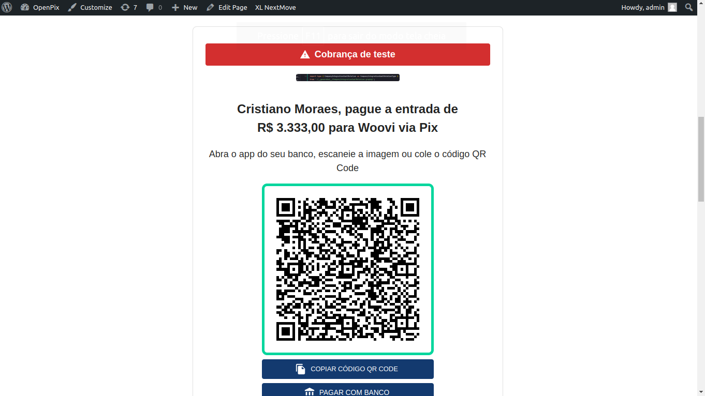

import WooAdvancedSettings from './__components__/woocommerce-advanced-settings.mdx';

:::caution Atenção
Este documento espera que você já tenha um ambiente WooCommerce ativo, e uma conta criada na OpenPix
Caso não tenha acesso à plataforma registre-se [aqui](https://app.openpix.com/register?src=wordpress-docs)
:::

## Instale o Plugin OpenPix na sua instância WooCommerce

Este documento detalha passos necessários para conectar a sua plataforma de e-Commerce, baseada no WooCommerce, na OpenPix.

### 1. Instale a OpenPix na sua instância WooCommerce

[OpenPix For WooCommerce](https://wordpress.org/plugins/openpix-for-woocommerce/)

### 2. Configurando o Plugin WooCommerce

Ao configurar uma nova integração, será possível criar novos pedidos com OpenPix Crediário.

É necessário ter um [AppID](../../plugin/app-id.md) do tipo _Plugin_ para que seja possível a integração.

Para tanto, entre na plataforma e crie uma nova aplicação na página de [_Nova API/Plugin_](https://app.openpix.com/home/applications/add) em _API/Plugins > Nova API/Plugin_:

Ao ser redirecionado para a página de visualizar uma aplicação, copie o _App ID_:

Vá até a página de configurações do seu plugin, clicando em _Settings Pix Crediary_, para configurar o plugin:

Cole o _App ID_ copiado no campo _AppID OpenPix_:

### 3. Ativando Plugin Brazilian Market

Para utilizar o OpenPix Crediário e salvar o customer da order na sua cobrança OpenPix é necessário que seja ativado um plugin que possibilite que o cliente informe os campos abaixo no momento da compra.

- Nome
- Cpf/Cnpj
- Email
- Telefone
- Endereço

Indicamos o uso do plugin [woocommerce-extra-checkout-fields-for-brazil](https://wordpress.org/plugins/woocommerce-extra-checkout-fields-for-brazil/) para este caso. Uma vez ativado o plugin passará a salvar os clientes que informarem o CPF/CNPJ no momento da compra.

### 4. Configurações do Plugin no WooCommerce

Ao acessar as configurações do plugin após os passos anteriores note que o AppID OpenPix ja estará preenchido e você poderá editar o título, descrição e label do botão de compra do plugin.

Para o tutorial iremos seguir com o titulo **Pagar com OpenPix Crediário** como no print abaixo:

## 5. Realizar Pedido com Pix Crediário no WooCommerce

Escolha a opção de pagar o pedido usando OpenPix Crediário ou o nome que você escolheu no momento da configuração do plugin.

Selecione a opção de pagamento:

Pague a entrada via Pix usando o app do seu banco:

## 4. Como ver meus logs OpenPix em minha loja WooCommerce/Wordpress

Você pode visualizar os logs OpenPix em sua loja através dos seguintes passos:

- 1. Tenha acesso aos arquivos da loja
- 2. Acesse o seguinte path: `/wp-content/uploads/wc_logs`
- 3. Dentro de `wc_logs` você irá encontrar os arquivos de logs da openpix com o seguinte padrão de nome `woocommerce_openpix-2023-01-13-7d609d821235742dd8162bbb0ef84862`
