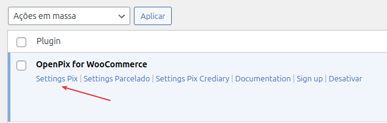
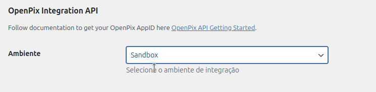
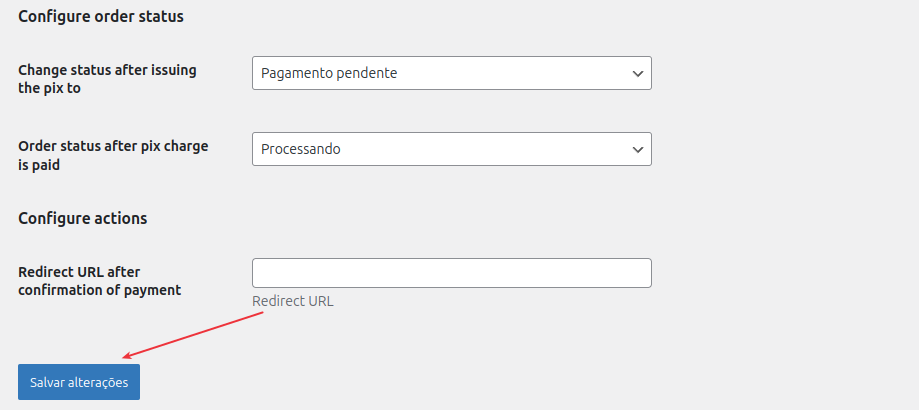

## Trocando ambiente 

1. Acesse o painel admin do seu wordpress  
2. No menu lateral acesse -> Plugins -> Plugins Instalados  
3. Localize o nosso plugin "OpenPix for Woocommerce"  
4. Clique em "Settings Pix"  

5. Localize input de seleção "Ambiente" e troque para qual ambiente deseja integrar o plugin  
- Sandbox  
- Production  

6. Gera um appID em nossa plataforma  
Você pode seguir [essa documentação](https://developers.openpix.com.br/docs/ecommerce/woocommerce/woocommerce-plugin) para criar um appID e usar os links abaixo para acessar nossos ambientes  
Produção: https://app.woovi.com  
Sanbox: https://app.woovi-sandbox.com  

7. Feito isso, volte para tela de configuração do plugin no seu painel admin do wordpress, role até o final e clique em salvar alterações
  