import WooAdvancedSettings from './__components__/woocommerce-advanced-settings.mdx'

:::caution Atenção
Este documento espera que você já tenha um ambiente WooCommerce ativo, e uma conta criada na OpenPix
Caso não tenha acesso à plataforma registre-se [aqui](https://app.openpix.com/register?src=wordpress-docs)
:::

## Instale o Plugin OpenPix na sua instância WooCommerce utilizando o 1-Click

Este documento detalha passos necessários para conectar a sua plataforma de e-Commerce, baseada no WooCommerce, na OpenPix.

### 1. Instale a OpenPix na sua instância WooCommerce

[OpenPix For WooCommerce](https://wordpress.org/plugins/openpix-for-woocommerce/)

### 2. Configurando o Plugin WooCommerce

Após a instalação, é necessário integrar o plugin com a nossa plataforma. Isso pode ser realizado por meio do nosso botão de um clique ou inserindo a URL do seu ecommerce diretamente em nossa plataforma.

Ao configurar uma nova integração, será possível criar novos pedidos com Pix e OpenPix Parcelado, e o webhook já estará configurado para atualizar o status de seus pedidos em tempo real.

Antes de tudo, vá até a página de configurações do seu plugin, clicando em "Settings Parcelado", para configurar o plugin:

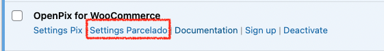

### 2.1. Configurando com um clique (recomendado)

Na página de configurações do plugin, clique no botão "Configure now with one click":

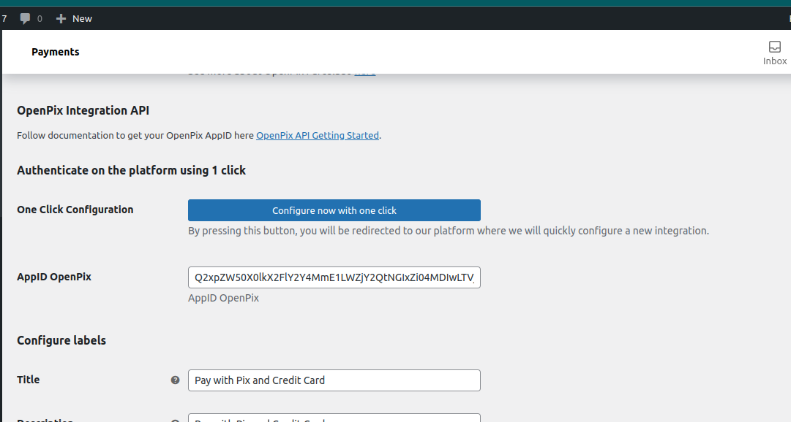

Ao pressionar este botão, uma nova página será aberta em nossa plataforma, onde você poderá configurar rapidamente uma nova integração com sua loja WooCommerce.

Na plataforma, a URL do seu e-commerce será configurada automaticamente; você só precisará clicar em "Salvar":

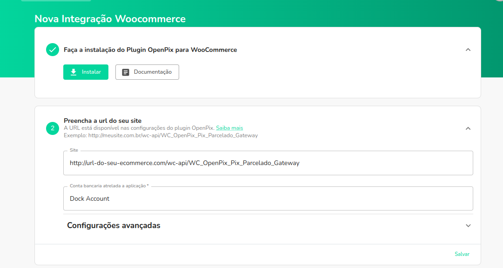

Após salvo, sua integração ja estará configurada. Você pode ir para o passo de [ativar as configurações dos clientes](#3-ativando-plugin-brazilian-market).

### 2.2. Configurando através da URL de seu ecommerce

Outra alternativa para configurar o plugin seria acessar diretamente a plataforma e inserir a URL do seu e-commerce.

Primeiramente, copie a URL de Webhook da sua loja WooCommerce:

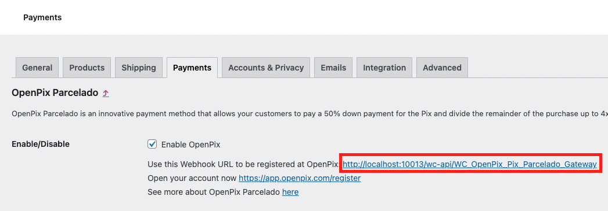

Entre na plataforma da OpenPix e [clique aqui](https://app.openpix.com/home/applications/woocommerce-pix-credit-card/add/oneclick) ou vá em `API/Plugins` > `Plugin WooCommerce Parcelado` > `Adicionar`:

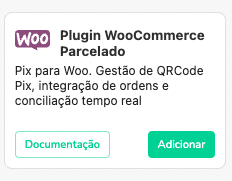

Cole a URL de Webhook que você copiou no campo "Site":

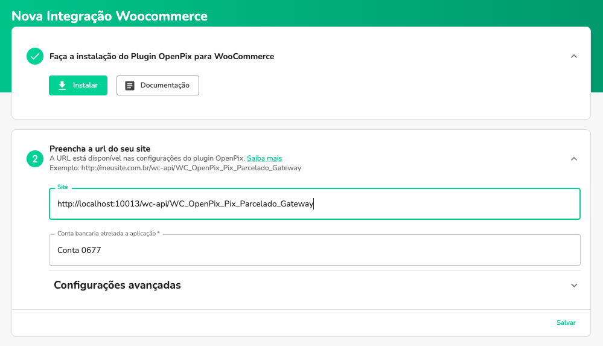

### 3. Ativando Plugin Brazilian Market

Para utilizar o OpenPix Parcelado e salvar o customer da order na sua cobrança OpenPix é necessário que seja ativado um plugin que possibilite que o cliente informe os campos abaixo no momento da compra.

- Nome
- Cpf/Cnpj
- Email
- Telefone
- Endereço

Indicamos o uso do plugin [woocommerce-extra-checkout-fields-for-brazil](https://wordpress.org/plugins/woocommerce-extra-checkout-fields-for-brazil/) para este caso. Uma vez ativado o plugin passará a salvar os clientes que informarem o CPF/CNPJ no momento da compra.

### 4. Configurações do Plugin no WooCommerce
Ao acessar as configurações do plugin após os passos anteriores note que o AppID OpenPix ja estará preenchido e confirme que o campo seja **Configured**.

Você também pode editar o titulo, descrição e label do botão de compra do plugin.

Para o tutorial iremos seguir com o titulo **Pagar com OpenPix Parcelado** como no print abaixo:

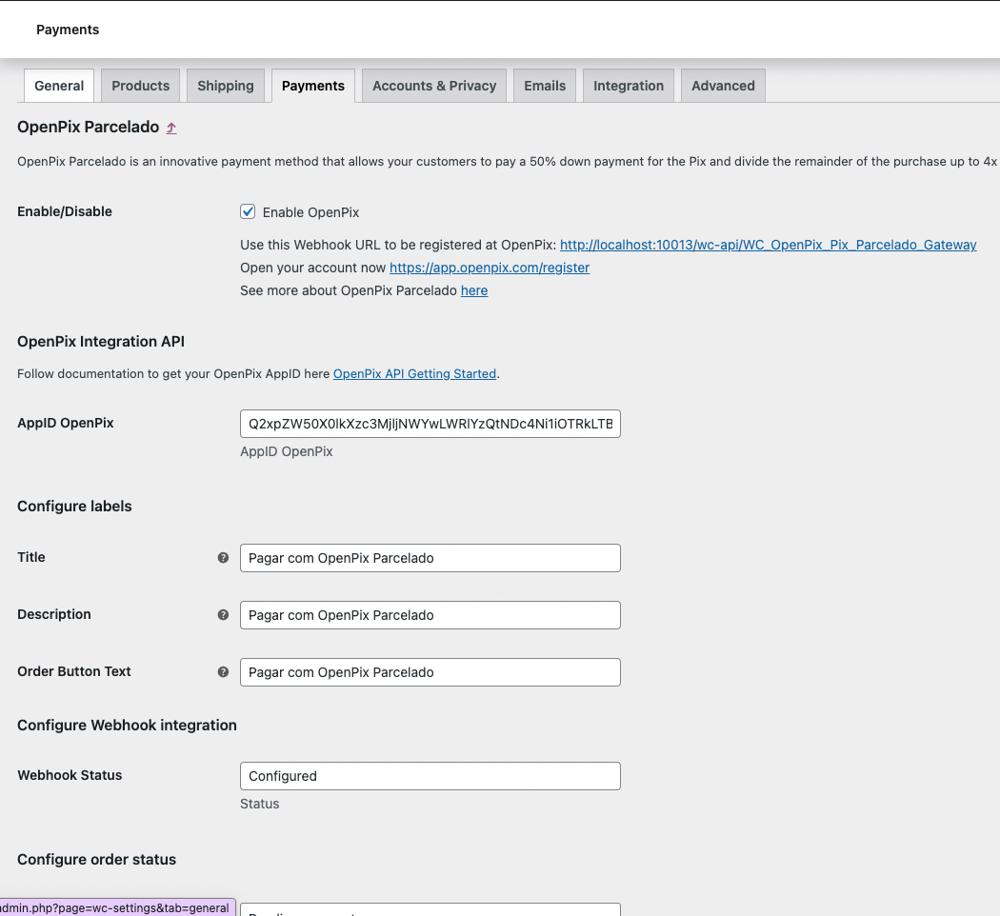

## 5. Realizar Pedido com Pix no WooCommerce

Escolha a opção de pagar o pedido usando OpenPix Parcelado ou o nome que você escolheu no momento da configuração do Plugin

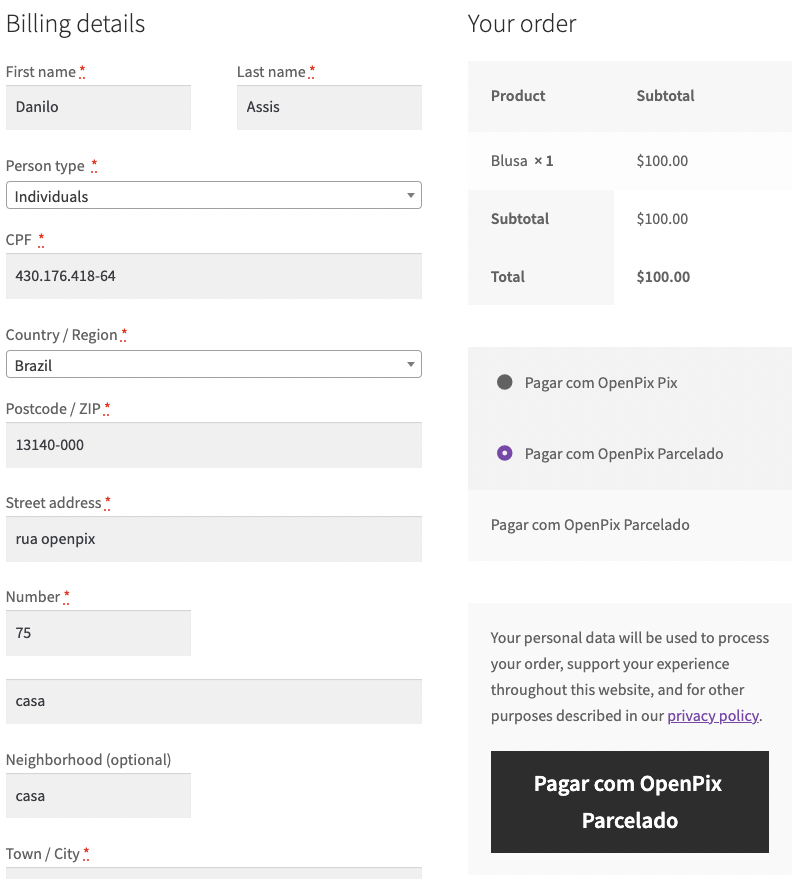

Selecione a opção de pagamento:

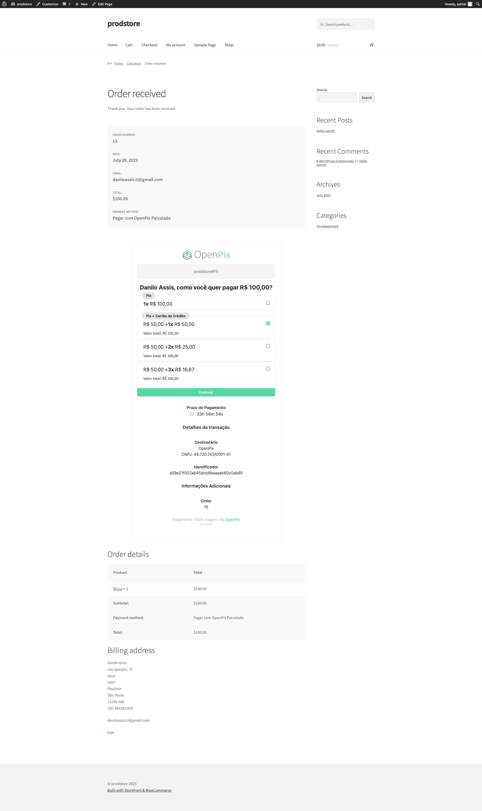

Preencha os dados do cartão:

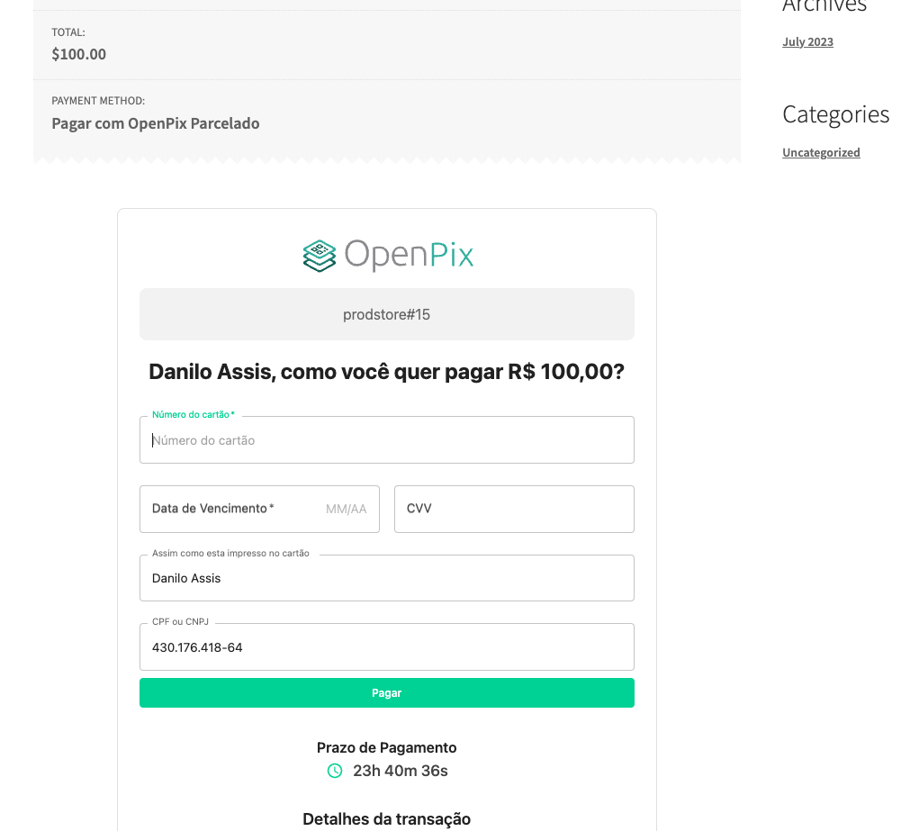

Será gerado o pix da entrada e ao ser pago será capturada a transação no cartão de crédito e por fim completerá a venda!

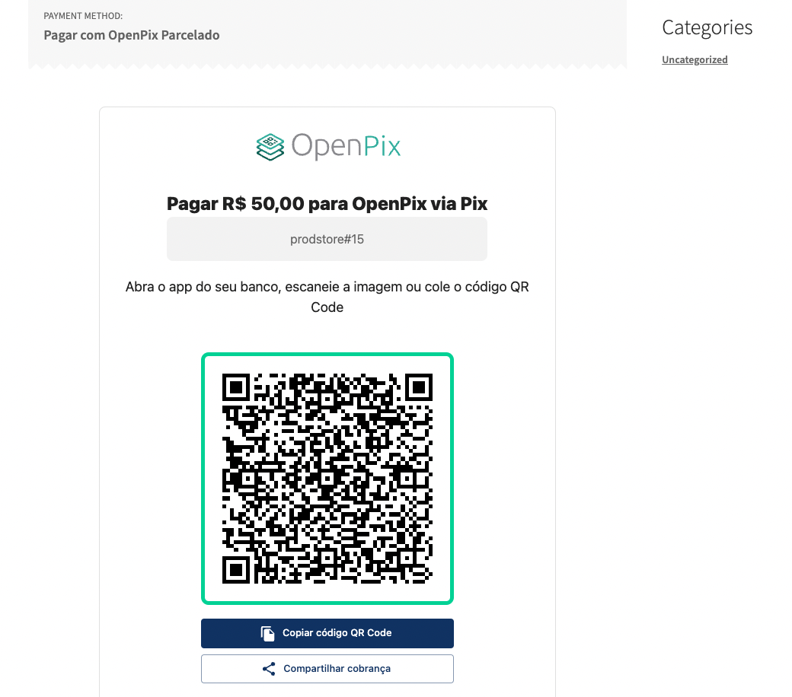

Valide que o status do Pedido mudou após o pagamento

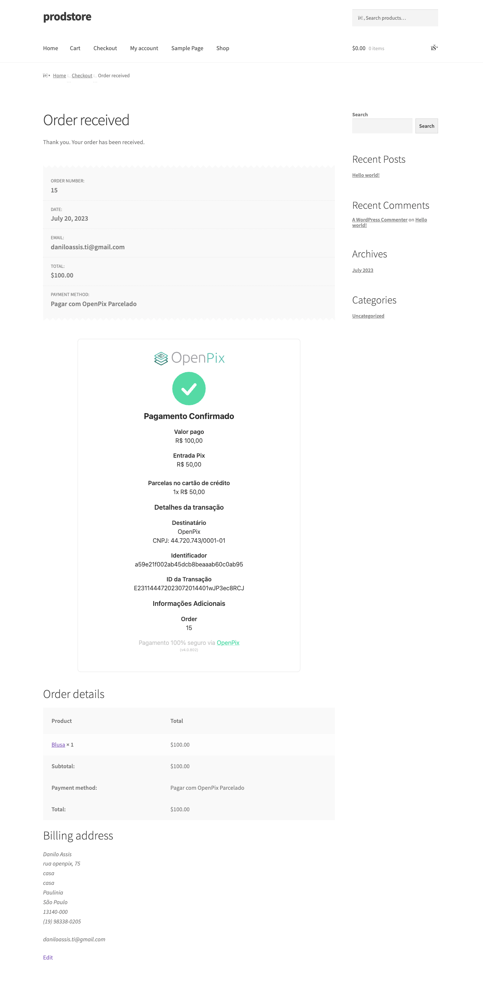

## Configurações avançadas WooCommerce

## 1. Como configurar a expiração do pedido Woocommerce

A cobrança da Openpix irá seguir o padrão selecionado dentro da plataforma para cobranças parceladas. Configure o tempo de expiração no woocommerce semelhante ao da plataforma para o funcionamento ideal.

Para saber mais sobre Como configurar o tempo de expiração da OpenPix Charge [Clique aqui](/docs/flows/flow-edit-default-expiration).

O prazo de pagamento representa o tempo selecionado de expiração.
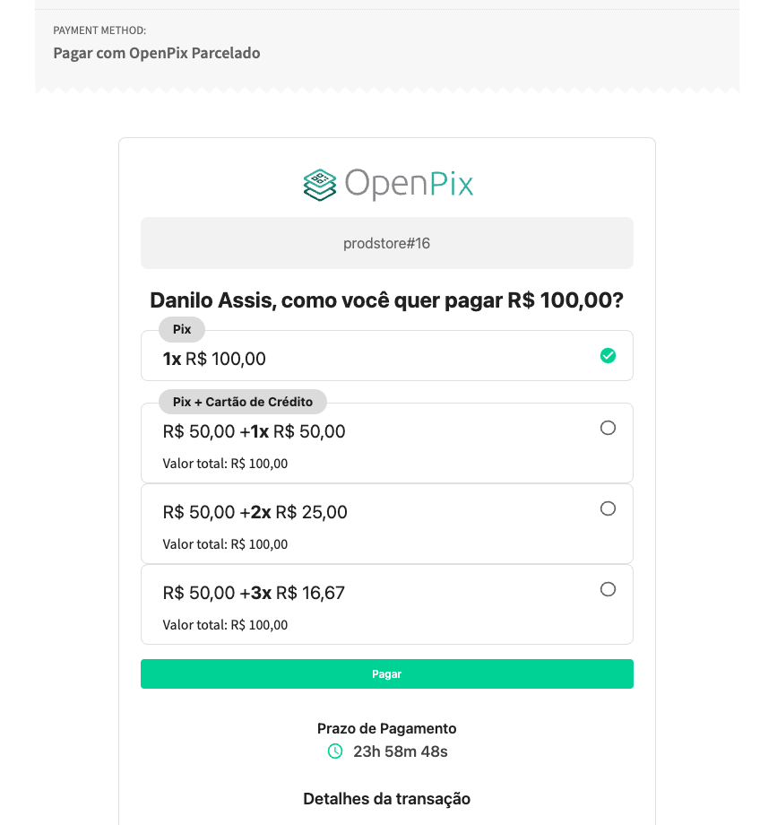

Para alterar e igualar esse tempo de expiração para a OpenPix e para Woocommerce você deve procurar no menu admin:

`Woocommerce` > `Settings` > `Products` > `Inventory`

Por último, alterar o valor do Hold stock para 1440 minutos equivalente a 1 dia

## 2. Como selecionar qual deverá ser o status quando um novo pedido for gerado

Por padrão quando a cobrança da Openpix é criada, o status do pedido é alterado para `Pending payment`, porém é possível configurar para qualquer status que você queira.

Basta clicar e selecionar qual status você quer que seja colocado no pedido quando a cobrança da Openpix for criada.

Após esta alteração os novos pedidos quando forem criados irão receber o valor desse campo em seu status.

## 3. Como selecionar qual deverá ser o status quando um pedido for pago

Por padrão quando a cobrança da Openpix é paga, o status do pedido é alterado para `Processing`, porém é possível configurar para qualquer status que você queira.

Basta clicar e selecionar qual status você quer que seja colocado no pedido quando a transação Pix for paga.

Após esta alteração os novos pedidos quando forem pagos irão receber o valor desse campo em seu status.

## 4. Como ver meus logs OpenPix em minha loja WooCommerce/Wordpress

Você pode visualizar os logs OpenPix em sua loja através dos seguintes passos:

- 1. Tenha acesso aos arquivos da loja
- 2. Acesse o seguinte path: `/wp-content/uploads/wc-logs`
- 3. Dentro de `wc-logs` você irá encontrar os arquivos de logs da openpix com o seguinte padrão de nome `woocommerce_openpix-2023-01-13-7d609d821235742dd8162bbb0ef84862`

