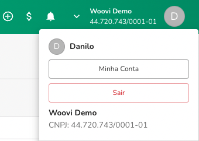
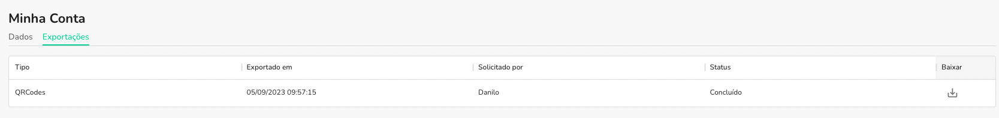

A plataforma OpenPix oferece diversos relatórios para serem baixados e auxiliar em suas tarefas. Veja abaixo como acessar seus relatórios.

## Como acessar meus relatórios baixados
1. Para acessar seu export acesse `Minha Conta` clicando em seu nome no header no lado direito

2. Em minha conta acesse a **Tab** `Exportações`
3. Faça Download das Exportações desejadas
   