### O que é uma cobrança?

Uma cobrança é uma solicitação de pagamento pelo Pix. Você pode configurar uma nova cobrança com as informações de `Cliente`, `Valor`, `Comentário` e outras informações de identificação.

### Como criar uma cobrança?

Para criar uma nova cobrança, acesse o menu `Cobranças`

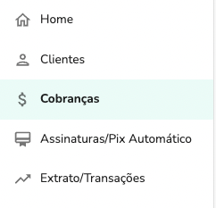

Clique em `Nova cobrança`

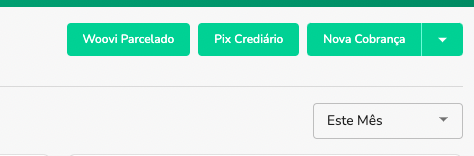

Você pode configurar a cobrança da forma que precisa.

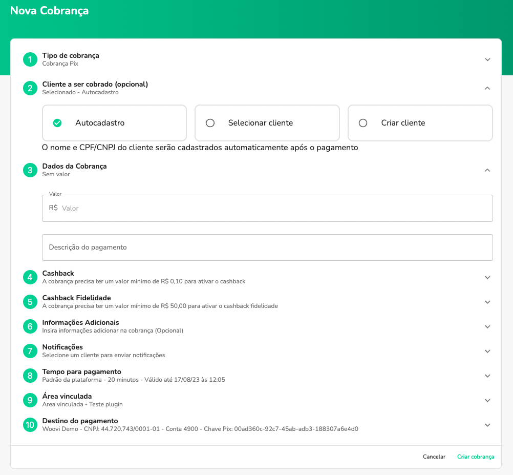

### Como definir o tempo de expiração de uma cobrança?

A configuração de expiração das cobranças pode ser configurado no menu `Cobranças`

Na aba `Ajustes`

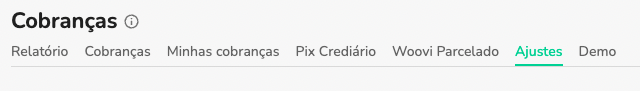

Identifique o card `Tempo padrão de expiração de cobrança` e configure da forma que desejar com as opções disponíveis ou então customizadas.

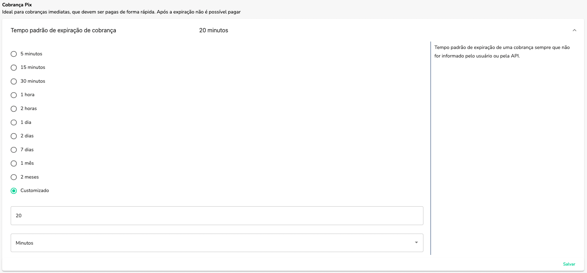

### Como compartilhar uma cobrança?

A melhor forma de compartilhar uma cobrança é enviando o link de pagamento para o seu cliente.

Você pode compartilhar esse link na nossa plataforma das seguintes formas:

#### Enviando o Link de Pagamento através de um e-mail

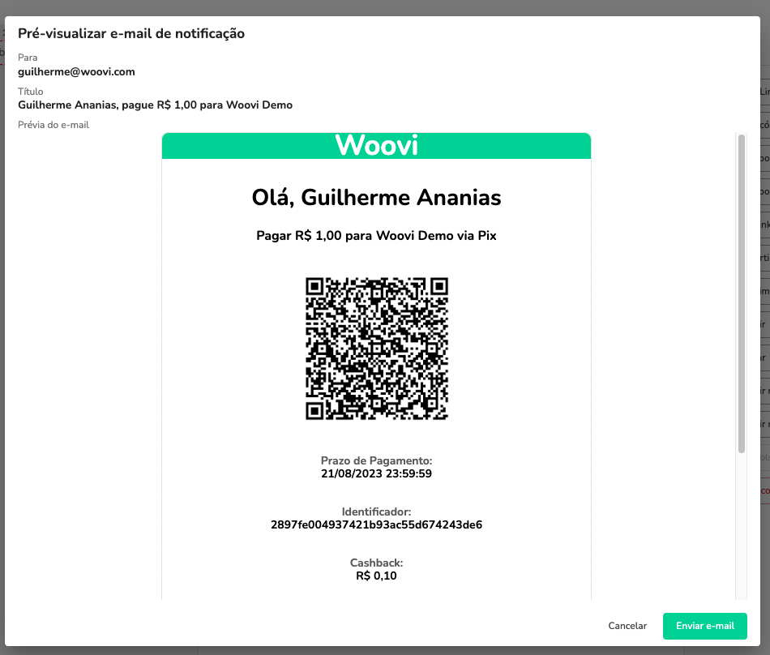

#### Enviando o Link de Pagamento

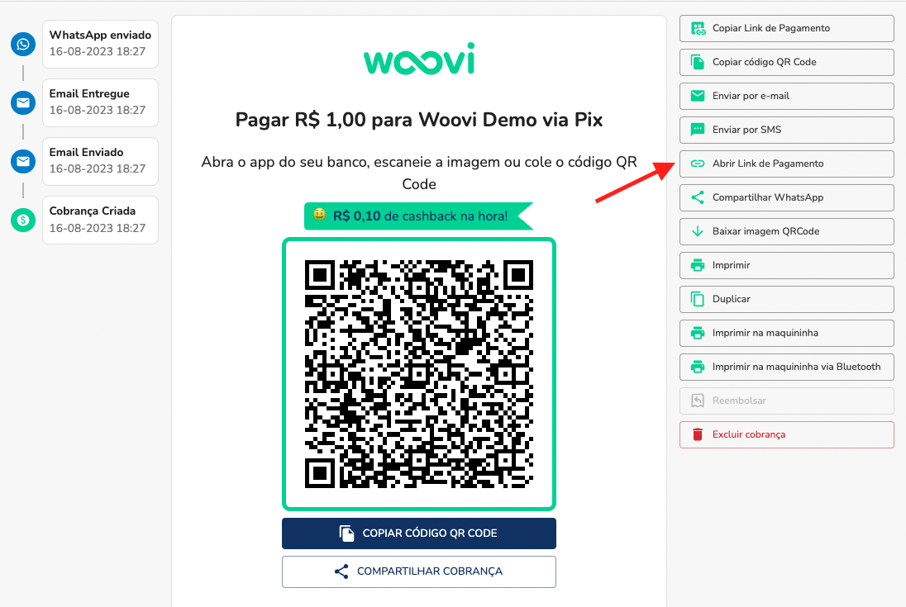

#### Enviando o Link de Pagamento através do WhatsApp

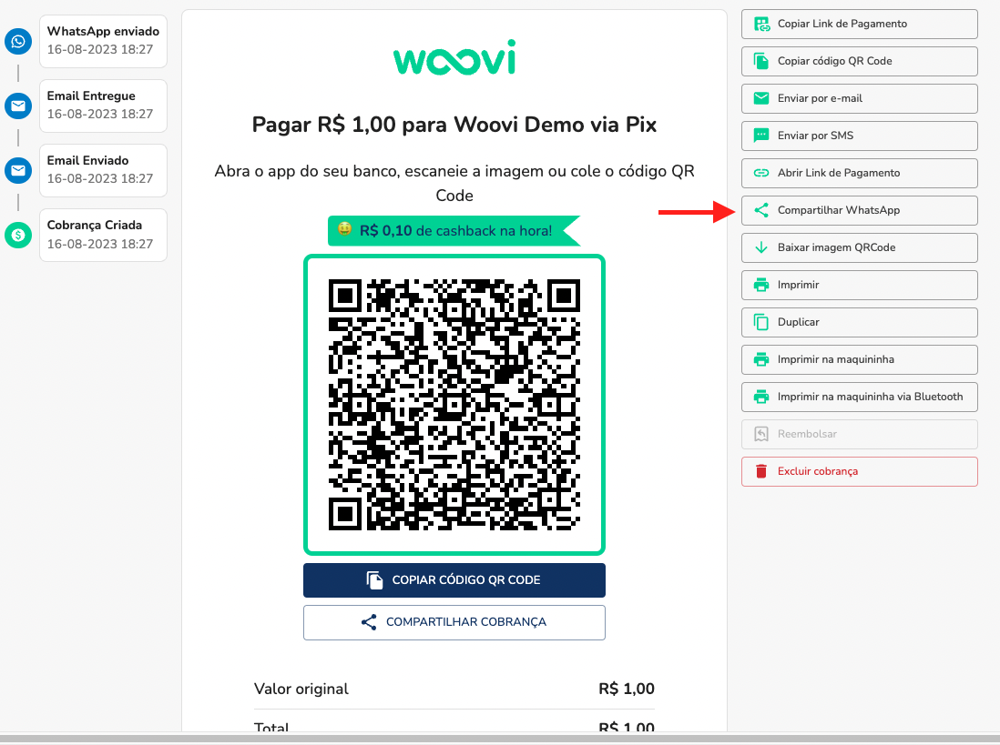

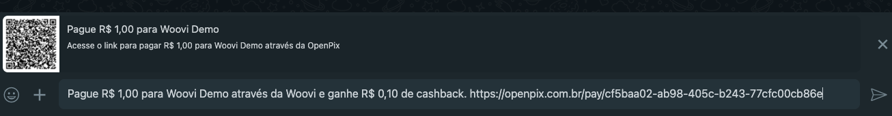

### Como pagar uma cobrança?

Você pode pagar de várias maneiras uma cobrança em nossa plataforma, como:

- Copiando o código do QR Code da cobrança e realizando o pagamento via Pix copia e cola

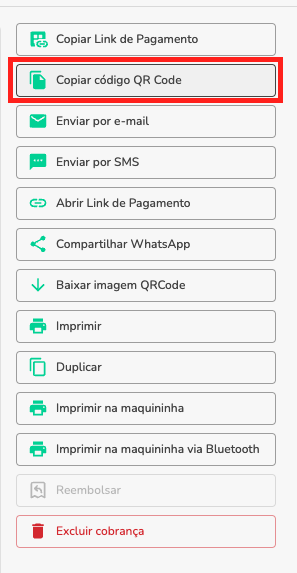

Exemplo de um código de QR Code:

    00020101021226990014br.gov.bcb.pix2577pix-h.bpp.com.br/23114447/qrs1/v2/01PFfypmDzCtFVaRhbq7l3DFonudYpTCNT48PBM6uOS520400005303986540510.005802BR5909User_Pix6009Sao_Paulo62290505e51a840039e14d8cabbed01be64052EFA

- Enviando o link de pagamento para o seu cliente como vimos no tópico anterior

### O que é um link de pagamento e como funciona?

O link de pagamento como o nome diz é um endereço de pagamento que você pode usar para enviar uma cobrança aos seus determinados clientes e realizar o pagamento do mesmo.

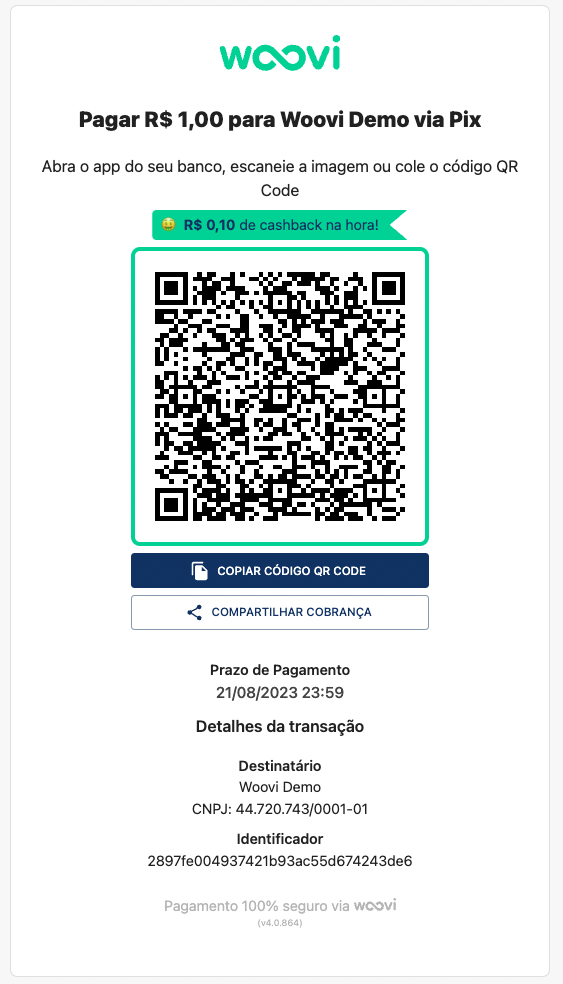

- Para realizar o pagamento, você pode escanear o QR code usando o seu aplicativo de pagamento preferido.
- Ou copiar o QR Code e colar no seu aplicativo de pagamento preferido.
