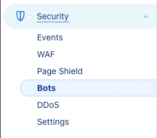
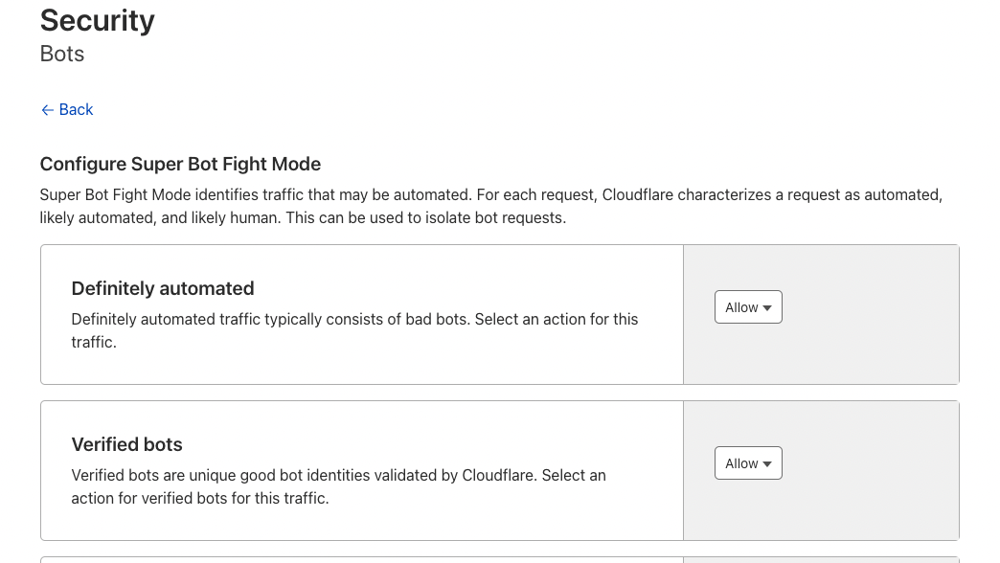

import Embed from 'react-embed';

## Como ajustar o Cloudflare para permitir o cadastro de Webhooks da forma corretas e evitar bloqueios?

Neste artigo, abordaremos como configurar o Cloudflare para permitir o cadastro eficaz de Webhooks, evitando bloqueios. Vamos ensinar a criar uma regra de exceção no firewall do Cloudflare e, se necessário, a desativar temporariamente a proteção antibots.

## Regra de Exceção no Firewall: Explicaremos como criar uma regra específica no Cloudflare para permitir Webhooks seguros.

<Embed url='https://youtu.be/q-XhQbGziGk' />

Exemplo de regra de excessão de firewall:

### Acesse `Security > WAF`

## Desativar Proteção Antibots: Mostraremos como desativar a proteção antibots, mantendo a segurança.

### Acesse `Security > Bots`

A solução de antibot da Cloudflare pode bloquear os requests de Webhooks.

Para desabilitar a proteção antibot siga os passos abaixo:

1. clique no seu dominio
2. Na Sidebar lateral procure por Security e clique, em seguida escolha o item Bots no menu:

3. Em Bots clique em `Configure Super Bot Fight Mode`

4. Procure por Definitely Automated e Verified Bots, atualize os valores de ambos para Allow

5. Realize um teste e veja se esta funcionando normalmente
[https://www.cloudflare.com/products/bot-management/](https://www.cloudflare.com/products/bot-management/)
