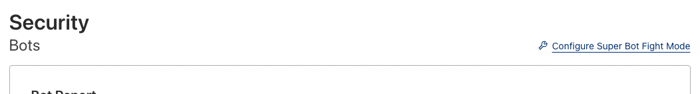

### Não estou conseguindo cadastrar meu Webhook ?

- Crie uma regra de excessão de firewall
- Se a regra não funcionar, desative a proteção antibots

## Regra de excessão de firewall

Exemplo de regra de excessão de firewall:

## Desabilitar Cloudflare Bot

A solução de antibot da Cloudflare pode bloquear os requests de Webhooks. 

Para desabilitar a proteção antibot siga os passos abaixo:

1. clique no seu dominio
2. Na Sidebar lateral procure por Security e clique, em seguida escolha o item Bots no menu:

4. Em Bots clique em `Configure Super Bot Fight Mode`

5. Procure por Definitely Automated e Verified Bots, atualize os valores de ambos para Allow

6. Realize um teste e veja se esta funcionando normalmente

[https://www.cloudflare.com/products/bot-management/](https://www.cloudflare.com/products/bot-management/)