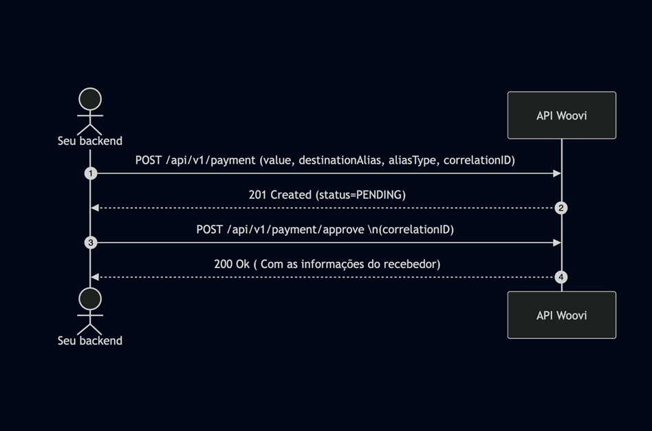
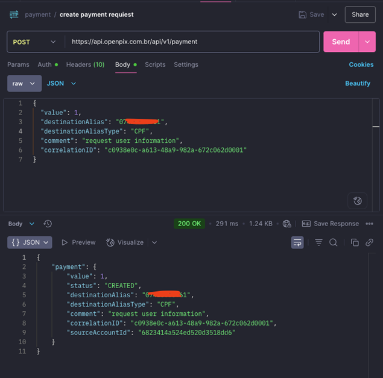

## 1. É necessario que você tenha uma API MASTER

Caso você não tenha, temos essa documentação que lhe ensina como criar uma [API MASTER](../apis/api-master.md).

Após criar a API MASTER basta seguir o passo a passo.

### Crie um pagamento de 1 centavo:

Para fazer este passo a passo é necessário que você tenha o PIXOUT habilitado em sua conta, então caso não tenha basta solicitar seguindo este artigo : [Como solicitar o pagamento externo (PIX OUT)](https://ajuda.openpix.com.br/pt-br/article/como-solicitar-o-pagamento-externo-pix-out-1qmsnj7/)

Após isso você irá criar um pagamento para a chave-pix que deseja saber os dados bancários.

## Sequência da integração



# 1. Crie o pagamento:
Nesta etapa você irá criar o pagamento seguindo os parâmetros de nosso endPoint: [Create Payment request](http://localhost:3000/api#tag/payment-(request-access)/paths/~1api~1v1~1payment/post)

```json
curl --location 'https://api.woovi.com/api/v1/payment' \
--header 'Content-Type: application/json' \
--header 'Authorization: ****' \
--data '{
  "value": 1,
  "destinationAlias": "07*******61",
  "destinationAliasType": "CPF",
  "comment": "request user information",
  "correlationID": "*****"
}

{
 "value": 1,
 "destinationAlias": "07*******61",
 "destinationAliasType": "CPF",
 "comment": "request user information",
 "correlationID": "*****"
}
```


# 2. Confirme o pagamento:
Nesta etapa será necessário que você aprove o pagamento que criou seguindo o endpoint: [Approve a Payment Request](http://localhost:3000/api#tag/payment-(request-access)/paths/~1api~1v1~1payment~1approve/post)

Após a confirmação do pagamento irá gerar um payload com os dados bancários da chave-pix que fez o pagamento

```json
curl --location 'https://api.woovi.com/api/v1/payment/approve' \
--header 'Content-Type: application/json' \
--header 'Authorization: ****' \
--data '{
  "correlationID": "c0938e0c-a613-48a9-982a-672c062d0001"
}'
{
   "payment": …,
   "transaction": …,
   "destination": {
       "name": "Luc— – —--ar",
       "taxID": "07*******61",
       "pixKey": "07*******61",
       "bank": "NU PAGAMENTOS - IP",
       "branch": "1",
       "account": "76******03"
   }
}
```


 

