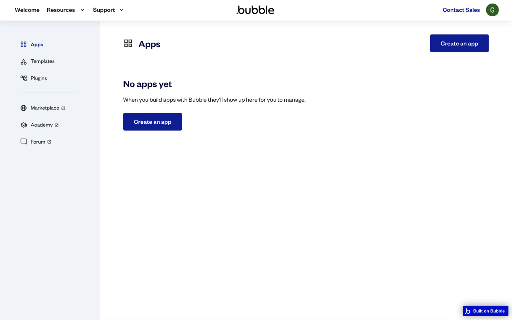
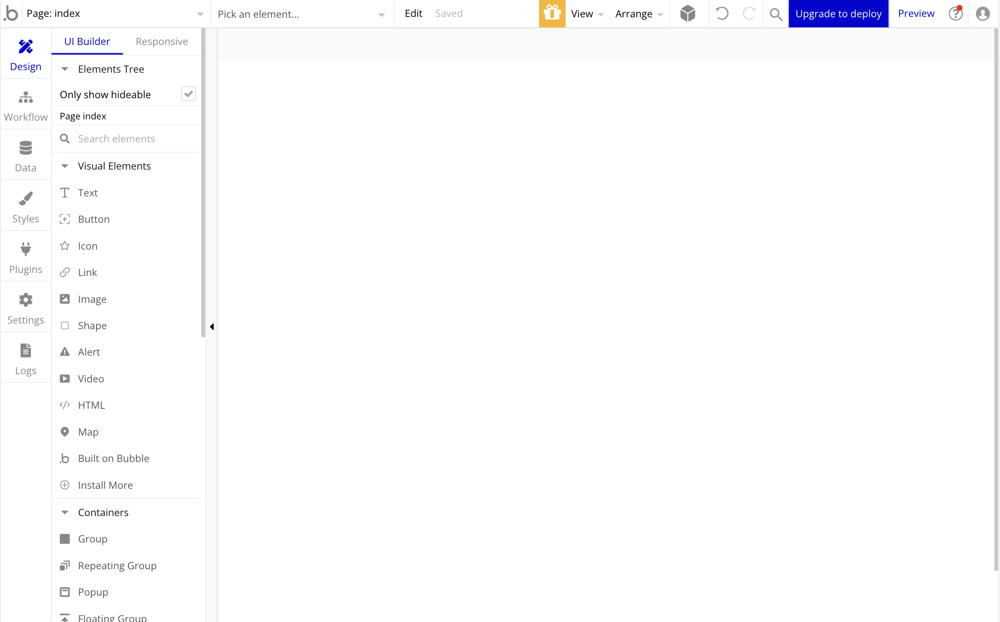
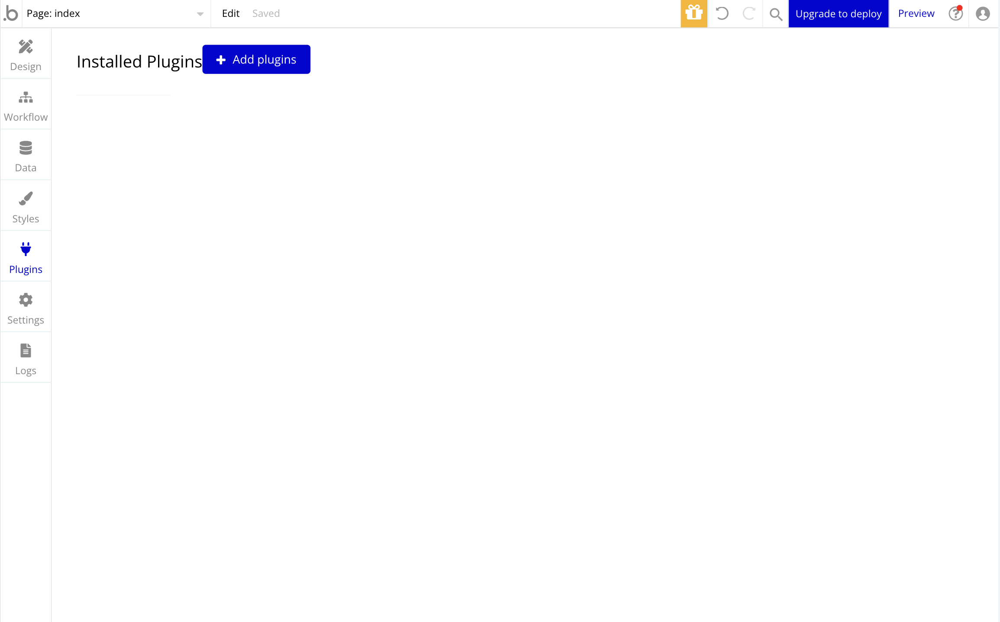
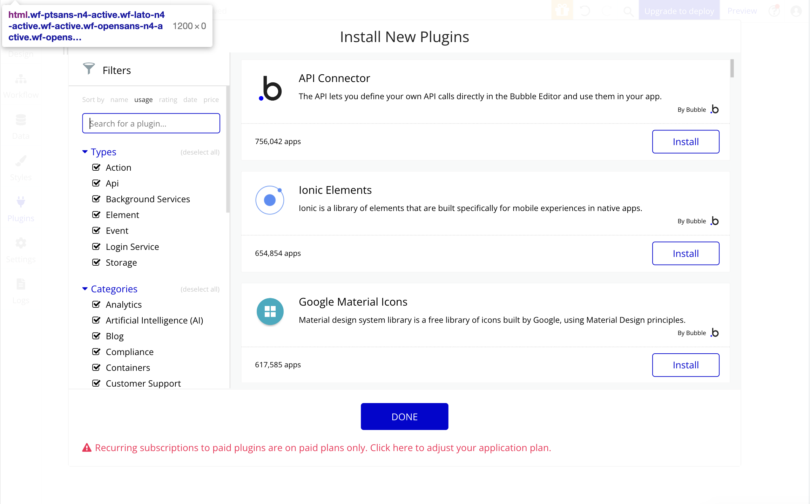
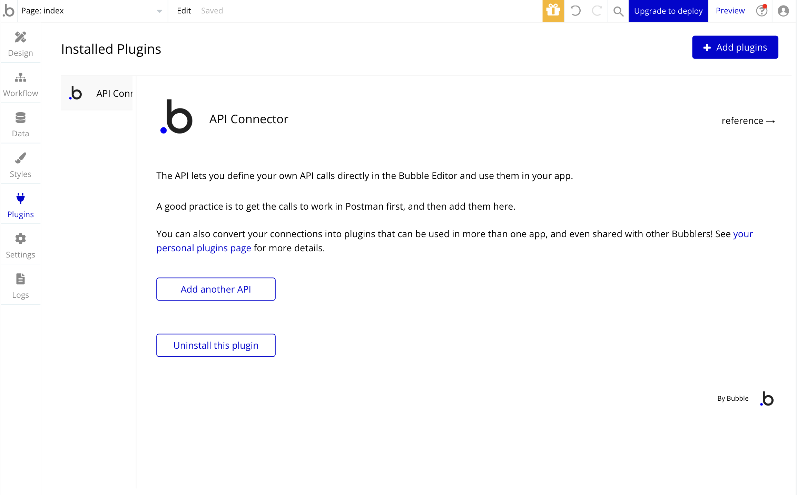
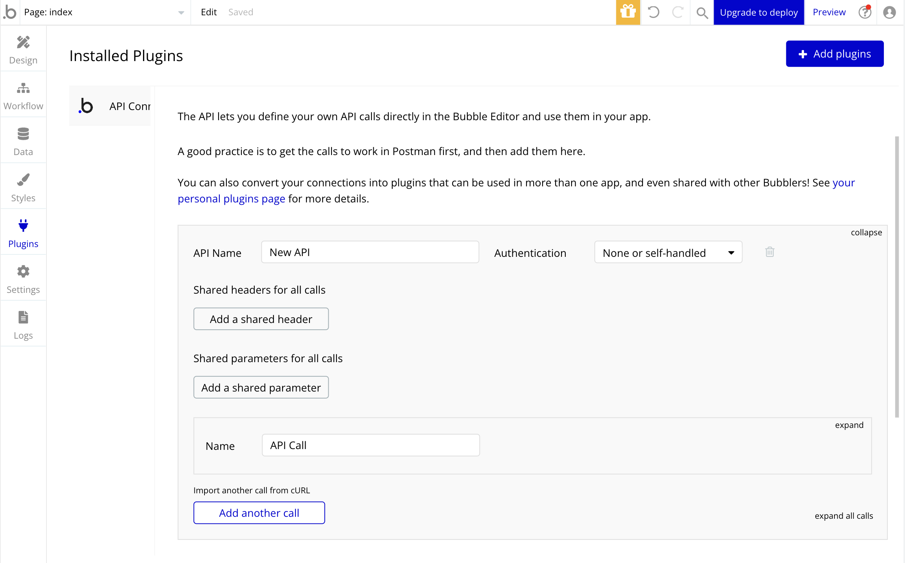
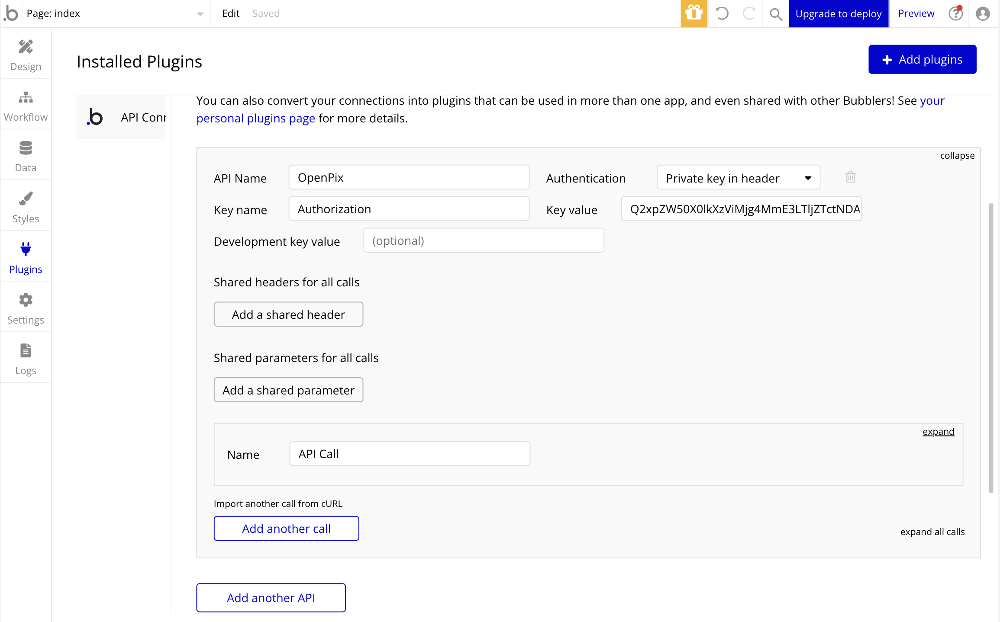
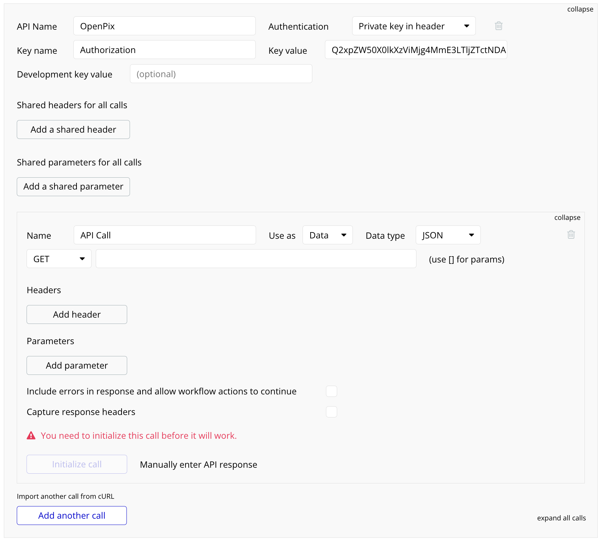
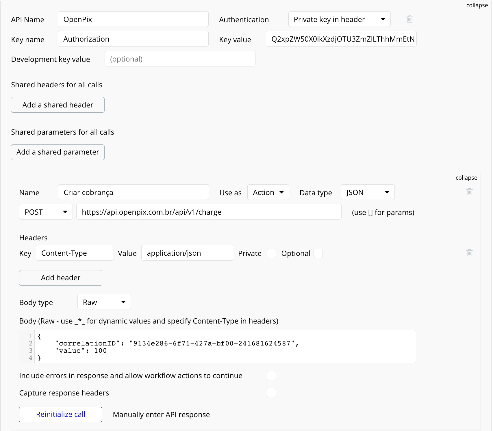

:::info

Essa documentação assume que você tenha preenchido alguns requisitos que são:

1. Ter uma conta no [Bubble.io](https://bubble.io)
2. Ter uma aplicação criada na OpenPix. Caso ainda não tenha feito, você pode criar uma seguindo [este tutorial](../apis/api-getting-started.md).

:::

## 1. Criando um App no Bubble.io 

:::info

Caso você já tenha um App criado no [https://bubble.io](https://bubble.io), esse passo é opcional.

:::

Após acessar a home do [https://bubble.io](https://bubble.io). Você irá estar vendo uma tela similar a esta:

Clique no botão `Create an app`. Irá aparecer um modal com as informações necessárias para criar um novo app. Selecione o plano do seu novo App.

Em seguida, você poderá estar optando por seguir o passo a passo de assistência do Bubble. Ele irá te ajudar a adicionar as configurações básicas para o seu site.

## 2. Adicionando um novo plugin

Caso o cadastro de um novo App tenha ocorrido com sucesso, você será redirecionado para uma página similar a esta:

Para estar adicionando um novo plugin você deve selecionar a opção `Plugins`, na barra lateral à esquerda.

Pós acessar esta página, você será redirecionado para a seguinte página:

Selecione a opção `Add plugins`, e logo em seguida clique no botão `Install` do plugin `API Connector`.

Se a instalação ocorreu bem, você verá a seguinte tela:

Você instalou com sucesso o plugin de API no Bubble.io!

## 3. Adicionando a API da OpenPix no API Connector

Pós instalar o `API Connector` dentro do Bubble.io, é necessário adicionar uma nova API.

Na tela do detalhe do plugin de `API Connector`, selecione a opção `Add another API`. Você verá uma tela similar a esta:

Preencha as informações necessárias levando em consideração os seguintes pontos:

1. Dê um nome pra sua API no campo de `API Name`, garantindo que seja fácil identificar essa nova API.
2. No campo `Authentication`, selecione a opção: `Private key in header`.
3. Irá aparecer uma seção abaixo contendo os seguintes fields: `Key name` e `Key value`. Preencha-os da seguinte forma:
    - **Key name:** `Authorization`
    - **Key value:** O AppID da sua aplicação OpenPix.

:::info

Caso tenha dúvida em como pegar o `AppID` da sua aplicação OpenPix.

Siga este tutorial [aqui](../apis/api-getting-started.md).

:::

Os campos devem estar preenchidos de forma similar a imagem abaixo:

Dessa forma, você já fez a etapa de autenticação e autorização para estar consumindo a API da OpenPix de forma segura.

## 4. Consumindo um endpoint da OpenPix via Bubble.io

Neste mesmo campo do API Connector, ele irá adicionar uma nova chamada para um endpoint, você pode estar clicando no botão `Expand`, no canto direito e verá algo similar a imagem a seguir:

Conforme a documentação da [API da OpenPix](https://developers.openpix.com.br/api), vamos preencher estes campos com:

- O endpoint que deseja consumir; 
- Os headers necessários;
- O body da requisição (caso necessário);

No exemplo abaixo, estamos consumindo o endpoint para criar uma cobrança Pix. Para *quaisquer* endpoints, a chamada deve estar configurada de forma similar.

Nesse caso, se atente aos seguintes pontos:

1. Colocamos o `Use as`, como `Action`. Isso permite que você possa estar acoplando ele ao click de um botão ou alguma outra ação do seu site.
2. Adicionar um novo header chamado `Content-Type` com valor `application/json`.
3. Troque o `Body type` para `Raw`. Isso vai impedir do Bubble formatar os valores presentes no  body.
4. Adicione o body da requisição conforme o JSON esperado pelo endpoint.

Após preencher estes pontos, você pode estar clicando no botão `Initialize call`.

Se tudo foi preenchido corretamente, você verá um modal com o payload de resposta daquele endpoint.

Por fim, você integrou com sucesso a OpenPix ao Bubble.io!
