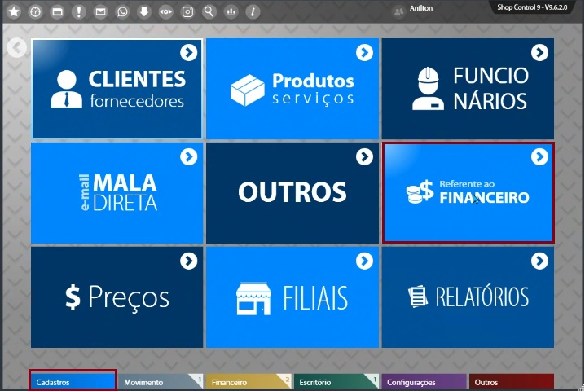
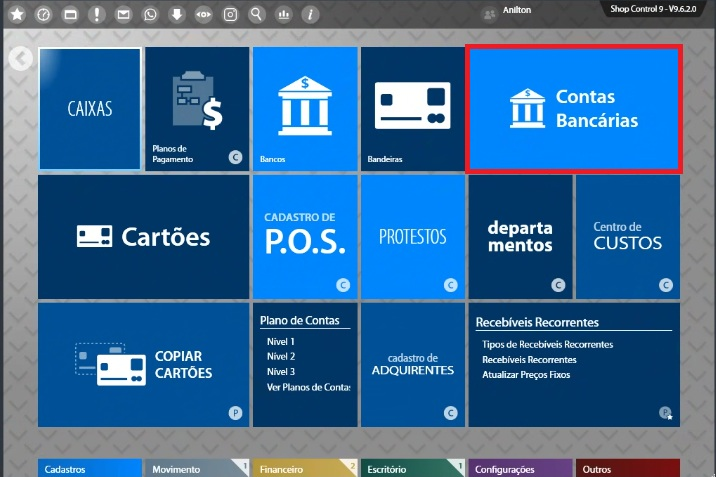
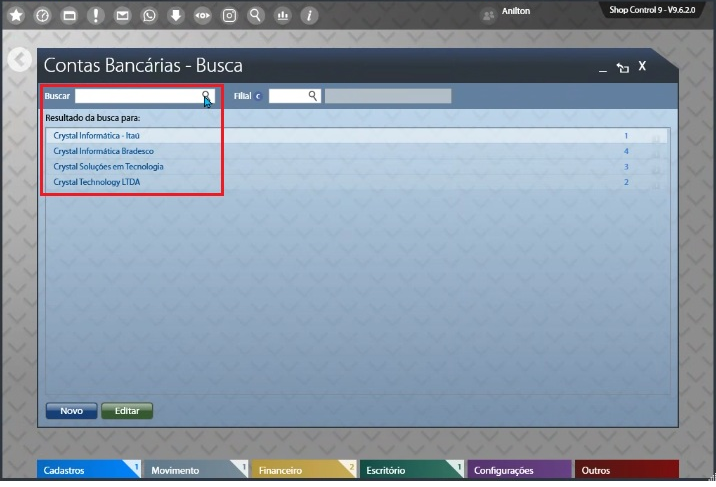
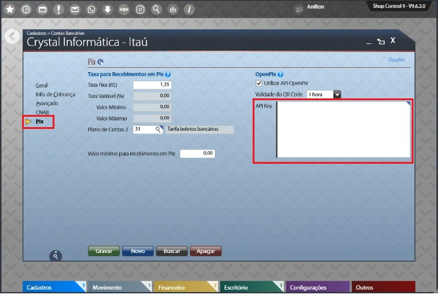

:::info

Essa documentação assume que você tenha preenchido alguns requisitos que são:

1. Ter uma aplicação criada na OpenPix. Caso ainda não tenha feito, você pode criar uma seguindo [este tutorial](../apis/api-getting-started.md).

:::

### 1. Primeiro você deve ir em `CADASTROS` depois em `FINANCEIRO`

### 2. Em seguida você deve ir até `CONTAS BANCÁRIAS`

### 3. Selecione a conta Bancária

Nesta parte você irá selecionar a conta bancária da Shop9

### 4. Cadastro do AppID

Aqui você irá até a opção `PIX` no campo `API KEY` irá passar o AppID criado em nossa plataforma e clicar em `GRAVAR`.

