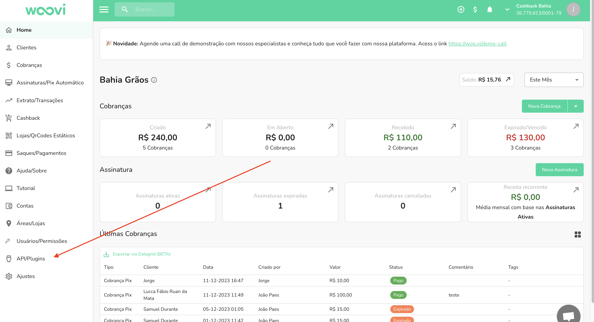
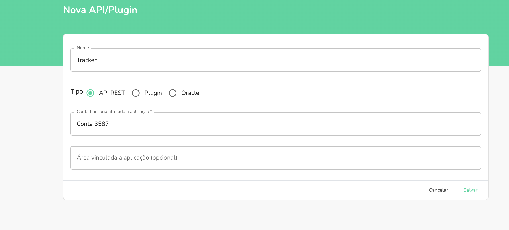
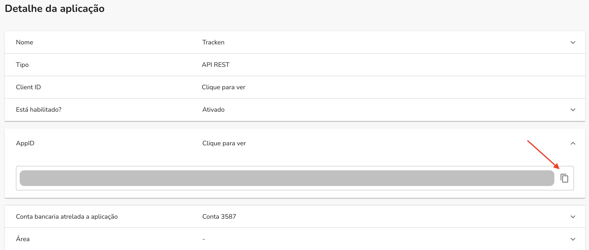

# Como Integrar a OpenPix com a Tracken?

Se você está buscando integrar a OpenPix com a Tracken, siga este guia passo a passo para realizar essa integração de forma eficaz.

## Passo 1: Acesso à Plataforma OpenPix

Para iniciar o processo de integração entre a OpenPix e a Tracken, acesse a plataforma OpenPix usando suas credenciais de acesso. Certifique-se de que você tenha permissões adequadas para criar uma nova API e que a sua conta virtual esteja ativa.

## Passo 2: Acessando a Seção de API/Plugin

Dentro da plataforma OpenPix, localize o menu "API/Plugin" na aba de navegação à esquerda.

## Passo 3: Criando uma Nova API

No menu "API/Plugin", procure e clique no botão "Nova API". Esse botão geralmente está localizado no canto superior direito da tela.

## Passo 4: Configurando a API para a Tracken

Ao criar uma nova API, você precisará configurar as informações corretas para a integração com a Tracken. Siga estas etapas:

### 4.1. Nome da API

Dê um nome descritivo para a nova API. Neste caso, nomeie-a como "Tracken" para facilitar a identificação.

### 4.2 Tipo de API

Selecione o tipo de API como "REST". Isso garante que a comunicação entre a OpenPix e a Tracken siga os padrões de integração RESTful.

### 4.3. Salvar

Após inserir as informações necessárias, clique no botão "Salvar" ou equivalente para criar a nova API com as configurações da Tracken.

## Passo 5: Obtenção do APPId

Após salvar a nova API, a plataforma OpenPix gerará um código chamado "APPId". Este código é essencial para a integração com a Tracken. Anote ou copie esse código, pois você precisará compartilhá-lo com a equipe da Tracken.

## Passo 6: Compartilhando o Código com a Tracken

Agora que você tem o código APPId gerado pela OpenPix, entre em contato com a Tracken e informe que deseja realizar a integração com a OpenPix. Forneça o código APPId para que a Tracken possa configurar a integração corretamente do lado deles.

## Conclusão

A integração entre a OpenPix e a Tracken é um processo fundamental para aproveitar ao máximo as capacidades dessas duas plataformas. Ao seguir este guia passo a passo e compartilhar o código APPId com a Tracken, você estará bem encaminhado para garantir uma integração bem-sucedida e eficiente entre as duas soluções. Certifique-se de manter uma comunicação clara e contínua com ambas as equipes para garantir que a integração atenda às suas necessidades específicas.
