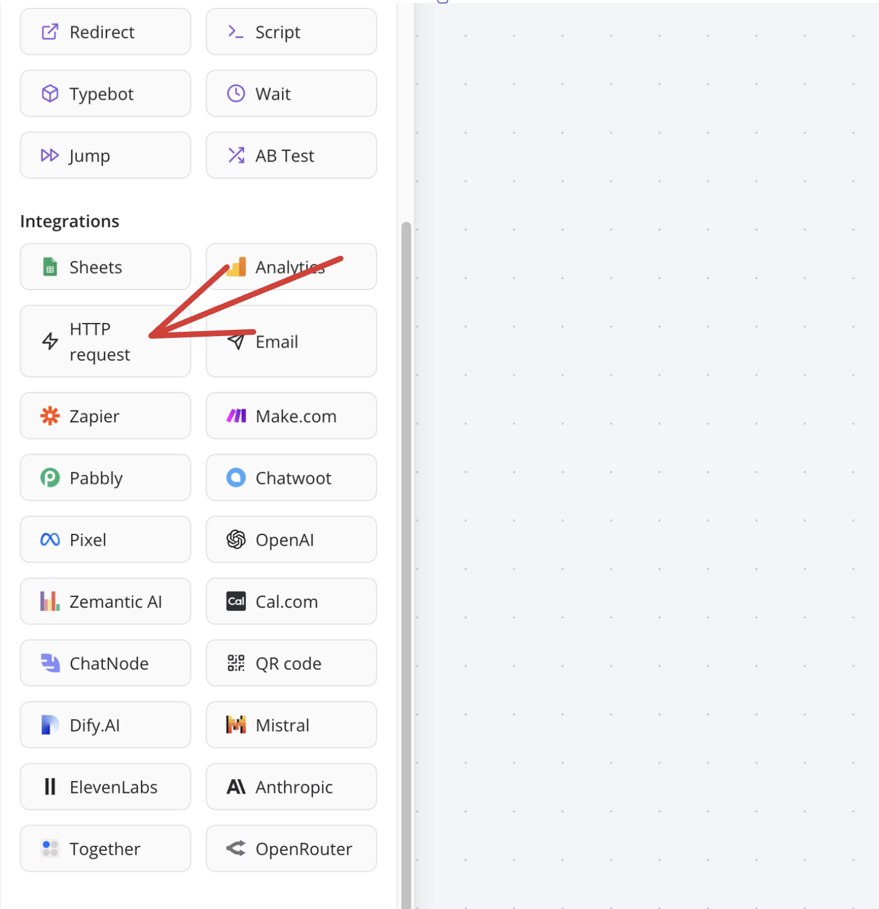
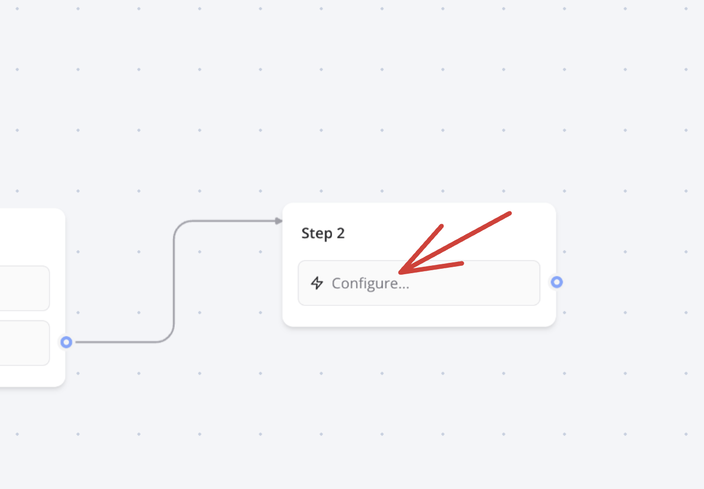
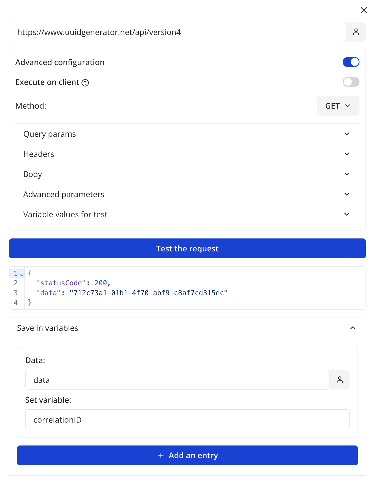
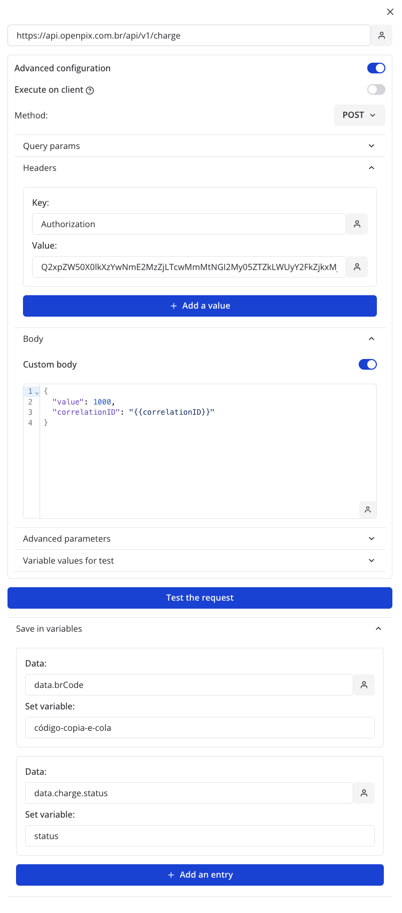
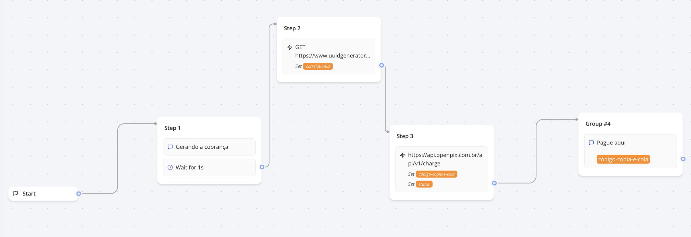

:::info

Essa documentação assume que você tenha preenchido alguns requisitos que são:

1. Ter uma conta no [Typebot](https://typebot.io/)
2. Ter um fluxo já criado no [Typebot](https://typebot.io/)
3. Ter uma aplicação criada na OpenPix. Caso ainda não tenha feito, você pode criar uma seguindo [este tutorial](../apis/api-getting-started.md).

:::

## Criando uma cobrança utilizando o Typebot

Para está criando uma cobrança no Typebot é necessário que você utilize a caixinha `HTTP request`, você pode está localizando ela na seção de `Integrations` no Typebot.



Após isso, clique na caixinha para efetuar a configuração da mesma.



Quando abrir o _pop-up_, selecione a opção `Advanced configuration`.

Antes de partimos para a requisição que irá criar a cobrança, vamos fazer uma requisição que será responsável por criar o ID único da mesma.

Para isso, basta você especificar a seguinte configuração na caixinha:

- **URL**: `https://www.uuidgenerator.net/api/version4`



Nessa parte, vamos utilizar a API da OpenPix de criação de cobrança (segue o [link](https://developers.openpix.com.br/api#tag/charge/paths/~1api~1v1~1charge/post) da especificação), ou seja, vamos configurar com as seguintes informações:

Aqui está um exemplo da URL e o corpo da requisição:

- **URL**: `https://api.openpix.com.br/api/v1/charge`
- **Body**:
  ```json
  {
    "value": 100, // O valor da sua preferência
    "correlationID": "d4c681a0-5d28-4ba0-b66b-3ea3cc158388" // ID único da cobrança
  }
  ```



Após isso, seu fluxo de criação de cobrança está pronto para uso!

Segue uma imagem de como o fluxo ficou na forma final:


