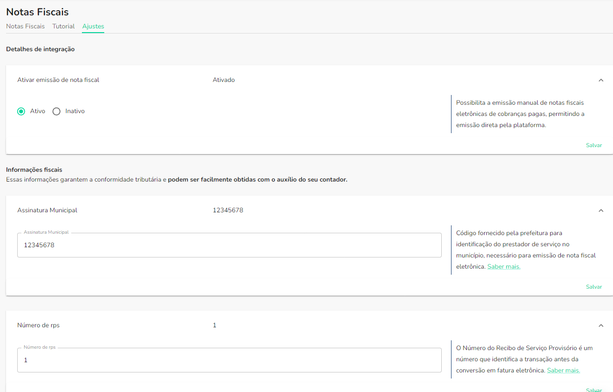

:::info

A integração de nota fiscal eletrônica está disponível apenas por solicitação via chat.

:::

:::caution

Essa documentação espera que você já tenha uma conta virtual criada na OpenPix.

:::

## 1. Adicionando a integração

Para começar a emitir notas fiscais, você deve adicionar a integração de notas fiscais. Para isso você pode seguir esses dois caminhos:

- Acessando diretamente o formulário de criação, clicando [aqui](https://app.openpix.com/home/integration-nfeio/tutorial);
- Após acessar a plataforma da [OpenPix](https://app.openpix.com/home), você pode acessá-lo através do menu, clicando em:
  1. API/Plugins;
  2. Nota fiscal eletrônica;
  3. Clique no botão `Adicionar`;

Após seguir um desses fluxos, você será redirecionado para a página de ativação da integração

## 2. Configurando a integração

Após clicar em ativar agora, você será redirecionado para a página de ajustes da integração e será necessário preencher algumas informações fiscais da sua empresa, essas informações garantem a conformidade tributária e podem ser facilmente obtidas com o auxílio do seu contador:

1. **Assinatura municipal**: Código fornecido pela prefeitura para identificação do prestador de serviço no município, necessário para emissão de nota fiscal eletrônica.
2. **Número de rps**: O Número do Recibo de Serviço Provisório é um número que identifica a transação antes da conversão em fatura eletrônica.
3. **Regime de imposto especial**: Indicação de impostos específicos aplicáveis ao serviço prestado, conforme legislação local ou federal.
4. **Código de serviço**: Identificador do tipo de serviço prestado, conforme a lista de serviços municipais, para cálculo correto de impostos e tributos..
5. **Regime tributário**: Categoria tributária da empresa, utilizada para determinar como são calculados os impostos e obrigações tributárias.

Logo após preencher e salvar as informações fisicais da sua empresa, você deverá verificar se a prefeitura da sua cidade requer credenciais para emitir notas fiscais, você fazer essa verificação entrando no serviço web da sua prefeitura. Caso seja necessário, preencha os campos mostrados abaixo com as devidas credencias e clique em `Salvar`:

Por fim, você deverá fazer o upload do seu certificado digital A1, assim como digitar a senha do documento no campo indicado conforme a imagem abaixo:

## 3. Finalizando a configuração

1. Depois de preencher todos os dados e enviar o certificado, o último passo é emitir uma nota fiscal de teste para validar a integração. Então você pode clicar no botão `Emissão de teste`, conforme a imagem abaixo:

2. Após clicar no botão `Emissão de teste`, você será redirecionado para a página de detalhes da integração e será possível ver os dados enviados assim como o atual estado da integração, que após ser validado pelo nosso provedor de nota fiscal deverá ficar como abaixo:

3. Você pode visualizar os detalhes da nota fiscal gerada clicando nela na tabela acima. Ao clicar você será redirecionado para a página de detalhes da nota fiscal e é possível ver as informações da nota e o documento PDF clicando em `Ver nota fiscal`

4. Depois de verificar o documento da nota fiscal de teste gerada com o seu contador, você já pode começar a emitir notas fiscais na plataforma!

## 4. Lidando com falhas de validação ou mudanças de dados

Caso ocorra algum problema na etapa de validação dos dados, você pode clicar em `Editar` no canto inferior, corrigir os dados e refazer o fluxo de teste da nota fiscal de novo. Também, caso seja preciso atualizar os dados, você pode seguir os mesmos passos para atualizá-los.

