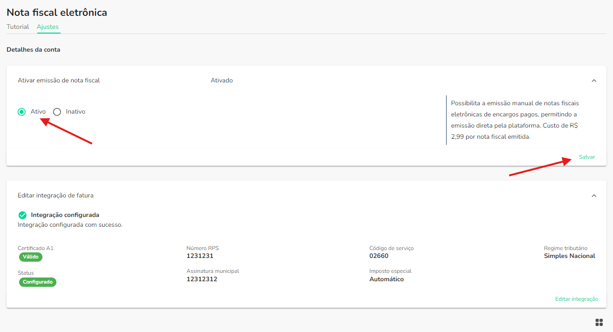
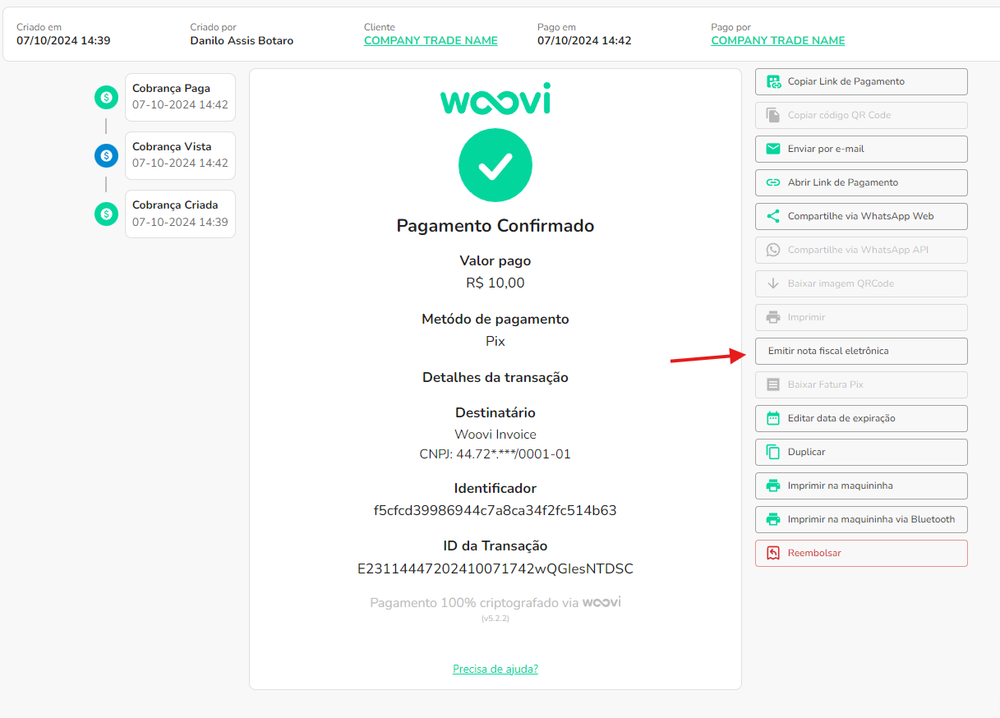
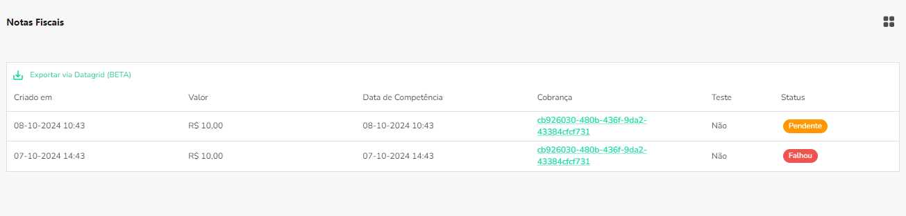

:::caution

Essa documentação espera que você já tenha configurado a integração de nota fiscal eletrônica

:::

## 1. Ativando a emissão de nota fiscal eletrônica manual

Já configurado a integração, você pode habilitar a emissão selecionando a opcão `Ativo` e clicando em `Salvar` na página de configurações como visto embaixo.

## 2. Emitindo uma nota fiscal eletrônica para cobranças pagas

:::caution

É possível emitir apenas uma nota fiscal por cobrança, porém caso a emissão falhe, é possível fazer uma nova emissão

:::

Para emitir uma nota fiscal, você deve:

1. Ir para a página de detalhes da cobrança
2. Clicar em `Emitir nota fiscal eletrônica`, como na imagem abaixo

3. Confirmar emissão de nota fiscal.

## 3. Visualizar notas fiscais emitidas

Logo abaixo os detalhes da cobrança, é possível encontrar a lista de notas fiscais emitidas.

