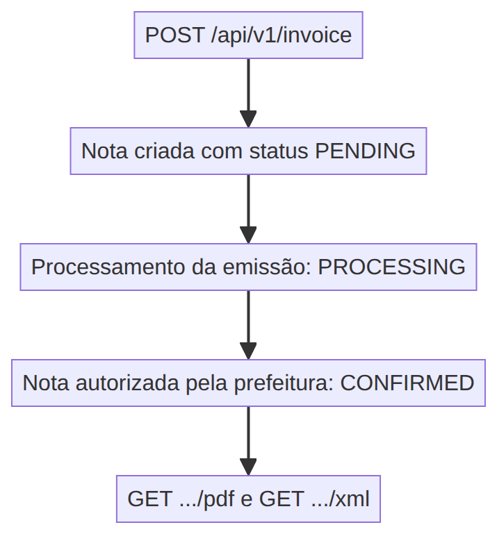

Este documento explica como emitir e consultar notas fiscais eletrônicas de serviço (NFS-e) usando a API REST da OpenPix, sem precisar acessar a plataforma.

:::caution

Antes de emitir notas via API, a integração de nota fiscal eletrônica precisa estar ativa e configurada. Veja [como ativar a emissão de nota fiscal eletrônica de serviço](/docs/integrations/invoice/invoice-how-to-integrate).

:::

:::info

Todas as requisições usam a URL base `https://api.openpix.com.br` e devem enviar o seu AppID no header `Authorization`. Se você ainda não tem um AppID, veja [Começando a Integração](/docs/apis/getting-started-api).

:::

## Fluxo de emissão



<!-- Diagrama gerado a partir de ./__assets__/invoice-issue-via-api-flow.mmd (mermaid).
     Para atualizar: edite o .mmd e re-renderize a imagem. -->

A emissão é assíncrona: a resposta do `POST` confirma que a nota foi registrada (status `PENDING`) e a autorização junto à prefeitura acontece em seguida. O PDF e o XML só ficam disponíveis depois que a nota atinge o status `CONFIRMED`.

## 1. Emitindo a nota fiscal

Endpoint: `POST /api/v1/invoice`

Existem duas formas de emitir:

- **A partir de uma cobrança**: envie o campo `charge` com o `correlationID` da cobrança. O valor e o cliente da nota são herdados da cobrança.
- **Informando valor e cliente**: envie `value` e os dados do cliente (`customer` ou `customerId`).

### Campos do corpo da requisição

| Campo                      | Tipo   | Obrigatório                                     | Descrição                                                                                       |
| -------------------------- | ------ | ----------------------------------------------- | ----------------------------------------------------------------------------------------------- |
| `correlationID`            | string | Sim                                             | Seu identificador único da nota fiscal. Não pode repetir dentro da mesma conta.                 |
| `billingDate`              | string | Sim                                             | Data de competência/vencimento da nota, no formato `YYYY-MM-DD` ou ISO 8601.                    |
| `charge`                   | string | Sim, se `value` não for enviado                 | `correlationID` de uma cobrança existente. O valor e o cliente da nota são obtidos da cobrança. |
| `value`                    | number | Sim, se `charge` não for enviado                | Valor da nota **em centavos** (ex.: `500` equivale a R$ 5,00).                                  |
| `customer`                 | object | Sim, quando emitir por `value` sem `customerId` | Dados do tomador do serviço, detalhados nas linhas seguintes.                                   |
| `customerId`               | string | Não                                             | `correlationID` de um cliente já cadastrado, como alternativa a enviar o objeto `customer`.     |
| `description`              | string | Não                                             | Descrição do serviço que aparece na NFS-e.                                                      |
| `customer.taxID`           | string | Sim (dentro de `customer`)                      | CPF ou CNPJ do tomador, somente números.                                                        |
| `customer.name`            | string | Sim (dentro de `customer`)                      | Nome ou razão social do tomador.                                                                |
| `customer.email`           | string | Sim (dentro de `customer`)                      | E-mail válido do tomador.                                                                       |
| `customer.phone`           | string | Sim (dentro de `customer`)                      | Telefone do tomador.                                                                            |
| `customer.address`         | object | Sim (dentro de `customer`)                      | Endereço do tomador.                                                                            |
| `customer.address.country` | string | Sim (dentro de `address`)                       | País do endereço.                                                                               |
| `customer.address.zipcode` | string | Sim (dentro de `address`)                       | CEP do endereço.                                                                                |
| `customer.address.street`  | string | Sim (dentro de `address`)                       | Logradouro.                                                                                     |
| `customer.address.number`  | string | Sim (dentro de `address`)                       | Número do endereço.                                                                             |
| `customer.address.state`   | string | Sim (dentro de `address`)                       | Sigla do estado brasileiro (ex.: `SP`).                                                         |

:::info

O `correlationID` é único por conta: cada conta tem o seu próprio espaço de identificadores, então o mesmo `correlationID` pode existir em contas diferentes.

:::

### Emitindo a partir de uma cobrança

```bash
curl --request POST \
  --url https://api.openpix.com.br/api/v1/invoice \
  --header 'Authorization: SEU_APPID_AQUI' \
  --header 'Content-Type: application/json' \
  --data '{
    "correlationID": "nfse-pedido-1042",
    "billingDate": "2025-08-28",
    "charge": "cobranca-pedido-1042",
    "description": "Consultoria de software"
  }'
```

Resposta `201 Created`:

```json
{
  "invoice": {
    "id": "67001bbf0b0621890af7dc28",
    "correlationID": "nfse-pedido-1042",
    "value": 7000,
    "description": "Consultoria de software",
    "date": "2025-08-28T13:10:22.512Z",
    "billingDate": "2025-08-28T00:00:00.000Z",
    "status": "PENDING",
    "statusRaw": null,
    "customer": {
      "correlationID": "6f46c15a-f471-4d54-bb28-207fe2568f69",
      "name": "John Doe"
    },
    "charge": {
      "correlationID": "cobranca-pedido-1042",
      "value": 7000,
      "status": "COMPLETED",
      "paidAt": "2025-08-28T13:05:10.000Z",
      "date": "2025-08-28T12:59:41.931Z"
    }
  }
}
```

### Emitindo informando valor e cliente

```bash
curl --request POST \
  --url https://api.openpix.com.br/api/v1/invoice \
  --header 'Authorization: SEU_APPID_AQUI' \
  --header 'Content-Type: application/json' \
  --data '{
    "correlationID": "nfse-avulsa-001",
    "billingDate": "2025-08-28",
    "value": 15000,
    "description": "Mensalidade de suporte",
    "customer": {
      "taxID": "31324227036",
      "name": "John Doe",
      "email": "john@example.com",
      "phone": "5511999999999",
      "address": {
        "country": "BR",
        "zipcode": "01001000",
        "street": "Praça da Sé",
        "number": "1",
        "state": "SP"
      }
    }
  }'
```

Resposta `201 Created`:

```json
{
  "invoice": {
    "id": "67001bbf0b0621890af7dc29",
    "correlationID": "nfse-avulsa-001",
    "value": 15000,
    "description": "Mensalidade de suporte",
    "date": "2025-08-28T13:12:44.108Z",
    "billingDate": "2025-08-28T00:00:00.000Z",
    "status": "PENDING",
    "statusRaw": null,
    "customer": {
      "correlationID": "a1f2c3d4-1111-4222-8333-9444abcd5555",
      "name": "John Doe"
    },
    "charge": {}
  }
}
```

## 2. Consultando as notas fiscais emitidas

Endpoint: `GET /api/v1/invoice`

Use esse endpoint para acompanhar o status da emissão. A nota começa em `PENDING`, passa por `PROCESSING` durante a emissão e chega a `CONFIRMED` quando é autorizada.

Parâmetros de query aceitos: `start`, `end` (filtro por data da nota), `skip` e `limit` (paginação).

```bash
curl --request GET \
  --url 'https://api.openpix.com.br/api/v1/invoice?start=2025-08-01&end=2025-08-31&skip=0&limit=100' \
  --header 'Authorization: SEU_APPID_AQUI'
```

Resposta `200 OK`:

```json
{
  "invoices": [
    {
      "id": "67001bbf0b0621890af7dc28",
      "correlationID": "nfse-pedido-1042",
      "value": 7000,
      "description": "Consultoria de software",
      "date": "2025-08-28T13:10:22.512Z",
      "billingDate": "2025-08-28T00:00:00.000Z",
      "status": "CONFIRMED",
      "statusRaw": null,
      "customer": {
        "correlationID": "6f46c15a-f471-4d54-bb28-207fe2568f69",
        "name": "John Doe"
      },
      "charge": {
        "correlationID": "cobranca-pedido-1042",
        "value": 7000,
        "status": "COMPLETED",
        "paidAt": "2025-08-28T13:05:10.000Z",
        "date": "2025-08-28T12:59:41.931Z"
      }
    }
  ]
}
```

## 3. Baixando o PDF e o XML da nota

Endpoints:

- `GET /api/v1/invoice/{correlationID}/pdf`
- `GET /api/v1/invoice/{correlationID}/xml`

:::info

No parâmetro de path você pode informar tanto o `correlationID` que você definiu na emissão quanto o `id` retornado pela API. Os dois identificam a mesma nota.

:::

```bash
curl --request GET \
  --url https://api.openpix.com.br/api/v1/invoice/nfse-pedido-1042/pdf \
  --header 'Authorization: SEU_APPID_AQUI' \
  --output nota-fiscal.pdf
```

A resposta `200 OK` é o próprio arquivo, com `Content-Type: application/pdf` e o header `Content-Disposition: inline; filename="..."`.

Para o XML, o formato é o mesmo, com `Content-Type: application/xml`:

```bash
curl --request GET \
  --url https://api.openpix.com.br/api/v1/invoice/nfse-pedido-1042/xml \
  --header 'Authorization: SEU_APPID_AQUI' \
  --output nota-fiscal.xml
```

:::caution

O PDF e o XML só existem depois que a nota está `CONFIRMED`. Consulte o status pelo endpoint da etapa anterior antes de baixar os documentos.

:::

## 4. Cancelando uma nota fiscal

Endpoint: `POST /api/v1/invoice/{correlationID}/cancel`

Assim como nos documentos, o parâmetro de path aceita o `correlationID` ou o `id` da nota. Somente notas com status `CONFIRMED` podem ser canceladas.

```bash
curl --request POST \
  --url https://api.openpix.com.br/api/v1/invoice/nfse-pedido-1042/cancel \
  --header 'Authorization: SEU_APPID_AQUI'
```

Resposta `200 OK`:

```json
{
  "success": true
}
```

Após o cancelamento, a nota passa para o status `CANCELED`.
