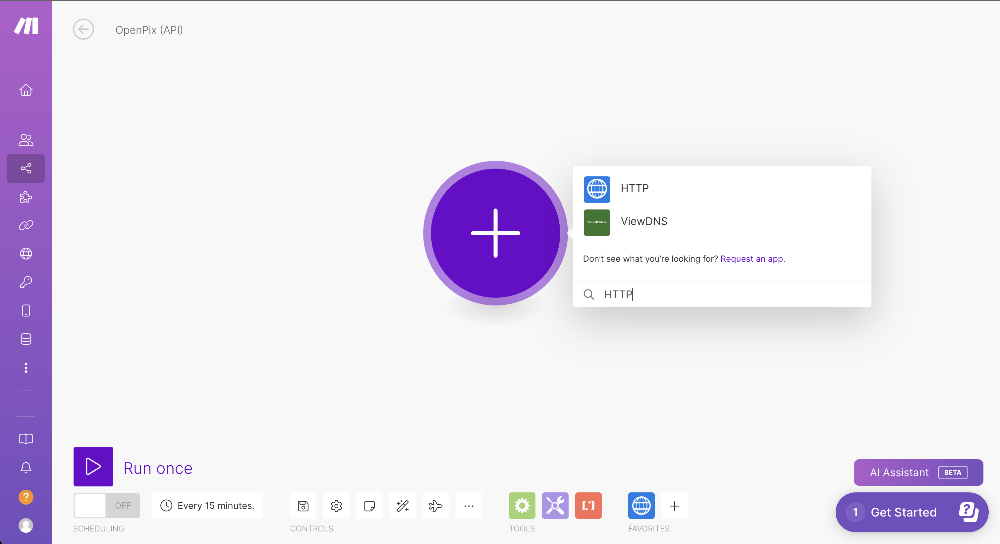

Esse tutorial tem como objetivo realizar um passo a passo de como integrar nossa API
usando a ferramenta [Make](https://make.com/).

## Pré-requisitos

Caso deseje realizar a integração, é necessário que você já tenha se cadastrado na OpenPix,
e por fim tenha já criado uma nova API na nossa plataforma. Caso ainda não tenha feito isso,
você pode seguir o tutorial de como criar uma nova API [aqui](../../apis/getting-started-api.md).

## 1. Adicionando o módulo para chamadas HTTP

Para realizar chamadas HTTP dentro de um cenário do Make, é necessário a utilização de um módulo
chamado `HTTP`.

Conforme a imagem acima, basta procurar o módulo HTTP e adicioná-lo no seu cenário.

## 2. Fazendo uma requisição com o módulo HTTP

Após adicionar o módulo HTTP, você pode fazer uma requisição para a nossa API. Utilizando a seguinte
funcionalidade do módulo: `Fazer uma requisição` (pode estar em inglês, com o seguinte nome: `Make a request`).

Após selecionar esta opção, você verá as seguintes opções conforme a imagem acima:

- `URL`: será inserido a URL referente a nossa API contendo o endpoint que deseja acessar.
  Para o nosso exemplo, estaremos usando o endpoint para criar uma cobrança (`https://api.openpix.com.br/api/v1/charge`),
  você poderá acessar todos os endpoints disponíveis pela nossa API a partir da [nossa documentação](https://developers.openpix.com.br/api).
- `Método`: o método HTTP que deseja utilizar, para criar uma nova cobrança, é necessário o método `POST`.
- `Headers`: os headers que irão na requisição, será necessário inserir um header `Authorization` com o valor disponibilizado pelo AppID.

Conforme nosso exemplo, após preencher todos os campos, você verá algo similar a imagem abaixo:

:::info

Lembre-se de inserir corretamente os seguintes pontos na sua requisição:

- `Body type` sendo `RAW`, dessa forma te permite passar um JSON no corpo da requisição, caso necessário.
- `Content-type` sendo `JSON (application/json)`, para que a API entenda que o corpo da requisição é um JSON.

Não esqueça de formatar corretamente o conteúdo da sua requisição, para garantir que esteja de acordo com um JSON
válido.

:::

## 4. Testando a requisição

Após preencher todos os campos, você pode clicar no botão `Rodar uma vez`, para realizar a requisição.

Se tudo ocorrer bem, você verá a resposta da requisição contendo na resposta o _status code_ `200`, e o campo
de `Data` contendo as informações da cobrança criada. Como no exemplo abaixo:

## 5. Utilizando esse módulo

Sua integração com a API da OpenPix já foi realizada com sucesso! Você pode estar colocando esse módulo
HTTP e acoplá-lo a outros cenários do Make, conforme a necessidade do seu fluxo.
