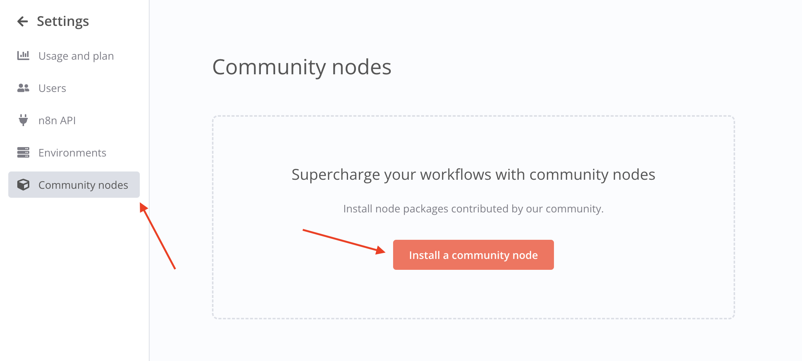

import Embed from 'react-embed';

## Como integrar o Webhook Pix com o N8N

<Embed url="https://www.youtube.com/watch?v=Xss_AN1oz8U" />

## Documentação

1. Crie uma API na OpenPix [aqui](../apis/getting-started-api.md)
2. Copie o AppID
3. Acesse a sua instância do N8N
4. Acesse `Configurações` > `Community nodes`
   4.1 Clique em `Install` e pesquise por `n8n-nodes-openpix`
   

5. Crie um novo Workflow e utilize o nó `OpenPix Trigger`

